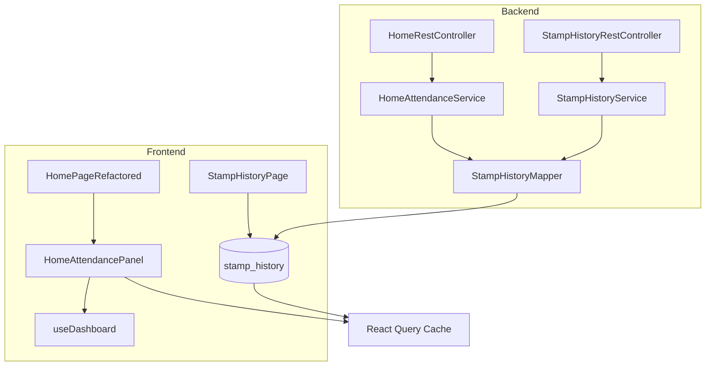
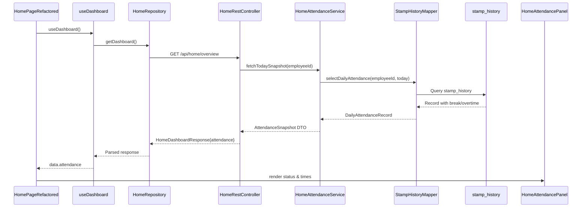
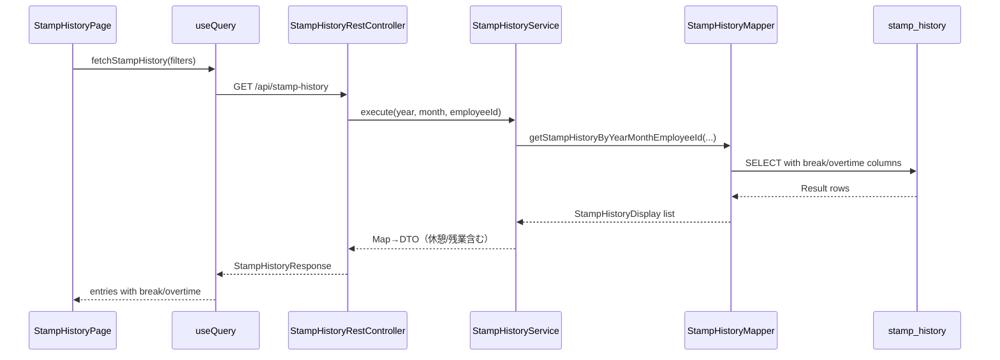

# Design Document

## Overview 
本機能はホームダッシュボードと勤怠履歴に休憩開始・休憩終了・残業情報を追加し、従業員が当日の勤務状態を即時に把握できるようにする。休憩中かどうかをバッジで提示し、履歴画面でも同じデータ粒度を表示することで、申請や自己管理の判断材料を提供する。  
対象ユーザーは一般従業員であり、ホーム画面でリアルタイム状況を確認し、勤怠履歴で証跡を確認するワークフローを想定する。副次的に管理者は同じAPIを通じて休憩データの整合性を確認できる。  
本機能により既存の`stamp_history`集計に休憩・残業データが統合され、ホーム/履歴UIでの表示が一貫する。バックエンドは既存のサービス/マッパー構造に追従しつつ、日次勤怠スナップショットを取得する専用サービスを追加する。

### Goals
- 当日の休憩開始・終了時刻と勤務ステータスをホームダッシュボードに表示する。
- 勤怠履歴テーブルへ休憩・残業列を追加し、欠損時は「未登録」を表示する。
- 休憩/残業算出ロジックをバックエンドに集約し、フロントは整形表示のみに専念する。

### Non-Goals
- 休憩開始・終了の打刻UIは別仕様とし、本設計では表示とAPI拡張に限定する。
- 複数休憩や分割残業の高度な集計はスコープ外。1日1区間＋日次残業合計を前提にする。
- 権限モデルや認証フローの変更は行わない。

## Architecture

### Existing Architecture Analysis
- バックエンドは Spring Boot + MyBatis 構成で、Controller→Service→Mapper→PostgreSQL のレイヤードアーキテクチャを採用している（`HomeRestController`, `StampHistoryRestController`）。
- `stamp_history`テーブルは日単位で`in_time`/`out_time`を保持し、月次統計は`StampHistoryMapper.findMonthlyStatistics`で算出している。
- フロントエンドは React 19 + React Query によるデータフェッチと shadcn/ui コンポーネントを利用し、`HomePageRefactored`と`StampHistoryPage`が該当画面をレンダリングする。
- 既存の QueryKey/Repository パターン (`HomeRepository`, `queryKeys.home`) を尊重し、API拡張は OpenAPI から型生成される TypeScript 型に反映させる必要がある。

### High-Level Architecture


**Architecture Integration**
- 既存パターン継承：Controller→Service→Mapper→DB、React Query フック、OpenAPI 型生成。
- 新規コンポーネント理由：日次勤怠取得を切り出す`HomeAttendanceService`、UI再利用のための`HomeAttendancePanel`。
- 技術整合性：PostgreSQL TIMESTAMPTZ で UTC 管理、React Query のキー体系を拡張。
- Steering遵守：DDD導入済領域との差異を最小化し、従来の MyBatis ベース領域で完結させる。

### Technology Alignment
- **バックエンド**: Spring Boot 3.4 / Java 21、MyBatis、PostgreSQL 16 TIMESTAMPTZ、UTC保存＋表示時にJSTへ変換（PostgreSQL公式推奨に準拠）。
- **フロントエンド**: React 19, TypeScript strict, React Query, shadcn/ui。新規依存は追加しない。
- **スキーマ管理**: 既存のSQLスクリプト（`01_schema.sql`, `database-optimization-indexes.sql`）をFlyway/手動マイグレーションに統合。
- **OpenAPI**: `/api/home/overview`と`/api/stamp-history`のレスポンス定義を更新し、`@hey-api/openapi-ts`による型生成を再実行する。

### Key Design Decisions
- **Decision**: `stamp_history`に休憩開始・終了・残業分数カラムを追加し、TIMESTAMPTZ/INTで保持する。  
  **Context**: 休憩と残業を日次で表示する要件。  
  **Alternatives**: (1) 別テーブル`stamp_breaks`で管理、(2) JSONB列に格納、(3) 計算専用ビュー。  
  **Selected Approach**: `stamp_history`行に `break_start_time`, `break_end_time`, `overtime_minutes` を追加。  
  **Rationale**: 1日1行の特性と整合し既存クエリを拡張しやすい。ビューでは書き込みが困難で、別テーブルはJOINコスト増。  
  **Trade-offs**: 将来複数休憩を扱う場合に拡張が必要。

- **Decision**: 休憩・残業の派生値はバックエンドで算出し、フロントはフォーマットのみ行う。  
  **Context**: TypeScript側で複雑な業務ルールを再実装すると整合性が取れない。  
  **Alternatives**: (1) フロントで算出、(2) GraphQL導入。  
  **Selected Approach**: `HomeAttendanceService`と`StampHistoryService`で算出し、DTOに整形済データを載せる。  
  **Rationale**: 業務ロジックの単一責任とテスト容易性。  
  **Trade-offs**: APIレスポンスサイズがわずかに増加。

- **Decision**: 勤務ステータスを列挙型として定義し、APIとUIで同一の列挙値を共有する。  
  **Context**: 休憩中/勤務中/未出勤/勤務終了などの状態を一貫して表示する必要。  
  **Alternatives**: (1) 文字列を直書き、(2) ブール組み合わせ。  
  **Selected Approach**: バックエンド`AttendanceStatus` enum → OpenAPI → TypeScript `AttendanceStatus` union。  
  **Rationale**: 型安全に状態遷移を管理でき、UIの分岐を単純化。  
  **Trade-offs**: 列挙値追加時は両者更新が必要。

## System Flows

### ホームダッシュボード取得フロー


### 勤怠履歴表示フロー


## Requirements Traceability
| Requirement | 要約 | 実装コンポーネント | インターフェース | 関連フロー |
|-------------|------|--------------------|-------------------|------------|
| 1.1-1.4 | ホームで休憩開始・終了表示 | HomeRestController, HomeAttendanceService, HomeAttendancePanel | GET `/api/home/overview` → `DailyAttendanceSnapshot` | ホームダッシュボード取得フロー |
| 2.1-2.4 | 勤務ステータスバッジ | HomeAttendanceService, AttendanceStatus enum, AttendanceStatusBadge | `DailyAttendanceSnapshot.status` | ホームダッシュボード取得フロー |
| 3.1-3.4 | 履歴の休憩/残業列 | StampHistoryRestController, StampHistoryService, StampHistoryPage | GET `/api/stamp-history` → `StampHistoryEntry.breakStartTime`等 | 勤怠履歴表示フロー |

## Components and Interfaces

### Backend

#### HomeRestController (既存拡張)
- **責務**: ホーム概要レスポンスに勤怠スナップショットを含める。
- **公開メソッド**: `ResponseEntity<HomeDashboardResponse> overview()`, `ResponseEntity<Void> toggleBreak(@RequestBody BreakToggleRequest request)`
  - 事前条件: 認証済み。  
  - 事後条件: `attendance`プロパティを含むレスポンス。
- **依存**: `HomeAttendanceService`, `HomeNewsService`, `StampService`.

#### HomeAttendanceService (新規)
- **責務**: 当日の日次勤怠を取得し、休憩・残業・ステータスを計算。
- **公開メソッド**:
  ```java
  Optional<DailyAttendanceSnapshot> fetchTodaySnapshot(int employeeId, ZoneId zone);
  ```
  - `DailyAttendanceSnapshot`は`attendanceStatus`, `break`, `overtime`, `timestamps`を保持する値オブジェクト。
- **ロジック**:
  - `StampHistoryMapper.selectByEmployeeAndDate(...)`で当日行を取得。
  - `ProfileMetadataRepository`から`breakMinutes`を参照し、残業時間の補正に利用。
  - ステータス判定：  
    - `未出勤`: `in_time`未設定  
    - `勤務中`: `in_time`あり、`break_start`未設定 or `break_end`ありかつ`out_time`未設定  
    - `休憩中`: `break_start`あり、`break_end`未設定  
    - `勤務終了`: `out_time`あり
- **検証**: タイムスタンプはUTCベース。`break_end`が`break_start`より前の場合はログに警告し無効扱い。

#### StampService (既存拡張)
- **責務**: 出退勤登録に加えて休憩トグル処理と日次残業の再計算を一元管理する。
- **公開メソッド**:
  ```java
  void toggleBreak(HomeBreakForm form, Integer employeeId);
  ```
- **更新点**:
  - 当日レコードを取得し、`break_start_time`または`break_end_time`の空き側だけを設定。既に同じ状態であれば`DuplicateBreakException`を送出し409を返却。
  - 出勤・退勤・休憩トグル後は`OvertimeCalculator.calculateDaily(...)`で残業分数を導出し、レスポンス構築時に使用する（DBカラムには保存しない）。

#### StampHistoryRestController (既存拡張)
- **追加責務**: 休憩/残業フィールドを`StampHistoryEntryResponse`に含める。
- **更新点**: `toEntry`で`breakStartTime`, `breakEndTime`, `overtimeMinutes`をマッピング。

#### StampHistoryService (既存拡張)
- **責務**: 取得結果をMap→DTOへ変換する際に休憩・残業のフォールバックを適用。
- **更新点**:
  - Mapに`breakStartTime`, `breakEndTime`, `overtimeMinutes`が存在しない場合`null`/0扱いに統一。
  - 月次サマリ計算（`calculateMonthlySummary`）に合わせ、休憩控除後の残業時間を返却（`StampHistoryMapper.calculateDailyOvertime`を呼び出しオンデマンドで集計）。

#### StampHistoryMapper (既存拡張)
- **新メソッド**:  
  ```java
  DailyAttendanceRecord selectDailyAttendance(
      @Param("employeeId") int employeeId,
      @Param("date") LocalDate date
  );
  int calculateDailyOvertime(
      @Param("employeeId") int employeeId,
      @Param("date") LocalDate date
  );
  ```
- **更新クエリ**: `getStampHistoryByYearMonthEmployeeId` に休憩・残業列を追加。
- **SQL**: TIMESTAMPTZを`AT TIME ZONE 'Asia/Tokyo'`で表示用フォーマットに変換。

#### DailyAttendanceSnapshot / Record (新規値オブジェクト)
- **フィールド**: `status`, `attendanceTimestamp`, `breakStart`, `breakEnd`, `overtimeMinutes`.
- **変換責務**: エンティティ→DTO変換時の共通ロジック。

### Frontend

#### HomeRepository (既存拡張)
- **更新**:
  - `HomeDashboardResponseSchema`に`attendance`オブジェクトを追加し、Zodで型検証。
  - `toggleBreak`メソッドを実装し、`POST /api/home/breaks/toggle`を叩く。
- **新型定義**:
  ```ts
  export type DailyAttendanceSnapshot = {
    status: "NOT_ATTENDED" | "WORKING" | "ON_BREAK" | "FINISHED";
    attendanceTime: string | null;
    breakStartTime: string | null;
    breakEndTime: string | null;
    overtimeMinutes: number | null;
  };
  ```

#### useDashboard (既存拡張)
- **更新点**: フェッチ結果に`attendance`を含め、UIで利用可能にする。

#### HomeAttendancePanel (新規)
- **責務**: 休憩開始/終了時刻とステータスバッジの表示。
- **Props**: `{ snapshot: DailyAttendanceSnapshot | null }`
- **表示ロジック**:
  - `snapshot`が`null`の場合は待機UI。
  - `status`に応じたshadcn Badgeのvariantを選択。
  - `breakStartTime`, `breakEndTime`は`HH:mm`フォーマット。`null`は「未登録」バッジ。
- **操作**: `ToggleBreakButton`を内包し、ボタン押下で休憩開始/終了をトグルしながら、操作後に`queryKeys.home.dashboard`等を無効化。

#### ToggleBreakButton (新規)
- **責務**: 休憩開始/終了ボタンを単一トグルとして提供し、状態に応じてラベルとAPIパラメータを切り替える。
- **Props**: `{ status: DailyAttendanceSnapshot["status"] }`
- **動作**:
  - `status`が`WORKING`なら「休憩開始」、`ON_BREAK`なら「休憩終了」を表示。
  - 押下時に`HomeRepository.toggleBreak`（新設）を呼び出し、失敗時はトーストで通知。409は「既に処理済み」メッセージを表示。

#### AttendanceStatusBadge (新規)
- **責務**: ステータス列挙値→UI表示へのマッピングを集中管理。
- **Props**: `{ status: DailyAttendanceSnapshot["status"] }`
- **フォールバック**: 未知値の場合は`muted`バッジ＋ログ。

#### StampHistoryPage (既存拡張)
- **更新点**:
  - テーブル列に休憩開始・休憩終了・残業(時間:分)を追加。
  - 空値処理は`Badge`で「未登録」表示。
  - 月次サマリカードで残業合計を追加表示。

#### StampHistory types/api (既存拡張)
- **更新**: OpenAPI生成後の`StampHistoryEntryResponse`に`breakStartTime`, `breakEndTime`, `overtimeMinutes`を追加。
- **Zod/型**: `StampHistoryEntry`および`calculateMonthlySummary`を`overtimeMinutes`を考慮するよう更新。

### Shared / Utilities
- `formatClockTime`を流用し、共通フォーマット関数`formatOptionalTime`を新設。
- Query invalidation: 打刻処理後に`queryKeys.home.dashboard`と`queryKeys.stampHistory.all`を無効化する既存ロジックを休憩表示でも活用。
- `OvertimeCalculator`: `DailyAttendanceRecord`と勤務予定（開始/終了/休憩分）を受け取り、日次残業分数を計算する純粋関数として作成。Unit Testで境界値を検証。

## Data Models

### Domain Model
- **DailyAttendanceRecord**:  
  - 属性: `attendanceTime`, `breakStartTime`, `breakEndTime`, `departureTime`, `status`.  
  - メソッド: `int calculateOvertimeMinutes(Duration scheduledBreak, Duration scheduledWork)` を提供し、入力パラメータに基づいて毎回残業分数を導出する。
  - 不変条件: `breakEndTime`は`breakStartTime`より後。
- **AttendanceStatus**: 列挙`NOT_ATTENDED`, `WORKING`, `ON_BREAK`, `FINISHED`。

### Physical Data Model
`stamp_history`テーブルへのカラム追加（TIMESTAMPTZはUTC保持、表示時にJST変換）。残業時間は派生値のため永続化しない。
| Column | Type | Nullable | Default | 説明 |
|--------|------|----------|---------|------|
| break_start_time | TIMESTAMP WITH TIME ZONE | YES | NULL | 休憩開始打刻（UTC） |
| break_end_time | TIMESTAMP WITH TIME ZONE | YES | NULL | 休憩終了打刻（UTC） |

**インデックス**: 既存`idx_stamp_history_employee_date`を活用し、そのまま`SELECT`で取得可能。新たなカラムに対する個別インデックスは不要。

### Data Contracts & Integration
#### GET `/api/home/overview` レスポンス拡張
```json
{
  "employee": { ... },
  "news": [ ... ],
  "attendance": {
    "status": "WORKING",
    "attendanceTime": "2025-11-06T09:01:12+09:00",
    "breakStartTime": "2025-11-06T12:00:00+09:00",
    "breakEndTime": null,
    "overtimeMinutes": 45
  }
}
```
- `attendance`は存在しない場合`null`（休日など）。
- ステータス値は列挙4種。
- `overtimeMinutes`はAPI側で毎回再計算した結果を返却するため、編集直後でも整合する。

#### POST `/api/home/breaks/toggle`（新設）
```json
{
  "timestamp": "2025-11-06T12:00:00+09:00"
}
```
- サーバ側で現在の休憩状態を判定し、開始→設定、終了→終了時刻設定を行うトグルAPI。
- 二重登録時は409 Conflictを返し、既存の`DuplicateStampException`に準じたメッセージを返却。
- レスポンスは204 No Content。小さな処理なので追加レスポンスは不要。

#### GET `/api/stamp-history` レスポンス拡張
`entries[]`に以下フィールドを追加:
- `breakStartTime`: `HH:mm`または`null`
- `breakEndTime`: `HH:mm`または`null`
- `overtimeMinutes`: 数値（分）。フロントで`HH:mm`に変換。

> Note: `overtimeMinutes` はクエリ時に`calculateDailyOvertime`で導出し、DBへ永続化しない。

OpenAPI定義の更新によりTypeScript型も同期される。

## Error Handling

### Error Strategy
- **欠損データ**: 休憩時刻が欠落した場合はAPIで`null`を返し、フロントは「未登録」バッジ。ログで警告。
- **矛盾値**: `break_end_time < break_start_time`など検出時は`WARN`ログし、表示には反映しない。
- **未認証**: 既存の401処理を継続。フロントは現在のトーストハンドラを再利用。
- **DB障害**: Springの共通例外ハンドラで500を返却。React Queryはエラーステートを表示。
- **二重登録**: 休憩トグル時に既に開始/終了済みの場合は409 Conflictでエラーを返す。

### Error Categories and Responses
- **User Errors (400/409)**: 当日既に休憩終了済みなのに再開指示があるなど、今後の機能拡張時に`DuplicateStampException`を流用できるよう準備。
- **System Errors (5xx)**: MyBatis例外／DB障害時は`GlobalErrorHandler`に委譲。
- **Business Logic Errors (422想定)**: データ矛盾を検出した場合、当面は500処理だがログで識別できるようにする。

### Monitoring
- `HomeAttendanceService`で異常検知時に構造化ログ（status, employeeId, date）を出力。
- 休憩情報の欠損率を後続で計測できるようにログキー`attendance_snapshot`を追加。

## Testing Strategy

- **Unit Tests**
  - `HomeAttendanceServiceTest`: ステータス判定（未出勤/勤務中/休憩中/勤務終了）と残業計算を検証。
  - `DailyAttendanceSnapshotTest`: 値オブジェクトの不変条件チェック。
  - `OvertimeCalculatorTest`: 勤務予定・休憩区間・出退勤の組み合わせから残業分数を導出するケースを網羅。
- **Integration Tests**
  - `HomeRestControllerTest`: `/api/home/overview`のJSONに`attendance`が含まれることをMockMvc＋Testcontainersで検証。
  - `StampHistoryMapperOvertimeCalculationTest`: 既存テストに休憩カラムを追加し、オンデマンド計算の残業時間が期待通りであることを確認。
  - `StampHistoryRestControllerTest`: テーブル行に休憩/残業が表示されるレスポンスを確認。
  - `StampServiceBreakToggleTest`: 休憩開始→終了トグルの正常系と二重登録で409になるケースを検証。
- **E2E/UI Tests**
  - Playwright: ホーム画面でステータスバッジと休憩時刻が表示されること。
  - Playwright: 勤怠履歴テーブルの新列が存在し、欠損時に「未登録」が表示されること。
  - Playwright: 休憩トグルボタンが状態に応じてラベル切り替えを行い、操作後に表示が更新されること。
- **Performance**
  - `/api/stamp-history`のレスポンス時間が既存と同等 (<200ms@p95)であることを確認。

## Security Considerations
- 休憩情報は個人勤怠情報に該当するため、APIは現状のセッション認証を流用し、CORS/CSRF設定は変更不要。
- 新カラムへのアクセスは既存`stamp_history`権限に内包されるため追加のRBACは不要。
- ログには具体的な時刻情報が含まれるため、機微情報としてアクセス権を限定する既存のログ戦略に従う。

## Performance & Scalability
- 既存インデックスにより日次・月次取得はO(n)（日数）で動作。休憩列追加によるテーブルサイズ増は軽微。
- 残業計算は対象日のみオンデマンドで実施し、必要列のみSELECTすることでIOとCPUの追加コストを最小化する。
- 将来的に複数休憩や稼働日数増が発生した場合は、ビュー/関数化や計算結果のキャッシュ戦略を検討できる余地を残す。

## Migration Strategy

```mermaid
flowchart TD
    Phase0[Phase 0: 準備\n- 仕様承認\n- バックアップ取得\n- ステージングで検証] --> Phase1
    Phase1[Phase 1: スキーマ拡張\n- break_start_time 等カラム追加 (NULL許容)\n- 新カラムにコメント付与] --> Phase2
    Phase2[Phase 2: アプリ更新\n- Mapper/DTO/サービス更新デプロイ\n- OpenAPI & フロント型再生成\n- フィーチャーフラグ無しで即時有効] --> Phase3
    Phase3[Phase 3: データ初期化\n- 過去データはNULLのまま\n- 初回残業計算ジョブ実行検討\n- モニタリング設定] --> Phase4
    Phase4[Phase 4: バリデーション\n- 停止なくレスポンス検証\n- ログ監視で欠損データ確認\n- 問題発生時はアプリロールバックで対応] --> Phase5
    Phase5[Phase 5: 仕上げ\n- ドキュメント更新\n- チーム共有\n- 将来の複数休憩要件を backlog に記録]
```
- ロールバック: アプリを旧バージョンに戻せば新カラムは未参照のため影響なし。必要ならカラム削除を別フェーズで実施。
- データ移行: 過去分の残業計算が必要な場合、`StampHistoryMapper.findMonthlyStatistics`を利用したバッチを別途計画する。
