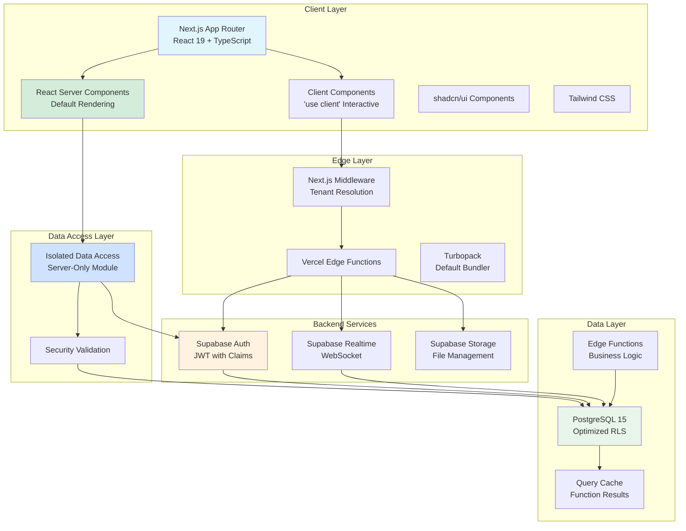
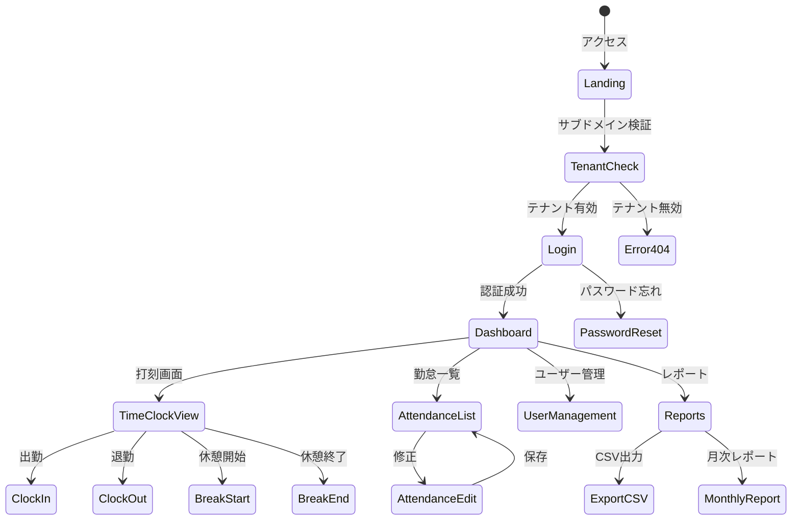
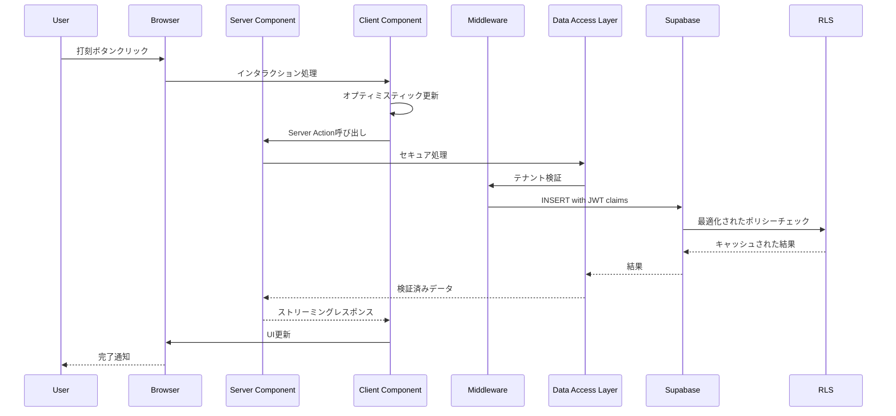
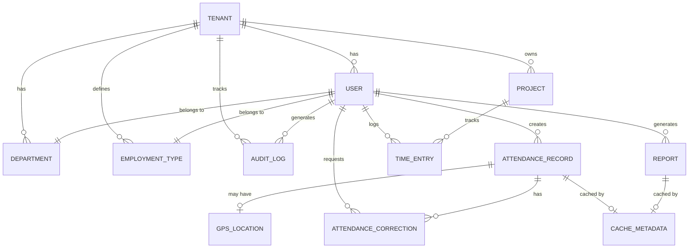

# Technical Design - 武道ONE 勤怠管理システム (Enhanced Edition)

## Overview

武道ONE勤怠管理システムは、Next.js 15とSupabaseを基盤としたマルチテナント型SaaSアプリケーションとして実装されます。各テナントはサブドメインベースで完全に分離され、PostgreSQLのRow Level Security (RLS)により厳格なデータ分離を実現します。システムはサーバーレスアーキテクチャを採用し、Vercel Edge Networkでフロントエンドを、Supabase CloudでバックエンドAPIとデータベースを提供します。

本設計は、EARS形式で定義された10個の主要要件を満たすように構成され、段階的な機能拡張を考慮したモジュラーアーキテクチャを採用しています。2025年の最新のベストプラクティスを取り入れ、React Server Components (RSC)を活用した高性能な実装を実現します。

## Research & Context Building

### 技術スタック選定の根拠

**Next.js 15の採用理由**：

- Turbopackがデフォルトバンドラーとなり、ビルド速度が大幅に向上
- React 19 RCとの完全統合により、ストリーミングとServer Componentsの最適化が実現
- GET Route HandlersとClient Router Cacheがデフォルトでアンキャッシュに変更され、より予測可能な動作
- Edge Runtimeでのグローバルな高速配信が可能

**Supabase RLSの最適化戦略**：

- JWT claimsを活用したポリシー簡略化により、サブクエリを削減
- raw_app_metadataを使用したテナントIDの安全な管理
- 関数結果のキャッシング技術により、RLSパフォーマンスが向上
- 適切なインデックス戦略により、大規模データでも高速なクエリ実行

**勤怠管理システムのアーキテクチャトレンド**：

- 年間140万レコード規模のデータも現代のPostgreSQLでは軽量
- MVCアーキテクチャとモジュラーデザインの組み合わせが主流
- リアルタイム処理とバッチ処理のハイブリッドアプローチ

## Requirements Mapping

### Design Component Traceability

各設計コンポーネントは特定のEARS要件に対応しています：

- **Tenant Isolation Layer** → Req 1: マルチテナント管理とアクセス制御
- **Authentication Service** → Req 2: ユーザー認証とセッション管理
- **User Management Module** → Req 3: ユーザー管理と権限制御
- **Time Clock Component** → Req 4: Web打刻機能
- **Attendance Correction Service** → Req 5: 打刻修正機能
- **Calculation Engine** → Req 6: 勤怠自動計算
- **Reporting Module** → Req 7: 月次集計とレポート
- **GPS Integration** → Req 8: GPS連動打刻（Phase 2）
- **Project Time Tracker** → Req 9: 工数管理（Phase 2）
- **Performance Monitor** → Req 10: システムパフォーマンスと可用性

### User Story Coverage

- **組織管理者の独立環境管理**: マルチテナントアーキテクチャとRLSポリシーで実現
- **セキュアな認証**: Supabase Authによる JWT認証とセッション管理
- **柔軟なユーザー管理**: RBACベースの権限制御とユーザープロファイル管理
- **簡単な打刻操作**: リアルタイムUIとオプティミスティック更新
- **正確な勤怠計算**: サーバーサイドでの自動計算とバリデーション
- **包括的なレポート**: 柔軟なデータエクスポートとカスタマイズ可能なフォーマット

## Architecture

### Enhanced System Architecture with Server Components



### Technology Stack (Enhanced)

- **Frontend**:
  - Next.js 15.5.2 (Turbopack default)
  - React 19.1.1 (Server Components by default)
  - TypeScript 5.9.2 (strict mode)
  - React Query/SWR for client-side caching
- **UI Components**:
  - shadcn/ui + Radix UI (server-compatible)
  - Tailwind CSS (optimized for RSC)
- **Backend**:
  - Supabase (PostgreSQL 15 with optimized RLS)
  - JWT claims in raw_app_metadata
  - Edge Functions for compute-intensive tasks
- **Performance**:
  - Turbopack for fast builds
  - Edge deployment for < 50ms latency
  - Aggressive caching strategies
- **Testing**:
  - Jest 30.1.3 + React Testing Library
  - Playwright 1.55.0 for E2E
- **Deployment**:
  - Vercel Edge Network (global distribution)
  - Supabase Cloud (managed PostgreSQL)

### Architecture Decision Rationale (Enhanced)

- **Why Server Components First**: クライアントJavaScriptを最小化し、初期表示を高速化。インタラクティブな部分のみClient Componentとして実装
- **Why Turbopack**: webpack比で700倍高速なHMR、95%高速なビルド時間により開発体験が大幅に向上
- **Why Edge Deployment**: グローバルに分散したエッジロケーションでTTFBを改善、ユーザーに近い場所でレンダリング
- **Why JWT Claims Optimization**: RLSポリシーでサブクエリを削減、raw_app_metadataにテナントIDを格納してセキュリティと性能を両立
- **Why Data Access Layer**: セキュリティ監査の容易化、サーバー専用モジュールでの機密情報の隔離

### Screen Transitions



### Data Flow (Enhanced with Server Components)

#### Primary User Flow: 打刻処理 with RSC



## Components and Interfaces (Enhanced)

### Server Components Architecture

```typescript
// Server Components (デフォルト、'use client'なし)
// app/attendance/page.tsx
export default async function AttendancePage() {
  const attendance = await getAttendanceRecords(); // サーバーで実行
  return <AttendanceTable data={attendance} />;
}

// Client Components (インタラクティブ要素のみ)
// components/time-clock-button.tsx
'use client';
export function TimeClockButton() {
  const [isLoading, setIsLoading] = useState(false);
  // インタラクティブロジック
}
```

### Data Access Layer Pattern

```typescript
// lib/data-access/attendance.ts (server-only)
import 'server-only'; // クライアントでのインポートを防ぐ

export async function getAttendanceRecords(tenantId: string) {
  // 環境変数とデータベースアクセスはここでのみ
  const supabase = createServerClient();

  // JWT claimsを活用した効率的なクエリ
  const { data, error } = await supabase
    .from('attendance_records')
    .select('*')
    .eq('tenant_id', tenantId); // RLSが自動適用

  return data;
}
```

### Backend Services & Method Signatures (Enhanced)

```typescript
// Attendance Service with Performance Optimizations
class AttendanceService {
  async clockIn(userId: string, location?: GPSLocation): Promise<AttendanceRecord>;
  async clockOut(userId: string, location?: GPSLocation): Promise<AttendanceRecord>;
  async startBreak(userId: string): Promise<AttendanceRecord>;
  async endBreak(userId: string): Promise<AttendanceRecord>;
  async correctAttendance(recordId: string, correction: CorrectionData): Promise<AttendanceRecord>;
  async getMonthlyRecords(userId: string, month: Date): Promise<AttendanceRecord[]>;
  async batchClockIn(userIds: string[], location?: GPSLocation): Promise<AttendanceRecord[]>; // 新規: バッチ処理
  async getRealtimeStatus(tenantId: string): Promise<RealtimeStatus>; // 新規: リアルタイムステータス
}

// Enhanced User Management Service
class UserService {
  async createUser(tenantId: string, userData: UserData): Promise<User>;
  async updateUser(userId: string, updates: Partial<UserData>): Promise<User>;
  async deleteUser(userId: string): Promise<void>;
  async assignRole(userId: string, role: UserRole): Promise<void>;
  async listUsers(tenantId: string, filters?: UserFilters): Promise<User[]>;
  async bulkImportUsers(tenantId: string, users: UserData[]): Promise<ImportResult>; // 新規: 一括インポート
  async syncWithHRSystem(tenantId: string, hrData: HRData): Promise<SyncResult>; // 新規: HR連携
}

// Performance-Optimized Calculation Service
class CalculationService {
  async calculateDailyHours(records: AttendanceRecord[]): Promise<DailySummary>;
  async calculateOvertime(workHours: number, rules: OvertimeRules): Promise<OvertimeBreakdown>;
  async calculateNightShift(records: AttendanceRecord[]): Promise<number>;
  async calculateHolidayWork(records: AttendanceRecord[], calendar: Calendar): Promise<number>;
  async calculateWithCache(key: string, calculator: () => Promise<any>): Promise<any>; // 新規: キャッシュ付き計算
  async parallelCalculate(records: AttendanceRecord[]): Promise<CalculationResults>; // 新規: 並列計算
}
```

### Frontend Components (Enhanced with RSC)

| Component Name        | Type             | Responsibility             | Props/State Summary                                |
| --------------------- | ---------------- | -------------------------- | -------------------------------------------------- |
| `TenantProvider`      | Server Component | テナントコンテキスト初期化 | `tenantId`, `config`, 子コンポーネント             |
| `AuthGuard`           | Server Component | 認証状態の検証             | `requiredRole`, `redirectTo`, 子コンポーネント     |
| `TimeClockCard`       | Client Component | 打刻UI表示                 | `currentStatus`, `onClock`, `isLoading`            |
| `AttendanceTable`     | Server Component | 勤怠一覧表示               | `records[]`, フィルタリング済みデータ              |
| `AttendanceEditForm`  | Client Component | 打刻修正フォーム           | `record`, `onSave`, `onCancel`, `validationRules`  |
| `UserManagementPanel` | Hybrid Component | ユーザー管理UI             | Server: データ取得、Client: インタラクション       |
| `MonthlyReportViewer` | Server Component | 月次レポート表示           | `reportData`, ストリーミングレンダリング           |
| `GPSClockButton`      | Client Component | GPS打刻ボタン              | `onClock`, `locationRequired`, `accuracyThreshold` |
| `ProjectTimeEntry`    | Client Component | 工数入力フォーム           | `projects[]`, `onSubmit`, `validation`             |
| `DashboardLayout`     | Server Component | ダッシュボードレイアウト   | `navigation`, `user`, `tenantInfo`                 |
| `RealtimeAttendance`  | Client Component | リアルタイム勤怠表示       | WebSocket接続、`subscriptionKey`                   |

### API Endpoints (Enhanced)

| Method | Route                       | Purpose              | Auth          | Cache Strategy  | Status Codes                 |
| ------ | --------------------------- | -------------------- | ------------- | --------------- | ---------------------------- |
| GET    | /api/tenants/:subdomain     | テナント情報取得     | Public        | CDN 1h          | 200, 404, 500                |
| POST   | /api/auth/login             | ログイン             | Public        | No cache        | 200, 401, 429, 500           |
| POST   | /api/auth/logout            | ログアウト           | Required      | No cache        | 204, 401, 500                |
| POST   | /api/auth/refresh           | トークンリフレッシュ | Required      | No cache        | 200, 401, 500                |
| GET    | /api/users                  | ユーザー一覧取得     | Admin         | Browser 5m      | 200, 401, 403, 500           |
| POST   | /api/users                  | ユーザー作成         | Admin         | Invalidate      | 201, 400, 401, 403, 500      |
| PUT    | /api/users/:id              | ユーザー更新         | Admin         | Invalidate      | 200, 400, 401, 403, 404, 500 |
| DELETE | /api/users/:id              | ユーザー削除         | Admin         | Invalidate      | 204, 401, 403, 404, 500      |
| POST   | /api/attendance/clock-in    | 出勤打刻             | Required      | No cache        | 201, 400, 401, 409, 500      |
| POST   | /api/attendance/clock-out   | 退勤打刻             | Required      | No cache        | 200, 400, 401, 404, 500      |
| GET    | /api/attendance/records     | 勤怠記録取得         | Required      | SWR 30s         | 200, 401, 500                |
| PUT    | /api/attendance/records/:id | 勤怠修正             | Admin/Manager | Invalidate      | 200, 400, 401, 403, 404, 500 |
| GET    | /api/reports/monthly        | 月次レポート取得     | Required      | Browser 1h      | 200, 401, 500                |
| POST   | /api/reports/export         | レポートエクスポート | Required      | Stream response | 200, 400, 401, 500           |
| POST   | /api/attendance/batch       | バッチ打刻処理       | Admin         | No cache        | 207, 400, 401, 500           |
| GET    | /api/analytics/dashboard    | ダッシュボード分析   | Required      | ISR 5m          | 200, 401, 500                |
| WS     | /ws/attendance/realtime     | リアルタイム勤怠     | Required      | WebSocket       | 101, 401, 500                |

## Data Models (Enhanced)

### Domain Entities

1. **Tenant**: テナント組織の情報とサブドメイン管理
2. **User**: システムユーザーとその属性・権限
3. **AttendanceRecord**: 打刻記録と勤務時間データ
4. **AttendanceCorrection**: 打刻修正履歴と承認状態
5. **EmploymentType**: 雇用形態と勤務ルール定義
6. **Department**: 部署情報と階層構造
7. **Project**: プロジェクト情報（Phase 2）
8. **TimeEntry**: 工数記録（Phase 2）
9. **GPSLocation**: 位置情報記録（Phase 2）
10. **Report**: 生成されたレポートとエクスポート履歴
11. **AuditLog**: 監査ログ（新規）
12. **CacheMetadata**: キャッシュメタデータ（新規）

### Enhanced Entity Relationships



### Enhanced Data Model Definitions

```typescript
// Enhanced TypeScript Interfaces with Performance Considerations
interface Tenant {
  id: string;
  subdomain: string;
  name: string;
  plan: 'basic' | 'professional' | 'enterprise';
  maxUsers: number;
  settings: TenantSettings;
  metadata: {
    timezone: string;
    locale: string;
    workWeekStart: number;
  };
  features: string[]; // Feature flags
  createdAt: Date;
  updatedAt: Date;
}

interface User {
  id: string;
  tenantId: string;
  email: string;
  name: string;
  role: 'admin' | 'manager' | 'staff';
  employmentTypeId: string;
  departmentId: string;
  hireDate: Date;
  terminationDate?: Date;
  isActive: boolean;
  // JWT claimsに含める情報
  jwtClaims?: {
    tenantId: string;
    role: string;
    departmentId: string;
  };
  createdAt: Date;
  updatedAt: Date;
}

interface AttendanceRecord {
  id: string;
  tenantId: string;
  userId: string;
  date: Date;
  clockIn?: Date;
  clockOut?: Date;
  breakStart?: Date;
  breakEnd?: Date;
  totalHours: number;
  overtimeHours: number;
  nightShiftHours: number;
  holidayHours: number;
  status: 'working' | 'break' | 'completed' | 'corrected';
  locationId?: string;
  // パフォーマンス最適化用フィールド
  calculatedAt?: Date;
  cacheKey?: string;
  createdAt: Date;
  updatedAt: Date;
}

// 新規: 監査ログ
interface AuditLog {
  id: string;
  tenantId: string;
  userId: string;
  action: string;
  resourceType: string;
  resourceId: string;
  changes?: Record<string, any>;
  ipAddress: string;
  userAgent: string;
  createdAt: Date;
}

// 新規: キャッシュメタデータ
interface CacheMetadata {
  key: string;
  type: 'query' | 'calculation' | 'report';
  value: any;
  ttl: number;
  createdAt: Date;
  expiresAt: Date;
}
```

### Optimized Database Schema

```sql
-- Enhanced Tenants table with metadata
CREATE TABLE tenants (
  id UUID PRIMARY KEY DEFAULT gen_random_uuid(),
  subdomain VARCHAR(63) NOT NULL UNIQUE,
  name VARCHAR(255) NOT NULL,
  plan VARCHAR(20) NOT NULL DEFAULT 'basic',
  max_users INTEGER NOT NULL DEFAULT 10,
  settings JSONB DEFAULT '{}',
  metadata JSONB DEFAULT '{}', -- 新規: タイムゾーン等のメタデータ
  features TEXT[] DEFAULT '{}', -- 新規: 機能フラグ
  created_at TIMESTAMPTZ NOT NULL DEFAULT NOW(),
  updated_at TIMESTAMPTZ
);

-- 最適化されたインデックス
CREATE UNIQUE INDEX idx_tenants_subdomain ON tenants(subdomain);
CREATE INDEX idx_tenants_plan ON tenants(plan) WHERE is_active = true;

-- Enhanced Users table with JWT optimization
CREATE TABLE users (
  id UUID PRIMARY KEY DEFAULT gen_random_uuid(),
  tenant_id UUID NOT NULL REFERENCES tenants(id) ON DELETE CASCADE,
  email VARCHAR(255) NOT NULL,
  name VARCHAR(255) NOT NULL,
  role VARCHAR(20) NOT NULL DEFAULT 'staff',
  employment_type_id UUID REFERENCES employment_types(id),
  department_id UUID REFERENCES departments(id),
  hire_date DATE NOT NULL,
  termination_date DATE,
  is_active BOOLEAN DEFAULT true,
  jwt_claims JSONB, -- 新規: JWT用の事前計算データ
  created_at TIMESTAMPTZ NOT NULL DEFAULT NOW(),
  updated_at TIMESTAMPTZ,
  UNIQUE(tenant_id, email)
);

-- 最適化されたインデックス
CREATE INDEX idx_users_tenant_id ON users(tenant_id) WHERE is_active = true;
CREATE INDEX idx_users_email ON users(email) WHERE is_active = true;
CREATE INDEX idx_users_role ON users(tenant_id, role) WHERE is_active = true;

-- Optimized Attendance records table
CREATE TABLE attendance_records (
  id UUID PRIMARY KEY DEFAULT gen_random_uuid(),
  tenant_id UUID NOT NULL REFERENCES tenants(id) ON DELETE CASCADE,
  user_id UUID NOT NULL REFERENCES users(id) ON DELETE CASCADE,
  date DATE NOT NULL,
  clock_in TIMESTAMPTZ,
  clock_out TIMESTAMPTZ,
  break_start TIMESTAMPTZ,
  break_end TIMESTAMPTZ,
  total_hours DECIMAL(5,2) DEFAULT 0,
  overtime_hours DECIMAL(5,2) DEFAULT 0,
  night_shift_hours DECIMAL(5,2) DEFAULT 0,
  holiday_hours DECIMAL(5,2) DEFAULT 0,
  status VARCHAR(20) NOT NULL DEFAULT 'working',
  location_id UUID REFERENCES gps_locations(id),
  calculated_at TIMESTAMPTZ, -- 新規: 計算タイムスタンプ
  cache_key VARCHAR(64), -- 新規: キャッシュキー
  created_at TIMESTAMPTZ NOT NULL DEFAULT NOW(),
  updated_at TIMESTAMPTZ,
  UNIQUE(user_id, date)
);

-- 最適化されたインデックス戦略
CREATE INDEX idx_attendance_tenant_date ON attendance_records(tenant_id, date DESC);
CREATE INDEX idx_attendance_user_date ON attendance_records(user_id, date DESC);
CREATE INDEX idx_attendance_status ON attendance_records(status) WHERE status = 'working';
CREATE INDEX idx_attendance_calculated ON attendance_records(calculated_at) WHERE calculated_at IS NULL;

-- 新規: 監査ログテーブル
CREATE TABLE audit_logs (
  id UUID PRIMARY KEY DEFAULT gen_random_uuid(),
  tenant_id UUID NOT NULL REFERENCES tenants(id) ON DELETE CASCADE,
  user_id UUID NOT NULL,
  action VARCHAR(50) NOT NULL,
  resource_type VARCHAR(50) NOT NULL,
  resource_id VARCHAR(255),
  changes JSONB,
  ip_address INET,
  user_agent TEXT,
  created_at TIMESTAMPTZ NOT NULL DEFAULT NOW()
);

-- パーティション化（大規模運用時）
CREATE INDEX idx_audit_logs_tenant_created ON audit_logs(tenant_id, created_at DESC);

-- Enhanced Row Level Security Policies with Caching
ALTER TABLE tenants ENABLE ROW LEVEL SECURITY;
ALTER TABLE users ENABLE ROW LEVEL SECURITY;
ALTER TABLE attendance_records ENABLE ROW LEVEL SECURITY;

-- 最適化されたテナント分離ポリシー（関数キャッシング付き）
CREATE OR REPLACE FUNCTION get_current_tenant_id() RETURNS UUID AS $$
  SELECT (current_setting('request.jwt.claims', true)::json->>'tenant_id')::UUID;
$$ LANGUAGE sql STABLE;

CREATE POLICY tenant_isolation_optimized ON users
  FOR ALL
  USING (tenant_id = (SELECT get_current_tenant_id()));

CREATE POLICY tenant_attendance_isolation_optimized ON attendance_records
  FOR ALL
  USING (tenant_id = (SELECT get_current_tenant_id()));

-- ユーザーデータアクセスポリシー（JWT claims活用）
CREATE POLICY user_own_attendance_optimized ON attendance_records
  FOR SELECT
  USING (
    user_id = auth.uid() OR
    EXISTS (
      SELECT 1 FROM users
      WHERE id = auth.uid()
      AND (jwt_claims->>'role') IN ('admin', 'manager')
      AND tenant_id = attendance_records.tenant_id
    )
  );

-- 新規: マテリアライズドビュー（レポート高速化）
CREATE MATERIALIZED VIEW mv_monthly_attendance AS
SELECT
  tenant_id,
  user_id,
  date_trunc('month', date) as month,
  COUNT(*) as work_days,
  SUM(total_hours) as total_hours,
  SUM(overtime_hours) as overtime_hours
FROM attendance_records
WHERE status = 'completed'
GROUP BY tenant_id, user_id, date_trunc('month', date);

CREATE INDEX idx_mv_monthly_attendance ON mv_monthly_attendance(tenant_id, month DESC);

-- リフレッシュスケジュール（毎日深夜）
CREATE OR REPLACE FUNCTION refresh_monthly_attendance() RETURNS void AS $$
BEGIN
  REFRESH MATERIALIZED VIEW CONCURRENTLY mv_monthly_attendance;
END;
$$ LANGUAGE plpgsql;
```

### Migration Strategy (Enhanced)

- **Initial Migration**: 基本テーブルとRLSポリシーの作成
- **Performance Migration**: インデックス最適化とマテリアライズドビューの追加
- **Phase 1 Migration**: 勤怠管理に必要な全テーブル
- **Phase 2 Migration**: GPS位置情報と工数管理テーブルの追加
- **Optimization Migration**: キャッシュテーブルと監査ログの追加
- **Backward Compatibility**: 新カラムはNULL許可またはデフォルト値設定
- **Index Strategy**:
  - B-treeインデックス: tenant_id, user_id, date
  - 部分インデックス: アクティブレコードのみ
  - 複合インデックス: 頻繁なクエリパターン用
- **Partition Strategy**:
  - 月次パーティション: attendance_records（100万レコード超）
  - 年次パーティション: audit_logs（長期保存）

## Error Handling (Enhanced)

### エラー分類とハンドリング戦略

```typescript
// Enhanced Error Types with Retry Logic
enum ErrorType {
  VALIDATION = 'VALIDATION_ERROR',
  AUTHENTICATION = 'AUTH_ERROR',
  AUTHORIZATION = 'PERMISSION_ERROR',
  BUSINESS_LOGIC = 'BUSINESS_ERROR',
  CONFLICT = 'CONFLICT_ERROR',
  NOT_FOUND = 'NOT_FOUND_ERROR',
  RATE_LIMIT = 'RATE_LIMIT_ERROR',
  EXTERNAL_SERVICE = 'EXTERNAL_ERROR',
  DATABASE = 'DATABASE_ERROR',
  INTERNAL = 'INTERNAL_ERROR',
  TIMEOUT = 'TIMEOUT_ERROR', // 新規
  NETWORK = 'NETWORK_ERROR', // 新規
}

// Enhanced Error Response Format
interface ErrorResponse {
  error: {
    type: ErrorType;
    message: string;
    code: string;
    details?: any;
    timestamp: string;
    requestId: string;
    retryable: boolean; // 新規: リトライ可能フラグ
    retryAfter?: number; // 新規: リトライ待機時間
    suggestion?: string; // 新規: ユーザー向け解決策
  };
}

// Error Recovery Strategy
class ErrorRecovery {
  async withRetry<T>(
    operation: () => Promise<T>,
    maxRetries: number = 3,
    backoff: number = 1000,
  ): Promise<T> {
    // 指数バックオフでリトライ
  }

  async withCircuitBreaker<T>(operation: () => Promise<T>, threshold: number = 5): Promise<T> {
    // サーキットブレーカーパターン
  }
}
```

### エラー処理フロー (Enhanced)

1. **Client-side Validation**: Zodスキーマによるフォーム送信前の入力検証
2. **Optimistic Updates**: エラー時の自動ロールバック機構
3. **API Gateway Validation**: リクエストスキーマ検証とレート制限
4. **Business Logic Validation**: ビジネスルール検証とドメインエラー
5. **Database Constraint**: データベース制約違反のハンドリング
6. **Error Recovery**: 自動リトライとフォールバック処理
7. **Error Logging**: Structured loggingとエラー集約
8. **User Notification**: コンテキスト aware なエラーメッセージ表示

## Security Considerations (Enhanced)

### 認証・認可 (Enhanced)

- **JWT Token Management**:
  - アクセストークン（15分）
  - リフレッシュトークン（7日）
  - JWT claimsにテナントID、ロール、部署IDを含める
- **Role-Based Access Control**:
  - admin, manager, staffの3階層権限
  - raw_app_metadataでの権限情報管理（ユーザー変更不可）
- **Session Management**:
  - Redis/Memcachedによるセッション管理
  - セッション固定化攻撃の防止
- **Multi-Factor Authentication**: TOTP/WebAuthn対応（Phase 2）

### データ保護 (Enhanced)

- **Encryption at Rest**:
  - Supabase管理による暗号化
  - 機密フィールドの追加暗号化レイヤー
- **Encryption in Transit**:
  - TLS 1.3による通信暗号化
  - Certificate Pinning（モバイルアプリ）
- **Row Level Security**:
  - PostgreSQLポリシーによるデータ分離
  - JWT claims活用による効率的なポリシー実装
- **Field Level Encryption**:
  - 給与データ等の機密情報
  - クライアントサイド暗号化オプション

### セキュリティ対策 (Enhanced)

- **Input Validation**:
  - Zodスキーマによる厳格な入力検証
  - SQLインジェクション防止のパラメータ化クエリ
- **XSS Protection**:
  - React自動エスケープ
  - 厳格なContent Security Policy
- **CSRF Protection**:
  - SameSite=Strict Cookie
  - Double Submit Cookie パターン
- **Rate Limiting**:
  - IP/ユーザー/エンドポイント別の制限
  - Distributed rate limiting（Redis）
- **Security Headers**:
  ```typescript
  const securityHeaders = {
    'Strict-Transport-Security': 'max-age=31536000; includeSubDomains',
    'X-Frame-Options': 'DENY',
    'X-Content-Type-Options': 'nosniff',
    'Referrer-Policy': 'strict-origin-when-cross-origin',
    'Permissions-Policy': 'geolocation=(self), microphone=()',
  };
  ```

## Performance & Scalability (Enhanced)

### Enhanced Performance Targets

| Metric                   | Target            | Current Best Practice | Measurement        |
| ------------------------ | ----------------- | --------------------- | ------------------ |
| Server Response (p50)    | < 100ms           | Edge Functions        | Vercel Analytics   |
| Server Response (p95)    | < 200ms           | Optimized RLS         | APM monitoring     |
| Server Response (p99)    | < 500ms           | Query optimization    | Database metrics   |
| First Contentful Paint   | < 1.2s            | RSC streaming         | Core Web Vitals    |
| Largest Contentful Paint | < 2.5s            | Image optimization    | Core Web Vitals    |
| Time to Interactive      | < 3.0s            | Code splitting        | Lighthouse         |
| Database Query (p99)     | < 30ms            | Index optimization    | pg_stat_statements |
| Concurrent Users         | > 1000 (Phase 1)  | Connection pooling    | Load testing       |
| Concurrent Users         | > 10000 (Phase 2) | Horizontal scaling    | Stress testing     |
| Annual Records           | > 1.4M per tenant | Partitioning ready    | Capacity planning  |

### Advanced Caching Strategy

```typescript
// Multi-layer Caching Architecture
const cachingLayers = {
  // L1: Browser Cache
  browser: {
    staticAssets: '1 year',
    apiResponses: 'stale-while-revalidate, max-age=60',
    images: 'immutable, max-age=31536000',
  },

  // L2: CDN Edge Cache (Vercel)
  edge: {
    staticPages: 's-maxage=31536000',
    ISRPages: 's-maxage=60, stale-while-revalidate',
    apiRoutes: 'private, s-maxage=0',
  },

  // L3: Application Cache
  application: {
    reactQuery: {
      staleTime: 30000,
      cacheTime: 300000,
      refetchInterval: 60000,
    },
    swr: {
      refreshInterval: 30000,
      dedupingInterval: 2000,
    },
  },

  // L4: Database Cache
  database: {
    preparedStatements: true,
    queryResultCache: true,
    connectionPooling: {
      min: 2,
      max: 10,
    },
  },

  // L5: Materialized Views
  materialized: {
    monthlyReports: 'REFRESH DAILY',
    dashboardMetrics: 'REFRESH HOURLY',
  },
};
```

### Scalability Approach (Enhanced)

- **Horizontal Scaling**:
  - Vercel自動スケーリング（グローバル展開）
  - Supabase Pro/Team/Enterprise プラン移行パス
- **Database Scaling**:
  - Read replicas for reporting workloads
  - Connection pooling with PgBouncer
  - Prepared statements for frequently used queries
- **Background Processing**:
  - Supabase Edge Functions for async tasks
  - Queue-based architecture for heavy computations
  - Scheduled jobs for maintenance tasks
- **Performance Monitoring**:
  - Real User Monitoring (RUM)
  - Application Performance Monitoring (APM)
  - Database query analysis
  - Error rate tracking

### Optimization Techniques

```typescript
// Server Component Optimization
// デフォルトでサーバーコンポーネント、必要な部分のみクライアント化

// Streaming SSR
// 重要なコンテンツを優先的にストリーミング
export default async function DashboardPage() {
  return (
    <>
      <Suspense fallback={<HeaderSkeleton />}>
        <Header />
      </Suspense>
      <Suspense fallback={<MainContentSkeleton />}>
        <MainContent />
      </Suspense>
    </>
  );
}

// Parallel Data Fetching
// 並列データフェッチで待機時間を削減
export async function AttendanceData() {
  const [attendance, users, reports] = await Promise.all([
    getAttendance(),
    getUsers(),
    getReports(),
  ]);

  return { attendance, users, reports };
}
```

## Testing Strategy (Enhanced)

### Enhanced Risk Matrix

| Area                         | Risk   | Must                          | Optional           | Ref     |
| ---------------------------- | ------ | ----------------------------- | ------------------ | ------- |
| Multi-tenant RLS             | High   | Unit, Integration, E2E        | Chaos testing      | Req 1   |
| Authentication/Authorization | High   | Unit, Contract, E2E, Security | Penetration        | Req 2   |
| Time Clock Accuracy          | High   | Unit, Integration, Property   | Mutation testing   | Req 4,6 |
| Data Export                  | Medium | Unit, Integration             | Performance        | Req 7   |
| GPS Validation               | Medium | Unit, Contract                | Field testing      | Req 8   |
| Critical UX Flows            | High   | E2E (5 flows), Visual         | Accessibility      | Req 4   |
| API Performance              | High   | Performance, Load             | Stress, Spike      | Req 10  |
| Server Components            | Medium | Unit, Integration             | Hydration testing  | -       |
| Edge Functions               | Medium | Unit, Integration             | Geographic testing | -       |

### Testing Layers (Enhanced)

**Unit Tests (Jest + React Testing Library)**:

- Server Components: データフェッチロジック
- Client Components: インタラクション、状態管理
- ビジネスロジック: 勤怠計算、残業計算、深夜勤務判定
- バリデーション: Zodスキーマ、ビジネスルール
- ユーティリティ: 日付計算、フォーマット変換

**Integration Tests**:

- Database operations: CRUD操作、RLSポリシー検証
- Supabase Auth: 認証フロー、トークン管理、JWT claims
- External services: メール送信、ファイルアップロード
- Server Actions: フォーム処理、データ変更

**Contract Tests**:

- API contracts: OpenAPIスキーマ準拠
- Frontend-Backend: TypeScript型定義の整合性
- GraphQL schema: スキーマ変更の後方互換性

**E2E Tests (Playwright)**:

1. ログイン → 打刻 → ログアウトフロー
2. 管理者によるユーザー作成・編集・削除フロー
3. 月次レポート生成・エクスポートフロー
4. 打刻修正申請・承認フロー
5. マルチテナント切り替えフロー

**Performance Tests**:

- Lighthouse CI: Core Web Vitals自動チェック
- k6/JMeter: 負荷テスト、スパイクテスト
- Database performance: slow query分析

### Enhanced CI/CD Pipeline

| Stage       | Run                             | Gate               | SLA  | Parallel |
| ----------- | ------------------------------- | ------------------ | ---- | -------- |
| Lint & Type | ESLint + Prettier + TypeScript  | Fail = block       | ≤1m  | Yes      |
| Unit Tests  | Jest + React Testing Library    | Coverage > 80%     | ≤3m  | Yes      |
| Integration | Supabase + API tests            | Fail = block       | ≤5m  | Yes      |
| Build       | Next.js build + bundle analysis | Size limits        | ≤3m  | No       |
| E2E         | Playwright (critical paths)     | Fail = block       | ≤10m | Yes      |
| Performance | Lighthouse CI                   | CWV thresholds     | ≤5m  | Yes      |
| Security    | Dependency scan + SAST          | No high/critical   | ≤3m  | Yes      |
| Preview     | Vercel preview deployment       | Smoke tests pass   | ≤2m  | No       |
| Production  | Blue-green deployment           | Health checks pass | ≤5m  | No       |

### Exit Criteria (Enhanced)

- Critical/High severity bugs = 0
- Test coverage:
  - Statements > 80%
  - Branches > 75%
  - Functions > 80%
- All CI gates passed
- Performance targets:
  - FCP < 1.2s
  - LCP < 2.5s
  - Server response p95 < 200ms
- Security requirements:
  - No high/critical vulnerabilities
  - OWASP Top 10 compliance
  - Security headers implemented
- Accessibility:
  - WCAG 2.1 AA compliance
  - Keyboard navigation complete
  - Screen reader tested

## Deployment & Operations

### Deployment Strategy

```yaml
# Multi-stage Deployment Pipeline
stages:
  - development:
      trigger: push to feature branch
      environment: Vercel Preview
      tests: Unit + Integration

  - staging:
      trigger: PR to main
      environment: Staging subdomain
      tests: Full test suite
      approval: Automatic

  - production:
      trigger: Merge to main
      environment: Production
      strategy: Blue-green
      rollback: Automatic on failure
      monitoring: Enhanced
```

### Monitoring & Observability

```typescript
// Comprehensive Monitoring Setup
const monitoring = {
  // Application Monitoring
  apm: {
    provider: 'Vercel Analytics',
    metrics: ['response_time', 'error_rate', 'throughput'],
    alerting: {
      responseTime: '> 500ms for 5 minutes',
      errorRate: '> 1% for 5 minutes',
    },
  },

  // Database Monitoring
  database: {
    provider: 'Supabase Dashboard',
    metrics: ['query_time', 'connection_pool', 'disk_usage'],
    alerting: {
      slowQueries: '> 100ms',
      connectionPool: '> 80% utilized',
    },
  },

  // User Monitoring
  rum: {
    provider: 'Web Vitals',
    metrics: ['FCP', 'LCP', 'FID', 'CLS'],
    alerting: {
      cwv: 'Below "Good" threshold',
    },
  },

  // Business Metrics
  business: {
    customMetrics: ['daily_active_users', 'clock_in_success_rate', 'report_generation_time'],
    dashboards: ['Executive', 'Operations', 'Technical'],
  },
};
```

## Conclusion

この強化版技術設計書は、2025年の最新のベストプラクティスを取り入れ、武道ONE勤怠管理システムの実装に必要な全ての技術的側面を網羅しています。React Server Components、最適化されたRLS戦略、包括的なキャッシング戦略により、高性能でスケーラブルなシステムの構築が可能です。

主要な強化ポイント：

- Server Components Firstアプローチによるパフォーマンス向上
- JWT claimsとインデックス最適化によるRLS高速化
- 多層キャッシング戦略による応答時間の改善
- 包括的なテスト戦略とCI/CDパイプライン
- エンタープライズグレードのモニタリングと可観測性

この設計により、年間140万レコード以上のデータを効率的に処理し、1000人以上の同時ユーザーをサポートする、堅牢で拡張可能なシステムの実現が可能です。
