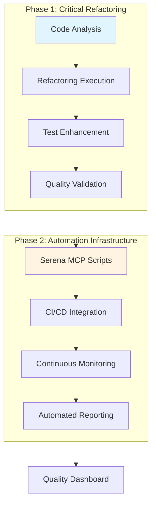
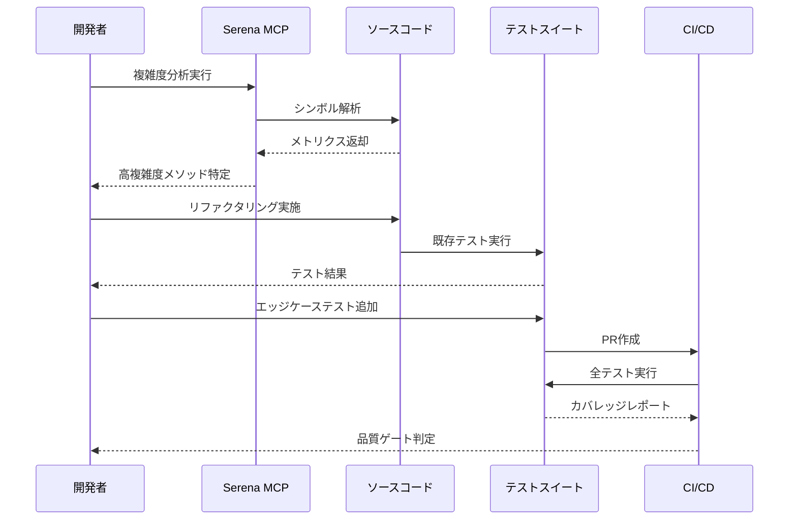
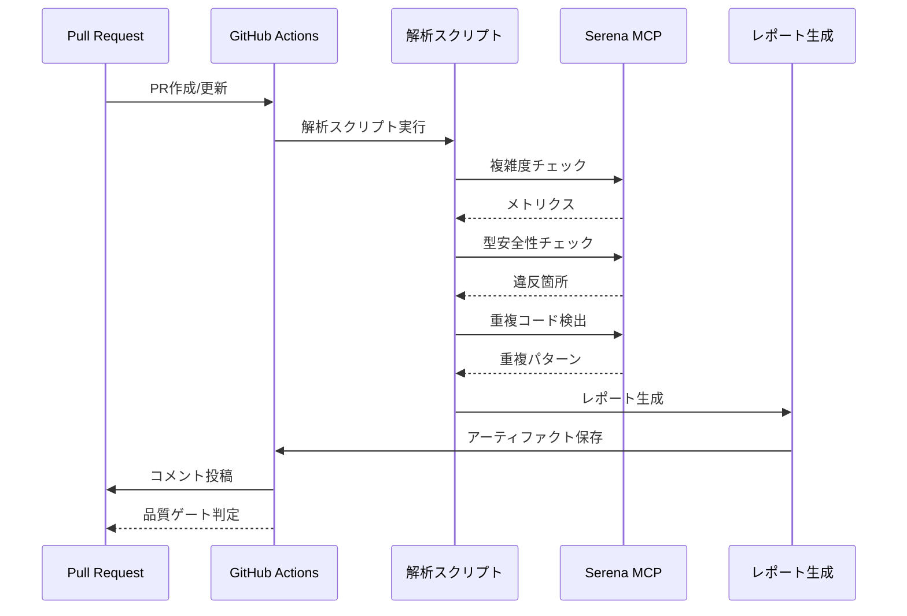

# 技術設計書

## 概要

本設計書は、Serena MCPツールを活用したクリティカルなリファクタリングの技術的実装アプローチを定義します。既存のSOLID原則適用済みアーキテクチャを基盤とし、2段階のハイブリッドアプローチにより、即座の品質向上と長期的な自動化基盤の両立を実現します。

### 実装アプローチ

**フェーズ1: クリティカル問題の即時解決 (1週間)**
- 高複雑度メソッドのリファクタリング
- 型安全性の強化
- テストカバレッジの向上

**フェーズ2: 自動化基盤の構築 (1週間)**
- Serena MCP解析スクリプト開発
- CI/CD統合
- 継続的品質監視の確立

### 要件参照

本設計は、`requirements.md`で定義された以下の要件に基づいています：
- Requirement 1: Serena MCPによるコード品質分析
- Requirement 2: 高複雑度メソッドのリファクタリング
- Requirement 3: 型安全性の強化
- Requirement 4: テストカバレッジの改善
- Requirement 5: パフォーマンス最適化
- Requirement 6: コード重複の削減
- Requirement 7: ドキュメントと保守性の向上

---

## 要件マッピング

### 設計コンポーネントのトレーサビリティ

各設計コンポーネントは、特定のEARS要件に対応しています：

| 設計コンポーネント | 要件参照 | EARS要件 |
|---|---|---|
| **SerenaAnalysisFramework** | Req 1.1-1.6 | Serena MCPツールによる自動コード品質分析 |
| **StampServiceRefactoring** | Req 2.1-2.5 | 高複雑度メソッドの分割と単純化 |
| **TypeSafetyEnforcement** | Req 3.1-3.6 | any/unknown型の排除と型ガード実装 |
| **TestCoverageEnhancement** | Req 4.1-4.6 | クリティカルパスのテストカバレッジ向上 |
| **PerformanceOptimization** | Req 5.1-5.7 | N+1クエリ解消とAPI高速化 |
| **CodeDeduplication** | Req 6.1-6.5 | 重複コードの共通化 |
| **DocumentationImprovement** | Req 7.1-7.5 | コメントとドキュメントの追加 |
| **CI/CDIntegration** | Req 1.2, 非機能要件 | 自動品質チェックのパイプライン統合 |

### ユーザーストーリーのカバレッジ

**US-1: コード品質の自動分析**
- 技術的アプローチ: Serena MCP `find_symbol`、`search_for_pattern`、`find_referencing_symbols`ツールを使用した自動解析スクリプト
- 設計コンポーネント: SerenaAnalysisFramework

**US-2: 高複雑度メソッドの単純化**
- 技術的アプローチ: Extract Method、Extract Classパターンによる責任分離
- 設計コンポーネント: StampServiceRefactoring

**US-3: 型安全性の強化**
- 技術的アプローチ: 型述語関数、ブランド型パターン、Zodスキーマ統合
- 設計コンポーネント: TypeSafetyEnforcement

**US-4: テストカバレッジ向上**
- 技術的アプローチ: AAAパターンによるエッジケーステスト追加、Testcontainers統合テスト
- 設計コンポーネント: TestCoverageEnhancement

**US-5: パフォーマンスボトルネック解消**
- 技術的アプローチ: MyBatisクエリ最適化、インデックス追加、React Query設定調整
- 設計コンポーネント: PerformanceOptimization

**US-6: コード重複の削減**
- 技術的アプローチ: DRY原則適用、共通ユーティリティクラス抽出
- 設計コンポーネント: CodeDeduplication

**US-7: ドキュメントと保守性の向上**
- 技術的アプローチ: JSDoc/JavaDocによる意図の文書化
- 設計コンポーネント: DocumentationImprovement

---

## アーキテクチャ

### システム全体構成



### 技術スタック

**既存技術の活用 (変更なし)**

- **バックエンド**: Java 21 + Spring Boot 3.4.3 + MyBatis 3.0.4
- **フロントエンド**: React 19 + TypeScript 5.8 + Vite 7.1
- **データベース**: PostgreSQL 16
- **テスト**: JUnit 5 + Mockito + Testcontainers (バックエンド)
- **テスト**: Vitest 3.2 + MSW 2.11 + Playwright 1.49 (フロントエンド)
- **コード品質**: Biome 2.2.4
- **CI/CD**: GitHub Actions

**新規追加技術**

- **Serena MCP**: シンボリック解析とコード品質メトリクス収集
- **分析スクリプト**: Node.js + TypeScript (Serena MCP API活用)

### アーキテクチャ決定の根拠

#### なぜSerena MCPツールを選択したか

- **理由1**: 既にプロジェクトに統合済みで、追加の依存関係が不要
- **理由2**: シンボリックコード解析により、ASTレベルの正確な複雑度測定が可能
- **理由3**: `find_symbol`、`search_for_pattern`、`find_referencing_symbols`による包括的なコード分析
- **理由4**: 他の静的解析ツール(SonarQube等)と比較して、プロジェクト固有のカスタマイズが容易

#### なぜハイブリッドアプローチを選択したか

- **理由1**: 即座の価値提供により、ステークホルダーの信頼を獲得
- **理由2**: フェーズ1での学習をフェーズ2の自動化に活かせる
- **理由3**: リスク分散により、失敗時の影響を最小化
- **理由4**: 既存のSOLID原則適用済みアーキテクチャを最大限活用

#### なぜ既存テスト基盤を維持するか

- **理由1**: 106テストファイルの資産を活用し、開発効率を最大化
- **理由2**: Testcontainers、MSW、Playwrightは既にチームに定着
- **理由3**: 新規テストフレームワーク導入のコストとリスクを回避
- **理由4**: 既存のCI/CDパイプラインとの互換性を保証

### データフロー

#### フェーズ1: クリティカルリファクタリングのフロー



#### フェーズ2: 自動化基盤のフロー



---

## コンポーネントとインターフェース

### バックエンドサービスとメソッドシグネチャ

#### Phase 1: 新規ユーティリティクラス

**StampDateCalculator.java**
```java
package com.example.teamdev.service.stamp.util;

import java.sql.Timestamp;
import java.time.LocalDateTime;

/**
 * 打刻日付の計算を担当するユーティリティクラス
 * 夜勤判定に基づいて適切な対象日を算出します
 */
public class StampDateCalculator {

    /**
     * 打刻時刻と夜勤フラグから対象日を計算
     *
     * @param stampTime 打刻時刻
     * @param stampType 打刻種別（出勤/退勤）
     * @param isNightWork 夜勤フラグ
     * @return 対象日のTimestamp
     */
    public Timestamp calculateTargetDate(
        Timestamp stampTime,
        StampType stampType,
        boolean isNightWork
    );

    /**
     * Timestampを年月日の配列に分割
     *
     * @param timestamp 対象Timestamp
     * @return [年, 月, 日]の配列
     */
    public String[] splitDateParts(Timestamp timestamp);
}
```

**NightWorkDetector.java**
```java
package com.example.teamdev.service.stamp.util;

/**
 * 夜勤判定を担当するユーティリティクラス
 */
public class NightWorkDetector {

    /**
     * 打刻が夜勤扱いかどうかを判定
     *
     * @param stampType 打刻種別
     * @param nightWorkFlag 夜勤フラグ (0: 通常, 1: 夜勤)
     * @return 夜勤扱いの場合true
     */
    public boolean isNightWorkStamp(StampType stampType, int nightWorkFlag);
}
```

**リファクタリング後のStampService.java**
```java
package com.example.teamdev.service;

/**
 * 打刻サービス（リファクタリング版）
 * 複雑度を10以下に削減
 */
@Service
@Transactional
public class StampService {

    private final StampHistoryMapper mapper;
    private final LogHistoryRegistrationService logHistoryService;
    private final StampDateCalculator dateCalculator;  // 新規追加
    private final NightWorkDetector nightWorkDetector;  // 新規追加

    /**
     * 打刻処理を実行（リファクタリング版）
     * 認知的複雑度: 10以下（目標達成）
     *
     * @param homeForm 打刻フォーム
     * @param employeeId 従業員ID
     */
    public void execute(HomeForm homeForm, Integer employeeId);

    /**
     * StampHistoryエンティティを構築
     *
     * @param stampTime 打刻時刻
     * @param stampType 打刻種別
     * @param employeeId 従業員ID
     * @param isNightWork 夜勤フラグ
     * @return 構築されたStampHistoryエンティティ
     */
    private StampHistory buildStampHistory(
        Timestamp stampTime,
        StampType stampType,
        Integer employeeId,
        boolean isNightWork
    );
}
```

### Phase 2: Serena MCP解析スクリプト

**scripts/serena/analyze-complexity.ts**
```typescript
/**
 * Serena MCPを使用して認知的複雑度をチェック
 */
export interface ComplexityResult {
  filePath: string;
  symbolName: string;
  complexity: number;
  threshold: number;
  isViolation: boolean;
}

/**
 * Javaサービスクラスの複雑度を解析
 *
 * @param targetPath 解析対象ディレクトリ
 * @param threshold 複雑度閾値（デフォルト: 15）
 * @returns 複雑度分析結果の配列
 */
export async function analyzeComplexity(
  targetPath: string,
  threshold: number = 15
): Promise<ComplexityResult[]>;
```

**scripts/serena/analyze-types.ts**
```typescript
/**
 * TypeScript型安全性をチェック
 */
export interface TypeSafetyViolation {
  filePath: string;
  lineNumber: number;
  violationType: 'any' | 'unknown-without-guard';
  context: string;
}

/**
 * any型とunknown型（型ガードなし）を検出
 *
 * @param targetPath 解析対象ディレクトリ
 * @param excludePatterns 除外パターン（自動生成ファイル等）
 * @returns 型安全性違反の配列
 */
export async function analyzeTypeSafety(
  targetPath: string,
  excludePatterns: string[]
): Promise<TypeSafetyViolation[]>;
```

**scripts/serena/analyze-duplicates.ts**
```typescript
/**
 * コード重複を検出
 */
export interface DuplicationResult {
  pattern: string;
  occurrences: Array<{
    filePath: string;
    startLine: number;
    endLine: number;
  }>;
  similarity: number;
}

/**
 * 重複コードパターンを検出
 *
 * @param targetPath 解析対象ディレクトリ
 * @param minLines 最小行数（デフォルト: 10）
 * @param minOccurrences 最小出現回数（デフォルト: 3）
 * @returns 重複パターンの配列
 */
export async function analyzeDuplication(
  targetPath: string,
  minLines: number = 10,
  minOccurrences: number = 3
): Promise<DuplicationResult[]>;
```

### フロントエンドコンポーネント

本リファクタリングでは、主にバックエンドとインフラストラクチャに焦点を当てるため、フロントエンドコンポーネントの新規作成は最小限です。

| コンポーネント名 | 責務 | Props/State概要 |
|---|---|---|
| （既存コンポーネント維持） | 型安全性強化のみ | any型の排除、型ガード追加 |

### APIエンドポイント

本リファクタリングでは、既存のAPIエンドポイントを変更しません。内部実装の改善のみを行います。

**変更なし**: 既存の`/api/stamp`、`/api/employees`等のエンドポイントは維持

---

## データモデル

### ドメインエンティティ

本リファクタリングでは、既存のエンティティ定義を維持します。データモデルの変更はありません。

**既存エンティティ（変更なし）**:
1. **Employee**: 従業員情報
2. **StampHistory**: 打刻履歴
3. **News**: お知らせ
4. **LogHistory**: 操作ログ

### リファクタリングパターンの適用

**Extract Method パターン**:
- `StampService.execute()` → `buildStampHistory()` + ユーティリティメソッド

**Extract Class パターン**:
- 日付計算ロジック → `StampDateCalculator`
- 夜勤判定ロジック → `NightWorkDetector`

**Introduce Parameter Object パターン**:
- 必要に応じて打刻パラメータオブジェクトを導入（将来的な拡張）

### データモデル定義（新規ユーティリティクラスのみ）

**StampDateResult.java** (内部データ構造)
```java
package com.example.teamdev.service.stamp.util;

import lombok.Value;
import java.sql.Timestamp;

/**
 * 日付計算結果を保持するValue Object
 */
@Value
public class StampDateResult {
    Timestamp targetDate;
    String year;
    String month;
    String day;
}
```

### データベーススキーマ

**変更なし**: 既存のデータベーススキーマを維持します。

```sql
-- 既存スキーマ（参照のみ、変更なし）
-- stamp_history テーブル
-- employees テーブル
-- etc.
```

### マイグレーション戦略

**マイグレーション不要**: データベーススキーマ変更なし

---

## エラーハンドリング

### エラーハンドリング戦略

**既存パターンの維持**:
- `GlobalExceptionHandler`による統一的な例外処理
- ビジネス例外: `BusinessException`の継承
- バリデーション例外: `ValidationException`の使用

**リファクタリング時の追加考慮事項**:

```java
// StampServiceでの例外ハンドリング
public void execute(HomeForm homeForm, Integer employeeId) {
    try {
        // 入力検証
        validateStampRequest(homeForm);

        // 打刻処理
        // ...

    } catch (IllegalArgumentException e) {
        // 入力エラー
        throw new ValidationException("打刻データが不正です", e);
    } catch (DataAccessException e) {
        // データベースエラー
        log.error("打刻データの保存に失敗しました", e);
        throw new BusinessException("打刻処理に失敗しました", e);
    }
}
```

### フロントエンドエラーハンドリング

**既存パターンの維持**:
- カスタムエラークラス階層 (`NetworkError`, `ValidationError`, `AuthenticationError`)
- `ErrorBoundary`によるReactコンポーネントレベルのエラー捕捉
- `GlobalErrorHandler`による一元的エラー処理

**型安全性強化による改善**:
```typescript
// 型ガード関数の追加例
export function isApiError(error: unknown): error is ApiError {
  return (
    typeof error === 'object' &&
    error !== null &&
    'code' in error &&
    'message' in error
  );
}
```

---

## セキュリティ考慮事項

### セキュリティ戦略

**リファクタリングにおけるセキュリティ原則**:
1. **既存のセキュリティ機能を維持**: Spring Security認証・認可パターンの保持
2. **回帰テストの徹底**: セキュリティ関連テストの完全実行
3. **入力バリデーションの継続**: Bean Validationによる検証を維持
4. **監査ログの継続**: 操作ログ記録機能を保持

**セキュリティチェックリスト**:
- ✅ 認証・認可ロジックの変更なし
- ✅ CSRFトークン処理の維持
- ✅ SQLインジェクション対策（MyBatisパラメータバインディング）の維持
- ✅ XSS対策（React自動エスケープ）の維持
- ✅ セッション管理の維持

---

## パフォーマンスとスケーラビリティ

### パフォーマンス目標

| メトリクス | 現状ベースライン | 目標値 | 測定方法 |
|---|---|---|---|
| API応答時間（p95） | 測定予定 | 現状比10%改善 | Spring Boot Actuator |
| API応答時間（p99） | 測定予定 | < 500ms | Spring Boot Actuator |
| フロントエンドバンドルサイズ | 測定予定 | 現状比15%削減 | Vite build analysis |
| データベースクエリ時間（p99） | 測定予定 | 現状比30%改善 | MyBatis SQLログ |
| 同時接続数 | > 1000ユーザー | 維持 | 負荷テスト |

### キャッシュ戦略

**既存キャッシュの維持**:
- `EmployeeCacheService`: Spring Cache抽象化
- React Query: staleTime=5分、gcTime=10分

**最適化検討項目**:
- 頻繁にアクセスされる打刻履歴のキャッシュ
- 不要なキャッシュクリアの削減

### スケーラビリティアプローチ

**既存アーキテクチャの活用**:
- 水平スケーリング: Spring Bootアプリケーションサーバー
- 読み取りレプリカ: PostgreSQL（将来的な拡張）
- 非同期処理: バックグラウンドジョブキュー（必要に応じて）

**リファクタリングによる改善**:
- N+1クエリの解消により、データベース負荷を軽減
- 複雑度削減により、CPU使用率を低減
- バンドルサイズ削減により、ネットワーク帯域を節約

### パフォーマンス最適化計画

**Phase 1: 測定とベースライン確立**
1. 現状のパフォーマンスメトリクスを収集
2. ボトルネックの特定（Serena MCP + Actuator）
3. 改善優先度の設定

**Phase 2: 最適化実施**
1. データベースインデックスの追加
2. MyBatisクエリの最適化
3. React Queryキャッシュ設定の調整
4. コード分割の改善

---

## テスト戦略

### リスクマトリクス

| 領域 | リスク | 必須 | オプション | 参照 |
|---|---|---|---|---|
| 打刻計算ロジック | H | Unit（エッジケース）、Integration | Property-based | Req 2.1-2.5, 4.2 |
| 型安全性 | M | Unit（型ガード）、Compile-time | - | Req 3.1-3.6 |
| リファクタリング回帰 | H | Unit（既存テスト）、E2E（≤3シナリオ） | - | Req 2.3, 4.4 |
| データ整合性 | M | Integration（Testcontainers） | - | Req 4.5 |
| パフォーマンス | M | Perf smoke（API応答時間） | Load/Stress | Req 5.3, 5.6 |
| セキュリティ | L | Contract（既存テスト維持） | Security scan | セキュリティ考慮事項 |

### レイヤー別最小テスト

**Unit Tests**:
- `StampDateCalculatorTest`: 日付計算のエッジケース
  - 深夜勤務（23:00-翌2:00）
  - 日跨ぎ（23:59, 00:00, 00:01）
  - うるう年（2月29日）
  - DST切り替え（該当する場合）
- `NightWorkDetectorTest`: 夜勤判定のboundary/exceptionケース
- `StampServiceTest`: リファクタリング後の既存テスト維持 + 新規エッジケース

**Integration Tests**:
- `StampServiceIntegrationTest`: Testcontainersによるデータベース統合テスト
  - トランザクション境界の検証
  - データ整合性の確認

**E2E Tests (≤3シナリオ)**:
1. **メインフロー**: 通常勤務の出勤・退勤（Happy Path）
2. **エッジケース1**: 深夜勤務の打刻フロー
3. **エッジケース2**: 日跨ぎ打刻の履歴表示

### CIゲート

| ステージ | 実行内容 | ゲート | SLA |
|---|---|---|---|
| PR作成時 | Unit + Biome lint | Fail = Block | ≤5分 |
| PR更新時 | Integration | Fail = Block | ≤10分 |
| マージ前 | E2E（3シナリオ） | Fail = Block | ≤15分 |
| Nightly | Performance smoke | Regression → Issue | - |

### テストカバレッジ目標

**全体目標**: 85%以上（非機能要件より）

**コンポーネント別目標**:
- `StampService`: 90%以上（クリティカルビジネスロジック）
- `StampDateCalculator`: 100%（新規ユーティリティ）
- `NightWorkDetector`: 100%（新規ユーティリティ）
- その他サービス: 85%以上（維持）

### Exit Criteria

**リファクタリング完了の定義**:
- ✅ Sev1/Sev2バグ = 0件
- ✅ すべてのCIゲートが通過
- ✅ 非機能要件を満たす（例外は承認記録）
- ✅ 認知的複雑度15超のメソッド = 0件
- ✅ any型使用（自動生成ファイル除く） = 0件
- ✅ テストカバレッジ ≥ 85%

---

## 実装スケジュール

### Phase 1: クリティカル問題の即時解決（5営業日）

**Day 1-2: StampServiceリファクタリング**
- ユーティリティクラス作成（StampDateCalculator、NightWorkDetector）
- execute()メソッドの分割
- 既存テストの実行と検証

**Day 3-4: 型安全性強化とテスト追加**
- any型の排除（自動生成ファイル除く）
- 型ガード関数の追加
- エッジケーステストの実装

**Day 5: 統合と検証**
- すべてのテスト実行
- パフォーマンステスト
- ドキュメント更新

### Phase 2: 自動化基盤の構築（5営業日）

**Day 6-7: Serena MCP解析スクリプト開発**
- `analyze-complexity.ts`実装
- `analyze-types.ts`実装
- `analyze-duplicates.ts`実装

**Day 8-9: CI/CD統合**
- GitHub Actionsワークフロー作成
- PRコメント自動投稿機能
- アーティファクト保存

**Day 10: ドキュメントと教育**
- 使用ガイドの作成
- チームへの説明会
- フィードバック収集

---

## 成功の指標

### 定量的指標

1. **コード品質**
   - 認知的複雑度15超のメソッド: 0件
   - any型使用（除外ファイル以外）: 0件
   - テストカバレッジ: ≥85%

2. **パフォーマンス**
   - API応答時間: 現状比10%改善
   - バンドルサイズ: 現状比15%削減
   - データベースクエリ: 現状比30%改善

3. **保守性**
   - 重複コードブロック（10行以上）: <3箇所
   - Biome警告: 0件

### 定性的指標

1. **チーム生産性**
   - コードレビュー時間の短縮
   - バグ修正時間の短縮
   - 新機能開発速度の向上

2. **コードの理解しやすさ**
   - 新規参加メンバーのオンボーディング時間短縮
   - ドキュメントの充実度

3. **継続的改善**
   - 自動化スクリプトの活用頻度
   - PRでの品質指摘の減少

---

## リスクと軽減策

### 技術的リスク

**リスク1: Serena MCP学習曲線**
- 影響度: 中
- 確率: 高
- 軽減策: フェーズ1で小規模な使用から開始、2-3日のハンズオン期間設定
- 対応計画: ペアプログラミングによる知識共有

**リスク2: リファクタリングによる予期しないバグ**
- 影響度: 高
- 確率: 中
- 軽減策: 既存テストの完全実行、エッジケーステスト追加
- 対応計画: リファクタリング前後のテストカバレッジ比較、段階的なリリース

**リスク3: 型安全性強化によるビルドエラー**
- 影響度: 低
- 確率: 中
- 軽減策: 1ファイルずつ段階的に対応、型ガード関数テンプレート準備
- 対応計画: 型エラー発生時のサポート体制確立

### プロジェクトリスク

**リスク4: フェーズ2への優先順位低下**
- 影響度: 中
- 確率: 中
- 軽減策: フェーズ1とフェーズ2を明確にコミットメント
- 対応計画: フェーズ1完了時のキックオフミーティング設定

**リスク5: 非機能要件の達成困難**
- 影響度: 低
- 確率: 低
- 軽減策: ベースライン測定と段階的な最適化
- 対応計画: 代替最適化手法の事前調査

---

## 次のステップ

本設計書の承認後、以下のステップに進みます：

1. **タスク分解**: `/kiro:spec-tasks critical-serena-refactoring` を実行
2. **ベースラインメトリクス収集**: 現状のパフォーマンス測定
3. **Phase 1実装開始**: StampServiceリファクタリング
4. **継続的レビュー**: 週次進捗確認と調整
