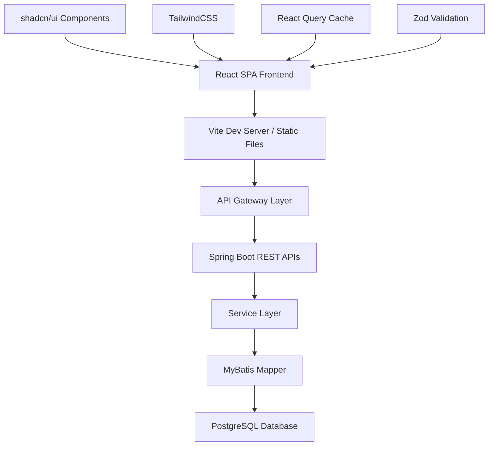
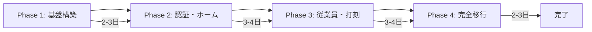
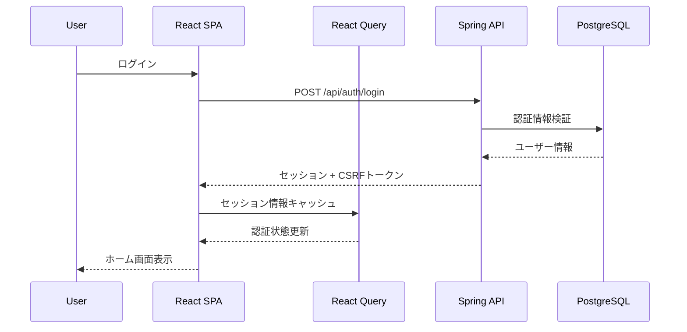
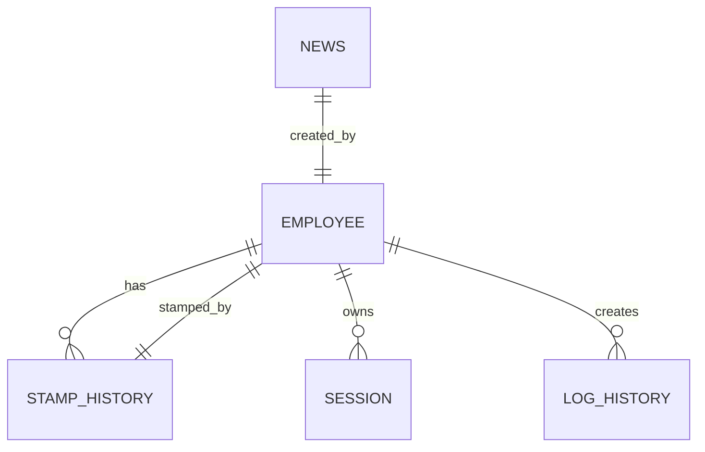

# テクニカルデザイン

## 概要

TeamDevelop Bravo勤怠管理システムのフロントエンドモダナイゼーションを、**アプローチC（機能優先戦略）**で実装します。このアプローチは段階的な価値提供を重視し、4つのフェーズで順次実装を進めることで、リスクを分散しながら早期にビジネス価値を提供します。

本設計では、React SPAへの完全移行、shadcn/uiとTailwindCSSによるUIモダナイゼーション、REST API完全性の確保を実現し、既存のSpring Bootバックエンドとの統合を維持しながら、モダンで保守性の高いシステムを構築します。

## 要件マッピング

### デザインコンポーネントの追跡可能性

各設計コンポーネントは特定の要件に対応します：

- **UIフレームワーク基盤** → 要件3: shadcn/ui + TailwindCSSによるUIモダナイゼーション
- **React SPA ルーター** → 要件1: Thymeleafからの完全移行
- **認証コンテキスト** → 要件5: 認証・セッション管理の統合
- **API クライアント層** → 要件4: REST API完全性の確保
- **データフェッチング層** → 要件7: パフォーマンス最適化
- **エラーバウンダリー** → 要件8: エラーハンドリングとユーザーフィードバック
- **型定義システム** → 要件9: TypeScript型安全性の徹底
- **ビルド最適化** → 要件6: 開発環境とビルドプロセスの整備

### ユーザーストーリーカバレッジ

- **開発者ストーリー（要件1）**: SPAフォワーディングコントローラーのみを使用し、レガシーコントローラーを段階的に削除
- **エンドユーザーストーリー（要件2）**: 既存画面機能をReactで再実装し、高速でレスポンシブな体験を提供
- **エンドユーザーストーリー（要件3）**: shadcn/uiコンポーネントとTailwindCSSによる直感的なUI
- **フロントエンド開発者ストーリー（要件4）**: 完全なREST APIによる独立した開発
- **セキュリティ管理者ストーリー（要件5）**: Spring Securityベースの認証維持

## アーキテクチャ



### テクノロジースタック

研究結果とベストプラクティスに基づく選定：

- **フロントエンド**: React 19.1.1 + TypeScript 5.8.3（strict mode）
- **UIフレームワーク**: shadcn/ui + Radix UI + TailwindCSS v4
- **状態管理**: TanStack Query v5.90.2 + Context API
- **ルーティング**: React Router v7.9.2
- **バリデーション**: Zod v4.1.11
- **ビルドツール**: Vite v7.1.7 + @tailwindcss/vite
- **テスティング**: Vitest + Testing Library + Playwright
- **バックエンド**: Spring Boot 3.4.3 + MyBatis（既存）
- **データベース**: PostgreSQL 16（既存）
- **認証**: Spring Security（セッションベース）

### アーキテクチャ決定の根拠

研究に基づく技術選定理由：

- **shadcn/ui選定理由**: Radix UIプリミティブによるアクセシビリティ保証、コンポーネントのコピー&カスタマイズ可能性、TypeScript完全サポート
- **TailwindCSS v4選定理由**: Viteネイティブ統合による高速ビルド、PurgeCSSによる最小バンドル、デザイントークンシステム
- **React Query選定理由**: 楽観的更新のネイティブサポート、キャッシュ無効化戦略、セッション管理との統合実績
- **Zod選定理由**: TypeScript型推論との完全統合、ランタイム検証、API レスポンス検証の実装容易性

### フェーズ別実装計画



### データフロー

主要ユーザーフローのシーケンス図：



## コンポーネントとインターフェース

### フロントエンドコンポーネント

| コンポーネント名 | 責務 | Props/State概要 |
|----------------|------|-----------------|
| AuthProvider | 認証コンテキスト管理 | session, csrfToken, login/logout関数 |
| AppLayout | レイアウト管理 | navigation, header, main content |
| SignInForm | ログインフォーム | email, password, validation, onSubmit |
| HomePage | ダッシュボード表示 | news, stampStatus, onStamp |
| EmployeeTable | 従業員テーブル | employees, onEdit, onDelete, filters |
| StampHistoryView | 打刻履歴表示 | history, yearMonth, employeeId |
| DataTablePagination | ページネーション | page, pageSize, total, onChange |
| Toast | 通知表示 | message, type, duration, onClose |
| ErrorBoundary | エラーキャッチ | fallback, onError, reset |
| LoadingSpinner | ローディング表示 | size, variant, className |

### バックエンドサービス（既存・拡張）

```typescript
// 既存APIの型定義
interface AuthService {
  login(credentials: LoginRequest): Promise<SessionResponse>
  logout(): Promise<void>
  getSession(): Promise<SessionInfo>
}

interface EmployeeService {
  list(filters?: EmployeeFilters): Promise<PagedResponse<Employee>>
  create(data: EmployeeCreateRequest): Promise<Employee>
  update(id: number, data: EmployeeUpdateRequest): Promise<Employee>
  delete(ids: number[]): Promise<void>
}

interface StampService {
  stamp(type: StampType): Promise<StampResponse>
  getHistory(params: HistoryParams): Promise<StampHistory[]>
  updateStamp(id: number, data: StampUpdateRequest): Promise<void>
  deleteStamp(id: number): Promise<void>
}

// 新規追加API
interface NewsService {
  list(filters?: NewsFilters): Promise<PagedResponse<News>>
  create(data: NewsCreateRequest): Promise<News>
  update(id: number, data: NewsUpdateRequest): Promise<News>
  delete(id: number): Promise<void>
  publish(id: number): Promise<void>
}

interface LogService {
  search(query: LogSearchQuery): Promise<PagedResponse<LogEntry>>
  export(params: ExportParams): Promise<Blob>
}
```

### APIエンドポイント

| メソッド | ルート | 目的 | 認証 | ステータスコード |
|---------|--------|------|------|-----------------|
| POST | /api/auth/login | ログイン | 不要 | 200, 400, 401 |
| GET | /api/auth/session | セッション確認 | 必須 | 200, 401 |
| POST | /api/auth/logout | ログアウト | 必須 | 204, 401 |
| GET | /api/employees | 従業員一覧 | 必須 | 200, 401, 500 |
| POST | /api/employees | 従業員作成 | 管理者 | 201, 400, 401, 403 |
| PUT | /api/employees/:id | 従業員更新 | 管理者 | 200, 400, 401, 403, 404 |
| DELETE | /api/employees | 従業員削除 | 管理者 | 204, 401, 403, 404 |
| GET | /api/home/overview | ホーム概要 | 必須 | 200, 401 |
| POST | /api/home/stamps | 打刻 | 必須 | 201, 400, 401 |
| GET | /api/stamp-history | 打刻履歴 | 必須 | 200, 401 |
| PUT | /api/stamp/:id | 打刻編集 | 管理者 | 200, 400, 401, 403, 404 |
| DELETE | /api/stamp/:id | 打刻削除 | 管理者 | 204, 401, 403, 404 |
| GET | /api/news | お知らせ一覧 | 必須 | 200, 401 |
| POST | /api/news | お知らせ作成 | 管理者 | 201, 400, 401, 403 |
| GET | /api/logs | ログ検索 | 管理者 | 200, 401, 403 |
| POST | /api/export/csv | CSV出力 | 必須 | 200, 400, 401 |

## データモデル

### ドメインエンティティ

1. **Employee**: 従業員情報
2. **StampHistory**: 打刻履歴
3. **News**: お知らせ
4. **LogHistory**: 操作ログ
5. **Session**: セッション情報

### エンティティ関係



### データモデル定義

```typescript
// フロントエンド型定義
interface Employee {
  employeeId: number
  employeeName: string
  email: string
  role: 'ADMIN' | 'USER'
  department: string
  createdAt: Date
  updatedAt: Date
}

interface StampHistory {
  id: number
  employeeId: number
  stampType: 'CLOCK_IN' | 'CLOCK_OUT' | 'BREAK_START' | 'BREAK_END'
  stampTime: Date
  location?: string
  note?: string
  createdAt: Date
  updatedAt: Date
}

interface News {
  newsId: number
  title: string
  content: string
  category: string
  publishedAt?: Date
  createdBy: number
  createdAt: Date
  updatedAt: Date
}

// Zodスキーマによる実行時検証
const EmployeeSchema = z.object({
  employeeId: z.number(),
  employeeName: z.string().min(1).max(100),
  email: z.string().email(),
  role: z.enum(['ADMIN', 'USER']),
  department: z.string(),
  createdAt: z.date(),
  updatedAt: z.date()
})

const LoginRequestSchema = z.object({
  email: z.string().email(),
  password: z.string().min(8)
})
```

### データベーススキーマ（既存）

```sql
-- 既存テーブル構造を維持
CREATE TABLE employee (
    employee_id SERIAL PRIMARY KEY,
    employee_name VARCHAR(100) NOT NULL,
    email VARCHAR(255) NOT NULL UNIQUE,
    password_hash VARCHAR(255) NOT NULL,
    role VARCHAR(20) NOT NULL,
    department VARCHAR(100),
    created_at TIMESTAMP NOT NULL DEFAULT CURRENT_TIMESTAMP,
    updated_at TIMESTAMP
);

CREATE TABLE stamp_history (
    id SERIAL PRIMARY KEY,
    employee_id INTEGER NOT NULL REFERENCES employee(employee_id),
    stamp_type VARCHAR(20) NOT NULL,
    stamp_time TIMESTAMP NOT NULL,
    location VARCHAR(255),
    note TEXT,
    created_at TIMESTAMP NOT NULL DEFAULT CURRENT_TIMESTAMP,
    updated_at TIMESTAMP
);

CREATE TABLE news (
    news_id SERIAL PRIMARY KEY,
    title VARCHAR(255) NOT NULL,
    content TEXT NOT NULL,
    category VARCHAR(50),
    published_at TIMESTAMP,
    created_by INTEGER NOT NULL REFERENCES employee(employee_id),
    created_at TIMESTAMP NOT NULL DEFAULT CURRENT_TIMESTAMP,
    updated_at TIMESTAMP
);

-- インデックス
CREATE INDEX idx_stamp_history_employee ON stamp_history(employee_id);
CREATE INDEX idx_stamp_history_stamp_time ON stamp_history(stamp_time);
CREATE INDEX idx_news_published ON news(published_at);
```

## エラーハンドリング

### フロントエンドエラー処理戦略

```typescript
// グローバルエラーハンドラー
class ErrorHandler {
  static handle(error: unknown): void {
    if (error instanceof ApiError) {
      this.handleApiError(error)
    } else if (error instanceof ValidationError) {
      this.handleValidationError(error)
    } else if (error instanceof NetworkError) {
      this.handleNetworkError(error)
    } else {
      this.handleUnknownError(error)
    }
  }

  private static handleApiError(error: ApiError): void {
    // Toast通知表示
    toast.error(error.message, {
      duration: 5000,
      action: error.retryable ? { label: '再試行', onClick: error.retry } : undefined
    })

    // 401の場合はログイン画面へリダイレクト
    if (error.status === 401) {
      queryClient.clear()
      navigate('/signin')
    }
  }
}
```

### React QueryエラーハンドリングとReact Error Boundary統合

```typescript
// React Query デフォルト設定
const queryClient = new QueryClient({
  defaultOptions: {
    queries: {
      retry: (failureCount, error) => {
        if (error instanceof ApiError && error.status === 401) return false
        return failureCount < 3
      },
      onError: (error) => ErrorHandler.handle(error)
    },
    mutations: {
      onError: (error) => ErrorHandler.handle(error)
    }
  }
})

// エラーバウンダリー
export function AppErrorBoundary({ children }: { children: ReactNode }) {
  return (
    <ErrorBoundary
      FallbackComponent={ErrorFallback}
      onError={(error) => {
        console.error('Uncaught error:', error)
        // Sentryなどのエラー追跡サービスに送信
      }}
      onReset={() => queryClient.clear()}
    >
      {children}
    </ErrorBoundary>
  )
}
```

## セキュリティ考慮事項

### 認証・認可実装

- **JWTベース認証**: ✗（セッションベースを維持）
- **セッションベース認証**: ✓ Spring Security統合
- **CSRFトークン**: Cookie + X-XSRF-TOKENヘッダー
- **ロールベースアクセス制御**: ADMIN/USER権限
- **入力検証**: Zodスキーマによるクライアント側検証 + Bean Validation

### セキュリティベストプラクティス

```typescript
// APIクライアント設定
const apiClient = axios.create({
  baseURL: '/api',
  withCredentials: true, // セッションCookie送信
  headers: {
    'Content-Type': 'application/json'
  }
})

// CSRFトークン自動付与
apiClient.interceptors.request.use((config) => {
  const csrfToken = getCsrfToken()
  if (csrfToken) {
    config.headers['X-XSRF-TOKEN'] = csrfToken
  }
  return config
})

// Content Security Policy
<meta http-equiv="Content-Security-Policy"
      content="default-src 'self'; script-src 'self' 'unsafe-inline'; style-src 'self' 'unsafe-inline';">
```

## パフォーマンス＆スケーラビリティ

### パフォーマンス目標

| メトリック | 目標値 | 測定方法 |
|-----------|--------|----------|
| 初回表示時間（LCP） | < 1.5秒 | Lighthouse |
| 対話可能時間（TTI） | < 2.0秒 | Lighthouse |
| APIレスポンス（p95） | < 200ms | APMツール |
| APIレスポンス（p99） | < 500ms | APMツール |
| バンドルサイズ | < 300KB（gzip） | webpack-bundle-analyzer |
| 同時接続ユーザー | > 1,000 | 負荷テスト |

### キャッシング戦略

- **ブラウザキャッシュ**: 静的アセット（max-age=31536000）
- **React Query キャッシュ**:
  - ユーザー情報: 5分
  - 従業員一覧: 30秒
  - 打刻履歴: 1分
- **CDN**: 画像・静的コンテンツ
- **サービスワーカー**: オフライン対応（将来実装）

### 最適化アプローチ

```typescript
// コード分割
const EmployeeAdmin = lazy(() => import('./features/employees/EmployeeAdmin'))
const StampHistory = lazy(() => import('./features/stamp/StampHistory'))

// 仮想スクロール（大量データ）
import { useVirtualizer } from '@tanstack/react-virtual'

// React Query楽観的更新
const stampMutation = useMutation({
  mutationFn: stampApi.create,
  onMutate: async (newStamp) => {
    await queryClient.cancelQueries(['stamps'])
    const previousStamps = queryClient.getQueryData(['stamps'])
    queryClient.setQueryData(['stamps'], old => [...old, newStamp])
    return { previousStamps }
  },
  onError: (err, newStamp, context) => {
    queryClient.setQueryData(['stamps'], context.previousStamps)
  },
  onSettled: () => {
    queryClient.invalidateQueries(['stamps'])
  }
})
```

## テスト戦略

### リスクマトリックス

| エリア | リスク | 必須 | オプション | 参照 |
|--------|--------|------|------------|------|
| 認証/認可 | 高 | Unit, Integration, E2E | Security | 要件5 |
| 外部API | 中 | Contract, Integration | Resilience | 要件4 |
| データ整合性 | 高 | Unit, Property | Integration | 要件2 |
| 重要UXフロー | 高 | E2E (3つ以下) | A11y | 要件3 |
| パフォーマンス | 中 | Perf smoke | Load/Stress | 要件7 |

### 階層別最小テスト

- **Unit**: ビジネスロジックの境界/例外ケース
- **Integration**: DB/外部依存統合
- **Contract**: OpenAPI仕様準拠
- **E2E**: ログイン、打刻、従業員管理の主要フロー

### CIゲート

| ステージ | 実行 | ゲート | SLA |
|---------|------|--------|-----|
| PR | Unit + TypeScript | 失敗=ブロック | ≤3分 |
| Staging | Integration + E2E | 失敗=ブロック | ≤10分 |
| Nightly | Performance | 回帰→issue | - |

### 終了基準

- Sev1/Sev2バグ = 0
- すべてのCIゲート通過
- TypeScript strict mode違反 = 0
- テストカバレッジ > 80%
- Lighthouseスコア > 90

## 移行戦略と実装上の考慮事項

### shadcn/uiコンポーネント段階的導入戦略

**課題**: 既存UIとshadcn/uiコンポーネントの混在期間における一貫性維持

**解決策**:
```typescript
// 共通コンポーネントラッパー層の実装
// Phase 1で作成し、既存UIをラップしながら段階的に内部実装を置換

// components/ui/button-wrapper.tsx
export const Button = ({ variant, ...props }: ButtonProps) => {
  // 移行期間中: 既存スタイルとshadcn/uiを条件分岐
  if (featureFlag.useShadcnButton) {
    return <ShadcnButton variant={variant} {...props} />
  }
  return <LegacyButton className={mapToLegacyStyles(variant)} {...props} />
}

// スタイルマッピングユーティリティ
const mapToLegacyStyles = (variant: string): string => {
  const styleMap = {
    'default': 'btn-primary',
    'secondary': 'btn-secondary',
    'destructive': 'btn-danger'
  }
  return styleMap[variant] || 'btn-default'
}
```

**実装方針**:
1. Phase 1で共通インターフェースを定義
2. 既存コンポーネントをラッパーで包む
3. 内部実装を段階的にshadcn/uiに置換
4. スタイルガイドドキュメントで一貫性を保証

### レガシーコントローラーとの並行稼働戦略

**課題**: `@Profile("legacy-ui")`コントローラーと新REST APIの競合回避

**解決策**:
```java
// Spring Profilesによる明確な切り替え
@Configuration
public class WebMvcConfig {
    @Bean
    @Profile("!legacy-ui")  // レガシーUIが無効の場合のみ有効
    public WebMvcConfigurer spaRoutingConfigurer() {
        return new WebMvcConfigurer() {
            @Override
            public void addViewControllers(ViewControllerRegistry registry) {
                // SPAフォールバックルーティング
                registry.addViewController("/{path:[^\\.]*}")
                        .setViewName("forward:/index.html");
            }
        };
    }
}

// Feature Flagによる段階的切り替え
@RestController
@RequestMapping("/api")
public class FeatureFlagController {
    @GetMapping("/features")
    public Map<String, Boolean> getFeatureFlags() {
        return Map.of(
            "useLegacyAuth", !profileActive("spa-auth"),
            "useReactUI", profileActive("react-ui"),
            "enableShadcnComponents", profileActive("shadcn-ui")
        );
    }
}
```

**移行計画**:
1. 開発環境: `spring.profiles.active=dev,react-ui`
2. ステージング: `spring.profiles.active=staging,react-ui,legacy-ui`（並行稼働）
3. 本番環境: 段階的にlegacy-uiプロファイルを削除

### 型安全性保証とAPI契約同期

**課題**: フロントエンド型定義とバックエンドDTOの同期維持

**解決策**:
```typescript
// OpenAPIからの型自動生成パイプライン
// package.json
{
  "scripts": {
    "generate:api-types": "openapi-typescript http://localhost:8080/v3/api-docs --output ./src/types/api.ts",
    "generate:zod-schemas": "openapi-zod-client http://localhost:8080/v3/api-docs --output ./src/schemas/api.ts"
  }
}

// 生成された型とZodスキーマの使用
import { components } from '@/types/api'
import { schemas } from '@/schemas/api'

type Employee = components['schemas']['Employee']
const EmployeeSchema = schemas.Employee

// API クライアントでの型安全な実装
const apiClient = {
  employees: {
    list: async (): Promise<Employee[]> => {
      const response = await fetch('/api/employees')
      const data = await response.json()
      return EmployeeSchema.array().parse(data) // 実行時検証
    }
  }
}

// React Queryフックでの型推論
export const useEmployees = () => {
  return useQuery({
    queryKey: ['employees'],
    queryFn: apiClient.employees.list,
    // 戻り値の型は自動的にEmployee[]として推論される
  })
}
```

**CI/CDパイプライン統合**:
```yaml
# .github/workflows/api-contract.yml
name: API Contract Test
on: [push, pull_request]

jobs:
  contract-test:
    runs-on: ubuntu-latest
    steps:
      - name: Generate API types
        run: npm run generate:api-types

      - name: Check for type changes
        run: git diff --exit-code src/types/api.ts

      - name: Run contract tests
        run: npm run test:api-contract
```

## 実装フェーズ詳細

### Phase 1: UIフレームワーク基盤構築（2-3日）

**実装内容**:
- TailwindCSS v4 + @tailwindcss/vite設定
- shadcn/ui初期設定とコンポーネント追加
- **共通コンポーネントラッパー層の作成**（新規追加）
- 基本レイアウトコンポーネント作成
- カラーシステムとデザイントークン設定
- **OpenAPI型生成パイプラインの設定**（新規追加）

**成果物**:
- `tailwind.config.ts`設定完了
- `components.json`設定
- Button, Card, Toast等の基本コンポーネント
- **コンポーネントラッパー層**（新規追加）
- **型生成スクリプトとCI統合**（新規追加）
- ダークモード対応

### Phase 2: 認証・ホーム画面（3-4日）

**実装内容**:
- SignInPageのshadcn/ui移行
- AuthProviderとセッション管理
- HomePageダッシュボード実装
- CSRFトークン統合

**成果物**:
- 完全なログイン/ログアウトフロー
- ホーム画面のお知らせ表示
- 打刻ボタン機能

### Phase 3: 従業員管理・打刻機能（3-4日）

**実装内容**:
- DataTable実装（TanStack Table）
- 従業員CRUD画面
- 打刻履歴表示
- CSV出力機能

**成果物**:
- 従業員管理画面完成
- 打刻履歴機能完成
- データエクスポート機能

### Phase 4: 完全移行・レガシー削除（2-3日）

**実装内容**:
- レガシーコントローラー削除
- 残りのAPI実装
- パフォーマンス最適化
- 最終テスト

**成果物**:
- Thymeleaf完全削除
- 全画面React化完了
- プロダクションビルド最適化
