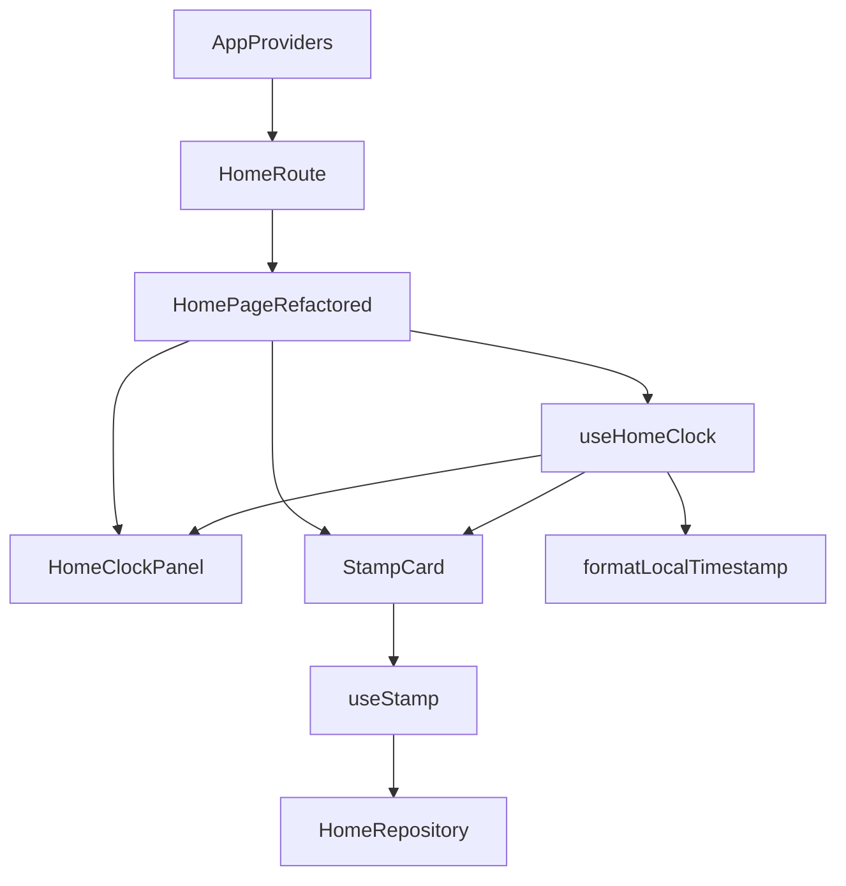
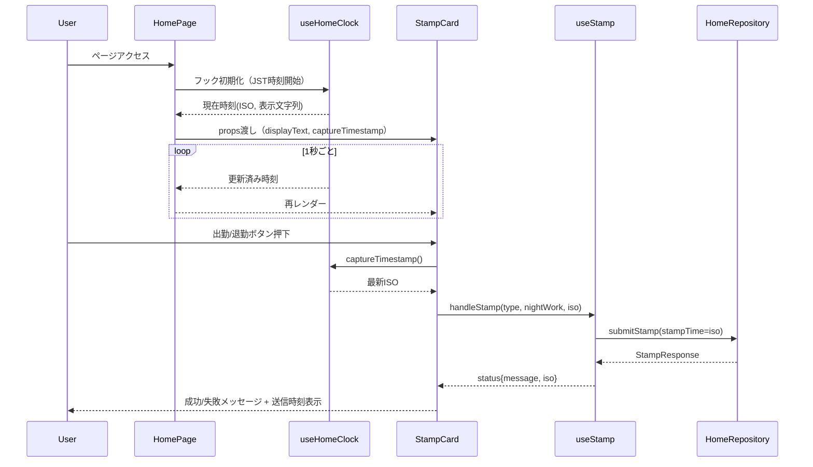

# Overview
本機能はホームダッシュボードにリアルタイムの日本標準時を表示し、利用者が視認した時刻と打刻APIに送信する時刻を一致させることで打刻データの信頼性を向上させる。従業員はホーム画面で秒単位の時刻を確認でき、打刻ボタン押下時には同一ロジックで取得したタイムスタンプが送信および結果表示に利用される。

対象ユーザーは日常的にホーム画面から出勤・退勤打刻を行う従業員であり、時刻確認と打刻操作を一つの画面で完了させるワークフローを支援する。本機能により、従来は別途時計アプリ等で確認していた時刻を画面上で完結させ、入力ミスや時刻差異によるトラブルを防止する。

### Goals
- JST固定の現在時刻をホーム画面に秒単位で表示し続ける。
- 表示中の時刻と打刻APIへ送信する`stampTime`を同一ソースで生成する。
- 打刻成功/失敗時に利用したタイムスタンプをユーザーが確認できるようにする。

### Non-Goals
- タイムゾーン切替やユーザーごとの表示形式変更。
- オフライン環境での打刻結果のキャッシュや再送制御。
- 打刻APIのサーバーサイド仕様変更。

## Architecture

### Existing Architecture Analysis
- ホームダッシュボードは`HomePageRefactored`が`useDashboard`（React Query）と`useStamp`（Mutation）を組み合わせて構築している。
- 打刻用`useStamp`は`formatLocalTimestamp`でJSTタイムスタンプを生成しAPIへ送信、結果は`StampCard`のメッセージ領域に流す。
- 現状、UI内に時刻表示は存在せず、打刻メッセージにタイムスタンプは含まれない。
- `HomePageRefactored`はローディング時にスケルトン、エラー時に専用カードを返しており、これらの分岐でも時計表示を維持する必要がある。

### High-Level Architecture


**Architecture Integration**
- Existing patterns preserved: React Queryによる`useDashboard`、Repository + Zodバリデーション、`formatLocalTimestamp`のJST固定化。
- New components rationale: `useHomeClock`でリアルタイム時刻管理、`HomeClockPanel`でUI責務を分離、`StampCard`改修で同期表示。
- Technology alignment: 既存のdayjs + timezoneユーティリティを再利用し、新規外部依存は導入しない。
- Steering compliance: 単一責務コンポーネント化・依存逆転・型安全性といった既定パターンに従い、features/home配下で完結させる。

### Technology Alignment
- Frontend: React 19 + TypeScript strictの既存スタックをそのまま適用。`useEffect`と`setInterval`で1秒更新を実装し、クリーンアップでリーク防止。
- Utilities: `formatLocalTimestamp`をシングルトンユーティリティとして共通利用。表示用にはISO文字列からフォーマット変換するヘルパーを`features/home/lib/clockFormat.ts`（新規）に定義。
- State管理: 時計状態は`useHomeClock`内の`useState`で管理し、`useRef`で最新ISOを保持して打刻時に副作用なく取得する。
- テスト: Vitest + Testing LibraryでフックとUIコンポーネントの単体テストを追加し、既存`useStamp`テストをアップデート。

### Key Design Decisions
- **Decision**: `useHomeClock`フックで時刻表示と打刻用タイムスタンプソースを一元管理する。  
  **Context**: 表示と送信のタイムスタンプ差異をなくしたい。  
  **Alternatives**: 1) `StampCard`内で`setInterval`を直接実装、2) グローバルContextで時計を共有、3) 既存`useStamp`に時計ロジックを内包。  
  **Selected Approach**: `HomePageRefactored`が`useHomeClock`を呼び出し、表示文字列と`getCurrentIso()`を子コンポーネントへprops提供。  
  **Rationale**: ホーム画面限定の関心事をローカルに閉じつつ、UIと打刻の両方で同じソースを利用できる。  
  **Trade-offs**: 他画面で再利用する場合は追加ラップが必要。

- **Decision**: `useStamp`に`timestampProvider`と`onStampCaptured`を追加し、送信タイムスタンプを外部から注入・公開する。  
  **Context**: 表示タイムスタンプと送信タイムスタンプの一致、および成功メッセージへの時刻表示を実現したい。  
  **Alternatives**: 1) `useStamp`内部で時計フックを呼ぶ、2) APIレスポンスにサーバー時刻を追加要求。  
  **Selected Approach**: 既定は`formatLocalTimestamp`、ホーム画面では`useHomeClock`から注入し、成功時に`onStampCaptured({ iso, type })`を通知。  
  **Rationale**: 既存テストと他画面実装への影響を最小化し、依存逆転を保てる。  
  **Trade-offs**: 呼び出し側でプロバイダ関数を渡す実装コストが発生。

- **Decision**: 打刻結果表示に`StampStatus`モデルを導入し、メッセージとタイムスタンプを分離する。  
  **Context**: 成功/失敗メッセージにタイムスタンプを混在させると文言管理が難しい。  
  **Alternatives**: 1) 既存`message`文字列にタイムスタンプを連結、2) UI側で`message`と`lastTimestamp`を個別管理。  
  **Selected Approach**: `useStamp`が`status`オブジェクトを返し、`StampCard`でレイアウト制御。  
  **Rationale**: テストで検証しやすく、将来的に詳細を追加しやすい。  
  **Trade-offs**: 既存呼び出し側の型調整が必要。

## System Flows


## Requirements Traceability
- **R1-1 / R1-2**: `useHomeClock` + `HomeClockPanel`で秒単位更新、`setInterval`管理、表示コンポーネントは`HomePageRefactored`とエラービュー双方に組み込み。
- **R1-3**: `HomeClockPanel`は`dataState`に依存せず独立レンダリングし、エラーカード内にも表示領域を追加。
- **R2-1 / R2-2**: `useStamp`へ`timestampProvider`を注入し、クリック時に取得したISO値をAPI送信かつ`pending`中保持。
- **R2-3**: `StampStatus`で`submittedAt`を保持し、成功時UIが明示表示。
- **R2-4**: 失敗時は`status`を`null`に維持、時計表示は`useHomeClock`により継続。
- **R3-1 / R3-2 / R3-3**: `useHomeClock`が例外時に`status: "error"`へ遷移しフォールバック文言を表示、復旧時に`status: "ready"`へ戻し、打刻処理・キャッシュ無効化とは独立運用。

## Components and Interfaces

### Home Dashboard UI
- **HomePageRefactored (既存強化)**  
  - 役割: 時計データを初期化し、ヒーロー/エラー/カードレイアウトへ配信。  
  - 主要変更: `const clock = useHomeClock()`、`HomeClockPanel`をヒーローセクション上部に配置、エラー時の返却JSXへ時計情報を挿入。  
  - Props/依存: `useDashboard`, `useStamp`, `useHomeClock`。  
  - インターフェース: `StampCard`へ`clock.displayText`, `clock.captureTimestamp`, `clock.lastCaptured`を渡す。

- **HomeDashboardSkeleton (既存強化)**  
  - 役割: ローディング中にも時計プレースホルダーまたはリアル時刻を表示。  
  - 対応: `HomeClockPanel`の`mode="skeleton"`でレイアウト揃え、1秒更新は不要（視覚的ズレ回避）。

### Time Synchronization Layer
- **useHomeClock (新規フック)**  
  - 役割: JST時刻の管理、表示文字列生成、打刻用ISO取得、エラーフォールバック。  
  - API:  
    ```ts
    type HomeClockStatus = "ready" | "error";
    type HomeClockState = {
      displayText: string; // 例: "2025年11月2日(日) 09:15:42"
      isoNow: string; // ISO8601
      status: HomeClockStatus;
      captureTimestamp: () => string;
      lastCaptured?: string;
      resetError: () => void;
    };
    ```  
  - 実装方針: `useEffect`で`setInterval`(1000ms)を開始、`try`ブロック内で`formatLocalTimestamp`→`formatClockDisplay`。例外時は`status="error"`＋メッセージ保持。

- **HomeClockPanel (新規コンポーネント)**  
  - 役割: 時計表示UIとフォールバックメッセージの描画。  
  - Props: `{ state: HomeClockState; variant: "hero" | "card" | "compact"; }`。  
  - UI仕様: `status==="error"`時は警告アイコン＋「現在時刻を取得できません…」、`status==="ready"`時はフォントペアリングをTailwindで調整。

- **clockFormat.ts (新規ライブラリ)**  
  - 役割: ISO文字列から表示用文字列を生成（`dayjs.tz().format("YYYY年MM月DD日(ddd) HH:mm:ss")`）。  
  - テスト: `clockFormat.test.ts`で曜日表記やゼロ埋めを検証。

### Stamp Synchronization Layer
- **useStamp (既存拡張)**  
  - 追加シグネチャ:  
    ```ts
    type TimestampProvider = () => string;
    type StampCapturedListener = (input: { iso: string; type: "1" | "2" }) => void;

    function useStamp(
      repository?: IHomeRepository,
      options?: {
        timestampProvider?: TimestampProvider;
        onStampCaptured?: StampCapturedListener;
      }
    ): {
      handleStamp: (type: "1" | "2", nightWork: boolean) => Promise<void>;
      isLoading: boolean;
      status: StampStatus | null;
      clearStatus: () => void;
    };
    ```  
  - `StampStatus`: `{ message: string; submittedAt: string; type: "1" | "2"; result: "success" | "error" | "conflict"; }`。  
  - 挙動: `timestampProvider`未指定時は既存の`formatLocalTimestamp`を使用。`onStampCaptured`はAPIリクエスト開始時に発火し、`useHomeClock`側が`lastCaptured`を更新。

- **StampCard (既存拡張)**  
  - 変更点:  
    - Propsに`clockDisplay`, `clockStatus`, `onCaptureTimestamp`, `submittedStatus`を追加。  
    - ボタン押下時に`const iso = onCaptureTimestamp(); handleStamp(type, nightWork, iso);`。  
    - 成功メッセージ領域に「打刻時刻: HH:mm:ss」を追加表示。  
    - 失敗時には`submittedStatus`を非表示、既存メッセージロジックは`status.message`を利用。
  - アクセシビリティ: 時計表示に`aria-live="polite"`を設定し、スクリーンリーダーへ秒更新を通知（頻度1秒のため`polite`を採用）。

## Error Handling
- **時計初期化エラー**: `useHomeClock`が例外捕捉→`status="error"`、UIはフォールバック文言とマニュアル確認の案内を表示。`resetError`で再試行可能。  
- **打刻送信エラー**: 既存`useStamp`フローを継承しつつ、`status.result="error"`を設定。時計表示は影響を受けない。  
- **サーバー未応答**: `isNetworkIssue`など既存ロジックを継承、ユーザーには最新の時計表示とエラー文言を同時提示。  
- **衝突エラー**: `result="conflict"`で明示。UIは衝突メッセージの下にクリック時刻を参考情報として表示。
- **監視**: 既存トースト通知に加え、時計エラー時には`console.warn`と`Sentry`（既存インテグレーション）へのイベント送信を追加予定（実装タスクで詳細化）。

## Testing Strategy
- **Unit**  
  - `useHomeClock`で秒更新とエラーフォールバック、`captureTimestamp`が最新ISOを返すことを検証。  
  - `clockFormat`で曜日・ゼロ埋め・エラーハンドリングをテスト。  
  - `useStamp`の新オプションを追加検証（プロバイダ/リスナー動作）。  
- **Integration (Component)**  
  - `StampCard`レンダリングテストで時計表示、成功メッセージへの時刻表示、エラー時非表示を確認。  
  - `HomePageRefactored`をMSWモックと組み合わせ、ローディング・エラー時も時計が描画されることを確認。  
- **E2E (Playwright)**  
  - ホーム画面で時計が更新されることを`page.waitForFunction`で確認。  
  - 打刻成功モック時にメッセージと共に送信時刻が表示されることを検証。  
- **Regression**  
  - 既存`useStamp`テストを更新し、`status`オブジェクトの期待値を追加。  
  - `formatLocalTimestamp`モックのまま新APIでも整合することを確認。

## Security Considerations
- 時計表示はクライアントサイドでのみ利用し、機密データを扱わないため新たな脅威はない。  
- 打刻送信時刻をクライアントが決定する点は従来と同様であり、サーバー側の二重打刻/タイムゾーン検証ロジックを変更しない。

## Performance & Scalability
- `setInterval`は1秒周期で最小限のレンダリング。`useMemo`でフォーマット済み文字列を保持し、再レンダー負荷を抑制。  
- 時計更新はCPUコストが軽微だが、React再レンダー増を抑えるため時計関連DOMを小規模に保つ。  
- 追加のAPIリクエストは存在せず、React Queryキャッシュ無効化への影響はない。

