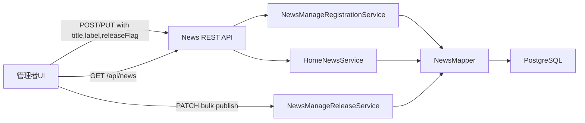
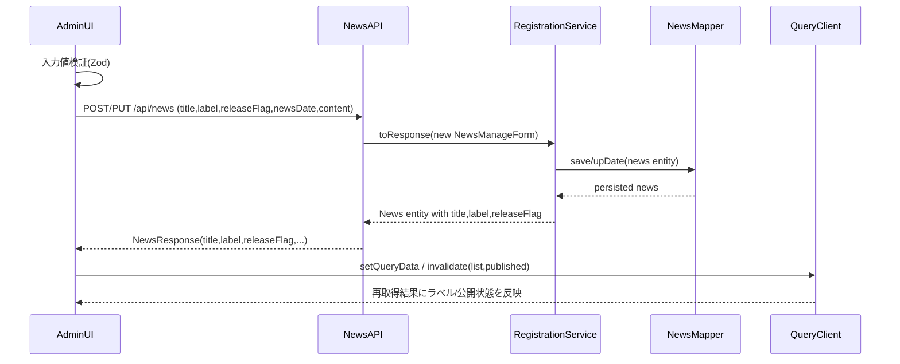
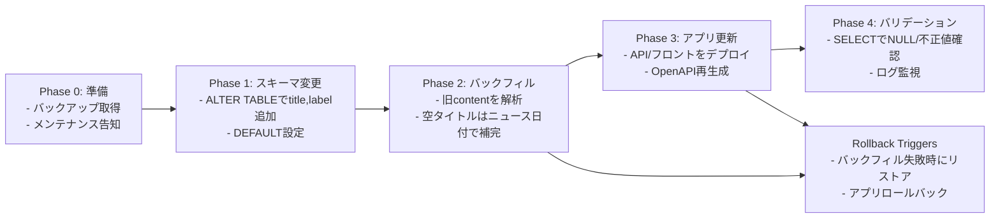

# Design Document

## Overview 
この機能は、お知らせ管理フォームに公開トグル・タイトル・ラベル入力を追加し、管理者が一度の操作で公開属性と分類情報を整備できるようにする。管理者は新規作成と既存お知らせの編集の両方で統一された入力体験を得られる。
対象ユーザーは管理者ロールであり、ダッシュボード上の「お知らせ管理」ワークフローにおいて効率的な公開設定と分類調整を行う。既存の公開切替APIとの整合を保ちながら、サーバー・クライアント双方のデータモデルを拡張し、公開一覧・ホーム画面表示まで一貫性を確保する。
本変更により、`content`から暗黙的にカテゴリを導出していた現行仕様を廃止し、リレーショナルデータベースおよびOpenAPI契約に明示的な`title`・`label`列を追加するため、スキーママイグレーションとバックフィルが必要となる。

### Goals
- フォームで公開状態・タイトル・ラベルを編集可能にし、保存結果を即時反映する。
- ラベル候補を「重要」「システム」「一般」の定義済みセットに制限し、UI表示とAPI契約を同期する。
- 新データモデルを公開一覧・ホーム画面表示・React Queryキャッシュと整合させる。

### Non-Goals
- ラベル候補の動的管理UIは対象外（将来のマスタ管理はConsiderationにとどめる）。
- リッチテキストエディタ導入や内容編集フローの大幅なUI刷新。
- バルク公開APIの仕様変更（個別保存と共存させる）。

## Architecture

### Existing Architecture Analysis
- バックエンドは`NewsManageRegistrationService`を中心に`NewsManageForm`で日付・内容を受け付ける構造。公開切替は`NewsManageReleaseService`が担当し、PATCHリクエスト経由。
- フロントエンドは`NewsFormModal.tsx`が日付・内容をZodで検証し、React Queryミューテーションで`createNews`/`updateNews`を呼び出す。カテゴリ表示は`newsViewModel.ts`が`content`先頭の【カテゴリ】表記を解析してBadge表示に使用。
- View層は`NewsManagementPage`でテーブル表示、`PublishedNewsGrid`で公開カード表示を行う。`HomeNewsService`が公開ニュースをホーム画面に供給するため、レスポンス拡張が必要。

### 高レベルアーキテクチャ

**Architecture Integration**:
- 既存のController/Service/Mapper層は維持し、DTOとエンティティを拡張して新フィールドを扱う。
- 新規コンポーネントは最小限に抑え、ラベル定義は`AppConstants.News`に列挙型を追加し、TypeScript側はliteral unionで同期する。
- オープンAPI型生成のワークフロー（`npm run generate:api`）を継続し、タイプセーフなクライアントとの整合を保つ。

### Technology Alignment
- バックエンド: Spring Boot 3 + MyBatis、既存のBean Validationを拡張して`@Size`, `@Pattern`でタイトル・ラベルを検証。
- フロントエンド: React 19 + React Hook Form + Zod。タイトル100文字制限とラベル選択（radioまたはselect）をZodで表現。公開トグルはshadcn/uiの`Switch`を活用。
- Shared: OpenAPI生成ファイル`types.gen.ts`を再生成し、`NewsResponse`等に新プロパティを追加。
- 追加依存なし。既存ユーティリティ（`useNews`）にオプションフィールドを追加するのみ。

### Key Design Decisions
1. **Decision**: 公開状態をフォーム保存リクエストに統合する。  
   **Context**: 要件R4で保存操作と公開状態の同時更新を求める。  
   **Alternatives**: (a) 既存PATCH APIを継続利用しフォーム保存後に追加呼び出し、(b) 新規トグル専用APIを追加。  
   **Selected Approach**: `NewsCreateRequest`/`NewsUpdateRequest`に`releaseFlag`を追加し、POST/PUTで公開状態を更新。  
   **Rationale**: 二重送信を避け、トランザクション境界を単一に保ち、履歴記録ロジックを簡潔にする。  
   **Trade-offs**: 既存PATCH APIとの整合が必要だが、バルク操作との共存は維持（PATCHは引き続きサポート）。

2. **Decision**: ラベル候補をサーバー側の定数`enum`とTypeScript literal unionで共有する。  
   **Context**: 要件R2で許可ラベルを限定し、サーバー・クライアント間の整合が重要。  
   **Alternatives**: (a) DBテーブルでラベルを管理、(b) フロントのみ定義。  
   **Selected Approach**: サーバー`AppConstants.News.Label`とTS側`NewsLabel`を揃え、OpenAPIスキーマでenum化。  
   **Rationale**: マスタ管理は将来課題だが現行要件に十分。型生成により型安全性を担保。  
   **Trade-offs**: ラベルの追加はコード変更を要するが、現段階では要件と一致。

3. **Decision**: 既存ViewModelのカテゴリ派生ロジックを廃止し、APIレスポンスの`label`を用いる。  
   **Context**: 旧ロジックは`content`の先頭に依存し、要件R2と矛盾。  
   **Alternatives**: (a) 従来ロジックを残しつつ優先度を切り替え、(b) Content内タグと明示ラベルの二重管理。  
   **Selected Approach**: `NewsViewModel`をラベルとタイトルをそのまま表示する単純構造へリファクタ。  
   **Rationale**: UIの一貫性が向上し、バックフィル後はcontentに依存しない。  
   **Trade-offs**: 旧フォーマットのcontentからラベル情報を削除する場合、移行期間に互換性を確保する必要あり。

## System Flows

## Requirements Traceability
| Requirement | 概要 | 関連コンポーネント | インターフェース | フロー |
|-------------|------|--------------------|-------------------|--------|
| R1 | フォームに公開/タイトル/ラベルを表示 | `NewsFormModal`, `NewsManageRegistrationService` | POST/PUT `/api/news` | 保存シーケンス |
| R2 | ラベル候補と表示一貫性 | `NewsFormModal`, `NewsManagementPage`, `AppConstants.News` | OpenAPI `NewsLabel` enum | 保存シーケンス + 一覧再描画 |
| R3 | 入力検証と既定値 | `NewsFormSchema`(Zod), `NewsManageForm`, `NewsCreate/UpdateRequest` | バリデーションエラー | フォームローカル検証 |
| R4 | 公開状態保存/応答 | `NewsManageRegistrationService`, `useNews`, `NewsListResponse` | POST/PUT `/api/news`, React Query | 保存シーケンス |

## Components and Interfaces

### Backend
- **NewsManageForm**: フィールドを`title`(必須, <=100文字), `label`(enum)に拡張。Bean Validationで`@NotBlank`, `@Size(max=100)`, `@Pattern`（enumは`@Pattern`またはカスタムバリデータ）。
- **DTO**:
  - `NewsCreateRequest`/`NewsUpdateRequest`: `title: @NotBlank @Size(max=100)`, `label: @NotBlank @Pattern(enum)`, `releaseFlag: @NotNull`を追加。
  - `NewsResponse`: `title`, `label` を追加。`releaseFlag`は既存。
- **Controller (`NewsRestController`)**: POST/PUTで新フィールドを受け取り`NewsManageForm`へ委譲。レスポンスに追加フィールドを含める。
- **Service (`NewsManageRegistrationService`)**: フォームから`title`, `label`, `releaseFlag`をエンティティへ設定。既存`mapper.upDate/save`の呼び出し前に`releaseFlag`も更新。`logHistoryService`呼び出しは変更なし。
- **Mapper (`NewsMapper`, XML)**: 新列`title`, `label`を選択・挿入・更新対象に追加。`ResultMap`にフィールドマッピングを設定。
- **Constants (`AppConstants.News`)**: `enum Label { IMPORTANT, SYSTEM, GENERAL }` を追加し、RESTへは`String`で公開。
- **HomeNewsService**: `HomeNewsItem`とレスポンスDTOを拡張し、新フィールドを含める。

### Frontend
- **Form Schema**: `newsFormSchema`に`title: z.string().min(1).max(100)`、`label: z.enum(['重要','システム','一般'])`、`releaseFlag: z.boolean()`を追加。既定値として`{ releaseFlag: false, label: '一般' }`。
- **UI (`NewsFormModal.tsx`)**: `Switch`による公開トグル、`Input`でタイトル、`RadioGroup` or `Select`でラベルを表示。編集時はAPIレスポンスから初期値設定。`aria-*`属性を既存と一致させ、エラー表示をラベルごとに用意。
- **Hooks (`useNews.ts`)**: `createNews`/`updateNews`ミューテーション型を新定義に合わせて更新。`invalidateQueries`対象は変わらず。`useNewsQuery`の`NewsListResponse`型が更新されるため`toNewsViewModel`は単純化。
- **ViewModel (`newsViewModel.ts`)**: `title`と`category`（→`label`へ改称）をAPIレスポンスの値に依存。旧`deriveCategory`を削除し、`Label`→Badge variantマッピングを更新。
- **UI表示 (`NewsManagementPage`, `PublishedNewsGrid`, `NewsDetailDialog`, `NewsCard`)**: `news.title`, `news.label`を直接表示。表示テキストは`title`/`label`で統一。
- **Shared Utils**: `categoryBadge.ts`を`newsLabelBadge.ts`に改称するか、`getNewsCategoryBadgeVariant`を列挙値に合わせて書き換え。

### Shared Contracts
- `openapi/openapi.yaml`: `NewsCreateRequest`, `NewsUpdateRequest`, `NewsResponse`, `HomeNewsItem`に`title`, `label`, `releaseFlag`（既存）を反映。`label`はenum(`IMPORTANT`, `SYSTEM`, `GENERAL`)で定義。
- TypeScript生成ファイル`frontend/src/types/types.gen.ts`に新プロパティを追加。文字列リテラル型`type NewsLabel = '重要' | 'システム' | '一般'`をラップするユーティリティ型を用意。

## Data Models

### Logical Data Model
- エンティティ`News`: 属性`title: varchar(100) NOT NULL`, `label: varchar(20) NOT NULL`を追加。`releaseFlag`は既存。
- ルール: `label`は`{important, system, general}`のいずれか。`title`は空不可・100文字以内。

### Physical Data Model
- テーブル`news`に列追加:
  - `title VARCHAR(100) NOT NULL` (既存データはバックフィルで埋める)
  - `label VARCHAR(20) NOT NULL DEFAULT 'general'`
- インデックス: 既存`idx_news_date`等に加え、公開一覧のフィルタ用に`idx_news_label_release`(label, release_flag)を検討。
- マイグレーション: `ALTER TABLE`で列追加後、`UPDATE`で旧contentからタイトル/ラベルを抽出（既存`deriveCategory`ロジックをJavaバッチorSQL関数で再利用）。

### Data Contracts & Integration
- **POST `/api/news`** Request Body: `{ newsDate: string; title: string; content: string; label: 'IMPORTANT'|'SYSTEM'|'GENERAL'; releaseFlag: boolean }`
- **Response**: `NewsResponse`に`title`, `label`追加。
- **Home API**: `/api/home/news`等のレスポンスも拡張。
- **Validation**: Bean Validation + OpenAPI Schema + Zodで三重整合。

## Error Handling

### Error Strategy
- フォーム: Zodで同期検証。タイトル空/超過で`aria-invalid`をtrue表示。
- サーバー: `MethodArgumentNotValidException`により400レスポンス。`label`不正時は`@Pattern`で検知。
- 公開状態競合: 既存PATCH APIとの同時更新時は最新状態で上書きする。必要ならばversioningは今後検討。

### Error Categories and Responses
- **400**: バリデーションエラー（タイトル/ラベル）→メッセージ「タイトルは1〜100文字で入力してください」「ラベルは候補から選択してください」。
- **404**: 編集対象なし→既存処理でToast通知。
- **500**: DB更新失敗→ログ出力とToast。

### Monitoring
- `logger`でフォーム保存時のラベル・公開状態変更をinfoログに記録。`news_manage`カテゴリで監視。
- フロントは既存Toast/Queryエラーハンドラを利用。

## Testing Strategy
- **ユニットテスト (Backend)**: `NewsManageRegistrationServiceTest`で`title/label/releaseFlag`更新の検証。DTOバリデーション用`NewsCreateRequestTest`。
- **コントローラテスト**: `NewsRestControllerTest`のPOST/PUTで新プロパティassert。ホームAPIのレスポンス確認。
- **Mapperテスト**: `NewsMapperTest`（存在する場合）で新列のInsert/Update/Select検証。
- **フロントユニット**: `NewsFormModal.test.tsx`で公開トグル・タイトル・ラベル入力、エラー表示確認。`NewsManagementPage.test.tsx`でラベル表示と再描画を検証。
- **E2E**: Playwrightシナリオ`news-management.spec.ts`を更新し、新規作成→公開→ラベル表示を確認。
- **バックフィル検証**: Migration後のデータで空タイトルが残らないことを`SQL`または`IntegrationTest`でチェック。

## Security Considerations
- 操作はADMINロール限定で既存Spring Security設定を継続。新フィールド追加に伴い、入力長を制限しSQLインジェクションリスクを排除。
- ラベルはコード定数化のため、任意文字列による表示汚染リスクが低減。

## Performance & Scalability
- 追加列によるテーブルサイズ増は軽微。`idx_news_label_release`でラベル別フィルタを高速化。
- React Queryのinvalidate数は現行と同じ。公開中カード最大4件表示のため負荷影響なし。

## Migration Strategy

- **Rollback条件**: バックフィル後にNULLタイトルが検知された場合、即時に旧バージョンへ切替。DDLは可能ならトランザクション内で実施。
- **移行ツール**: Flywayまたは既存SQLスクリプトで実施。Javaバッチでの文字解析は`deriveCategory`ロジックを移植して利用。

