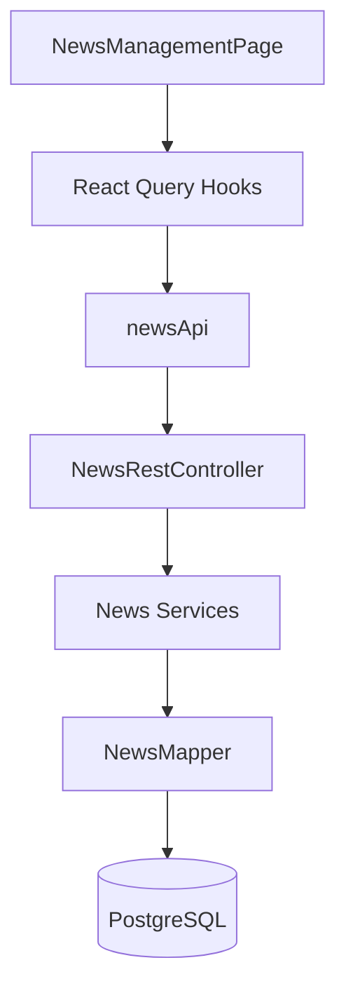

# 技術設計書

## Overview

既存のBackend Service層（NewsManageService、NewsManageRegistrationService、NewsManageDeletionService、NewsManageReleaseService）を活用し、REST API Controller層とFrontend UIを実装します。Backend Entity（News: id, news_date, content, release_flag, update_date）に準拠した型定義を採用し、OpenAPI自動生成により型安全性を保証します。

### Goals

- 既存Backend Serviceを活用した6つのREST APIエンドポイント実装
- Backend EntityとFrontend型定義の完全統一（OpenAPI自動生成活用）
- React Query統合による楽観的更新とキャッシュ最適化
- 管理者向けカード型一覧+モーダル型フォーム実装
- E2Eテスト完全パス

### Non-Goals

- リッチテキストエディタ統合（Phase 3）
- 未読管理機能（Phase 3）
- リアルタイム通知（WebSocket/SSE）（Phase 3）
- 並び替え・フィルタリング完全実装（Phase 3）

## Architecture

### Existing Architecture Analysis

Spring Boot 3.4.3 + React 19モノリシックSPA。完成済み: Entity/Mapper/Service層。未実装: Controller層、Frontend UI、E2Eテスト有効化。

**既存パターン遵守**: ファサードパターン、単一責任の原則、SOLID原則、OpenAPI駆動開発、React Query統合。

### High-Level Architecture

### Technology Alignment

既存スタック完全準拠。新規技術導入なし。Backend: Spring Boot 3.4.3、MyBatis 3.0.4、PostgreSQL 16。Frontend: React 19.1.1、TypeScript 5.8.3（strict）、React Query 5.90.2、React Router 7.9.2、shadcn-ui@canary、React Hook Form 7.63.0 + Zod。

### Key Design Decisions

#### Decision 1: Backend Entity準拠型定義への統一

**Context**: Frontend型定義（title, category等の存在しないフィールド）がBackend Entityと不整合。

**Selected Approach**: OpenAPI自動生成型を活用したBackend Entity準拠型定義。Backend Entity構造をOpenAPI仕様に反映し、`@hey-api/openapi-ts`で自動生成。生成型（NewsResponse, NewsCreateRequest, NewsUpdateRequest）をFrontend全体で統一使用。

**Rationale**: 型一貫性保証、自動型同期による保守コスト削減、TypeScript strict検証、Zodランタイムバリデーション二重保証。

**Trade-offs**: Gain: 型安全性、保守性、自動化。Sacrifice: 既存types.ts廃止の初期コスト（1-2時間）。

**移行手順**: ①types.ts削除、②E2Eテスト型修正（item.title→item.content等）、③エンドポイント統一（/api/news）、④Controller層でsnake_case→camelCase変換実装。

#### Decision 2: 楽観的更新とReact Query統合

**Context**: 公開/非公開切り替えの頻繁な操作でUI即応性が必要。

**Selected Approach**: React QueryのuseMutationにonMutateコールバックを実装し、API送信前にキャッシュ直接更新。エラー時はonErrorでロールバック。

**Rationale**: UI即時反映、ネットワーク遅延解消、自動ロールバックによる整合性保証、既存パターン統一。

**Trade-offs**: Gain: 優れたUX、体感速度向上、既存パターン統一。Sacrifice: エラーハンドリングコード追加（約40行）。

#### Decision 3: モーダルダイアログ型フォーム

**Context**: お知らせ作成・編集は低頻度でフィールド数は2つ（newsDate, content）のみ。

**Selected Approach**: shadcn-ui Dialog + React Hook Form + Zod。ページ遷移なしでモーダル内完結。

**Rationale**: シンプルなUX、shadcn-ui Dialogのアクセシビリティ機能活用、React Hook Formの高パフォーマンス、Zodによる二重保証。

**Trade-offs**: Gain: シンプルUX、既存パターン適用、アクセシビリティ保証。Sacrifice: モーダル内スペース制約（ただし2フィールドで問題なし）。

## Components and Interfaces

### Backend Layer

#### NewsRestController

**Responsibility**: 既存NewsManageServiceをRESTful APIとして公開。

**Dependencies**: Outbound: NewsManageService、NewsManageRegistrationService、NewsManageDeletionService、NewsManageReleaseService。

**API Contract**:

| Method | Endpoint | Request | Response | Errors | 認可 |
|--------|----------|---------|----------|--------|------|
| GET | /api/news | - | NewsListResponse | 500 | 認証必須 |
| GET | /api/news/published | - | NewsListResponse | 500 | 認証不要 |
| POST | /api/news | NewsCreateRequest | NewsResponse | 400, 500 | ADMIN |
| PUT | /api/news/{id} | NewsUpdateRequest | NewsResponse | 400, 404, 500 | ADMIN |
| DELETE | /api/news/{id} | - | 204 No Content | 404, 500 | ADMIN |
| PATCH | /api/news/{id}/publish | - | 204 No Content | 404, 500 | ADMIN |

**Request/Response DTOs**: NewsCreateRequest（newsDate: String (yyyy-MM-dd), content: String (max 1000)）、NewsResponse（id, newsDate, content, releaseFlag, updateDate）、NewsListResponse（List<NewsResponse> news）。

**Integration Strategy**: 新規コントローラー追加（既存コード影響なし）。既存Thymeleafは異なるURLで共存可能。

#### 既存Service層（活用のみ、変更なし）

- NewsManageService: ファサード、一覧取得
- NewsManageRegistrationService: 新規登録・更新（@Transactional）
- NewsManageDeletionService: 削除処理（@Transactional）
- NewsManageReleaseService: 公開/非公開切り替え（@Transactional）

### Frontend Layer

#### NewsManagementPage

**Responsibility**: お知らせ管理画面メインコンテナ、ルーティング統合、権限制御。

**Dependencies**: Outbound: NewsCard、NewsFormModal、useNewsQuery、useCreateNewsMutation。

**主要機能**: カード型一覧表示、新規作成・編集モーダル制御、空状態メッセージ、レスポンシブグリッド。

#### NewsCard

**Responsibility**: お知らせカード表示、公開切り替え、編集・削除アクション。

**Props**: NewsCardProps（news: NewsResponse, onEdit, onDelete, onTogglePublish）。

**表示内容**: お知らせ日付、内容、公開/下書きバッジ、アクションボタン（公開切り替え、編集、削除）。

#### NewsFormModal

**Responsibility**: お知らせ作成・編集モーダル、React Hook Form統合、Zodバリデーション。

**Props**: NewsFormModalProps（mode: 'create' | 'edit', news, open, onClose）。

**機能**: 日付選択（Input type="date"）、テキストエリア（複数行入力）、Zodバリデーション（日付形式、内容必須・1000文字以内）、保存/キャンセルボタン。

#### React Query Hooks

**キャッシュキー戦略**:
- NEWS_QUERY_KEY: ["news"]
- NEWS_PUBLISHED_QUERY_KEY: ["news", "published"]

**主要Hooks**:
- useNewsQuery: 全お知らせ一覧取得（staleTime: 5分）
- useCreateNewsMutation: 作成後キャッシュ無効化、Toast通知
- useUpdateNewsMutation: 更新後キャッシュ無効化、Toast通知
- useDeleteNewsMutation: 削除後キャッシュ無効化、Toast通知
- useTogglePublishMutation: 楽観的更新実装（onMutate→キャッシュ更新、onError→ロールバック、onSettled→再検証）

#### newsApi.ts（API Client）

**エンドポイント**: getAllNews、getPublishedNews、createNews、updateNews、deleteNews、toggleNewsPublish。

**実装**: apiClient（共通Axiosインスタンス）使用、NewsResponse型返却、エラー時はAPIエラークラススロー。

## Data Models

### Physical Data Model

既存newsテーブル活用。スキーマ変更不要。

| Column | Type | Constraints |
|--------|------|-------------|
| id | SERIAL | PRIMARY KEY |
| news_date | DATE | NOT NULL |
| content | TEXT | NOT NULL |
| release_flag | BOOLEAN | NOT NULL DEFAULT FALSE |
| update_date | TIMESTAMP | NOT NULL DEFAULT CURRENT_TIMESTAMP |

**インデックス**: PRIMARY KEY (id)、INDEX (news_date DESC)、INDEX (release_flag, news_date DESC)。

### Data Contracts

**Backend Entity（snake_case）→Response DTO（camelCase）変換**: toResponseメソッドでnews_date→newsDate、release_flag→releaseFlag、update_date→ISO 8601変換。

**OpenAPI仕様**: NewsResponse（newsDate: string (format: date), content: string, releaseFlag: boolean, updateDate: string (format: date-time)）。

## Error Handling

### Error Strategy

既存GlobalExceptionHandlerで統一処理。追加実装不要。

**User Errors (4xx)**: 400（バリデーションエラー）→フィールド別メッセージ、404（お知らせ不存在）→お知らせが見つかりません、403（権限不足）→アクセス権限がありません。

**System Errors (5xx)**: 500（データベースエラー等）→システムエラーが発生しました。

**Frontend Error Handling**: React Query自動捕捉、Toast通知、楽観的更新ロールバック。

### Monitoring

Spring Boot Actuator（/actuator/health, /actuator/metrics）、SLF4J + Logback、ログレベル別出力。

## Testing Strategy

### Unit Tests

**Backend**: NewsRestController（エンドポイント検証、認可テスト、バリデーション）、Service層既存テスト活用。

**Frontend**: useNewsQuery（キャッシュ戦略）、useCreateNewsMutation（キャッシュ無効化）、useTogglePublishMutation（楽観的更新・ロールバック）、NewsCard（props検証）、NewsFormModal（Zodバリデーション）。

### Integration Tests

**Backend**: Spring Boot Test + Testcontainers（PostgreSQL）、全エンドポイントEnd-to-End、Spring Security認証・認可統合。

**Frontend**: MSW + newsApi.ts統合、React Query + API統合、エラーハンドリング・楽観的更新テスト。

### E2E Tests

frontend/e2e/news-management.spec.ts有効化。シナリオ: ①一覧表示（カード形式、バッジ）、②作成（モーダル→フォーム→保存→一覧更新）、③編集（モーダル→編集→保存→一覧更新）、④削除（確認ダイアログ→削除→一覧から削除）、⑤公開切り替え（即座にUI反映→バッジ変更）、⑥エラーハンドリング（Toast表示、ロールバック）。

**E2E修正項目**: 型フィールド（item.title→item.content、item.published→item.releaseFlag）、UIセレクタ（locator("tr")→カード形式）、エンドポイント（/news→/news-management、/news→/api/news）。

### Performance Tests

**目標**: お知らせ一覧取得p95 200ms以内、作成/更新p95 300ms以内、同時接続100ユーザー以上。

**検証**: Lighthouse CI（フロントエンドパフォーマンス）、Apache Bench（Backend APIレスポンスタイム）。

## Security Considerations

### Authentication and Authorization

セッションベース認証（Spring Security既存実装）、CSRF保護（Cookie + X-XSRF-TOKEN）、ロールベースアクセス制御（@PreAuthorize("hasRole('ADMIN')")）、一般ユーザー向け公開お知らせ閲覧は認証不要（/api/news/published）。

### Data Protection

XSS対策（React自動エスケープ、shadcn-ui安全コンポーネント）、SQLインジェクション対策（MyBatisパラメータバインディング）。GDPR: 個人情報含まないため対象外。ログ管理: 既存LogHistoryRegistrationServiceによる操作履歴記録。

## Performance & Scalability

### Target Metrics

お知らせ一覧ロード時間500ms以内（p95）、モーダル開閉100ms以内、公開切り替えUI反映即座（楽観的更新）。

### Caching Strategies

**Frontend**: React Query staleTime 5分、gcTime 10分、楽観的更新（公開切り替え即座反映）。

**Backend**: Spring Boot @Cacheable不要（お知らせデータは頻繁変更）、HikariCP既存コネクションプーリング活用。

### Optimization Techniques

React Router 7 Route Loader（ページ遷移前データプリフェッチ）、Vite Code Splitting（機能別バンドル分割）、Lazy Loading（モーダル遅延読み込み）、Database Indexes（news_date、release_flag）。

## Migration Strategy

既存システムへの追加実装。既存機能への影響なし。段階的ロールアウト。

### Phase Breakdown

**Phase 1: Backend API実装（2-3時間）**: NewsRestController、Request/Response DTO、OpenAPI仕様定義・自動型生成、単体・統合テスト、Swagger UI動作確認。

**Phase 2: Frontend UI実装（3-4時間）**: NewsManagementPage、NewsCard、NewsFormModal、React Query Hooks、newsApi.ts、ルーティング統合。

**Phase 3: E2Eテスト有効化（1-2時間）**: 型定義修正（item.title→item.content等）、UIセレクタ修正（テーブル→カード）、エンドポイントパス修正（/news→/news-management）、E2Eテスト実行・デバッグ。

**Phase 4: 本番デプロイ（1時間）**: GitHub Actions自動ビルド、vercel, renderデプロイ、本番環境疎通確認、ログ監視。

### Rollback Triggers

Phase 1: Controller単体テスト失敗、OpenAPI生成エラー。Phase 2: TypeScriptコンパイルエラー、Biomeリンティングエラー。Phase 3: E2Eテスト失敗。Phase 4: 本番環境API 500エラー、認証エラー。

**Rollback手順**: Git revert（Phase 1-3）、vercel, renderロールバック（Phase 4）、DBスキーマ変更なし（ロールバック不要）。

### Validation Checkpoints

Phase 1完了: 全単体・統合テストパス、Swagger UIでCRUD操作成功。Phase 2完了: TypeScript型チェックパス、Biomeリンティングパス、開発環境全機能動作確認。Phase 3完了: E2Eテスト全シナリオパス。Phase 4完了: 本番環境CRUD操作成功、ログエラーなし。
