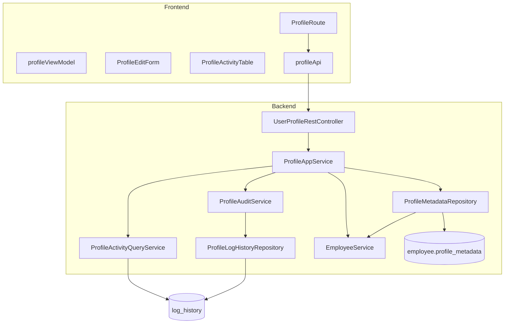
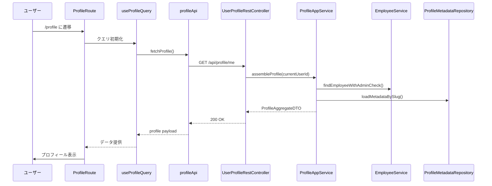
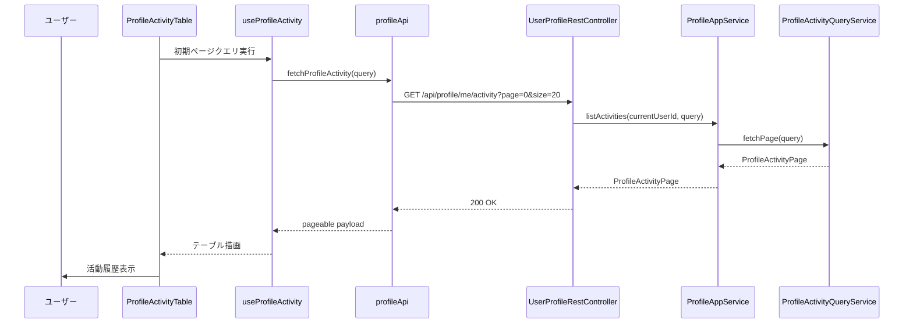
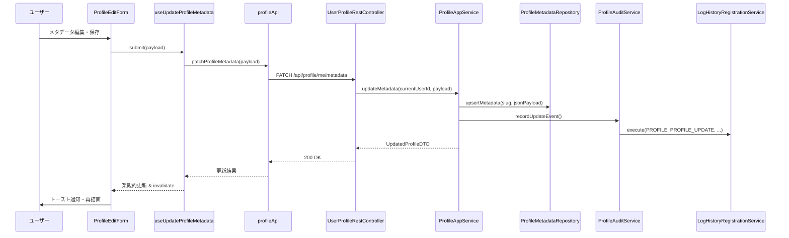

# Design Document

## Overview
本機能は従業員本人および管理者が単一画面でプロフィール基本属性（氏名・メールアドレス・部署・社員番号・住所）と自己記述的な活動メモを確認・更新しつつ、プロフィール操作履歴を追跡できるようにする。既存の employee テーブルから必須属性を読み取り、追加編集可能項目は柔軟なメタデータとして保持し、履歴は log_history を再利用して可視化する。
対象ユーザーは従業員本人（セルフサービス）、所属管理者（代理編集）、監査担当者（履歴確認）であり、React 19 + Spring Boot 3.4 の既存SPA構成に自然に組み込んでユーザー体験と監査性を向上させる。

### Goals
- 従業員が employee テーブル由来の氏名・メール・社員番号・部署・住所を一貫した表示形式で確認できること。
- 従業員と管理者がアドレス・部署・自己紹介・活動メモなどのメタデータを任意編集し、即時に反映できること。
- プロフィールの閲覧・編集操作が log_history に記録され、ユーザーが活動履歴を時系列で参照できること。

### Non-Goals
- 新規 Postgres スキーマ/テーブルの追加や既存テーブル構造の変更。
- HR 外部システムとの同期、および自動で社員基本情報を更新する双方向連携。
- CSV エクスポートや大量一括更新などの管理者向け高機能編集。

## Architecture

### Existing Architecture Analysis
- UIデザインは@.kiro/specs/user-profile-activity/mock/フォルダ内のファイル、画像を参考にして作成する
- バックエンドは EmployeeService が従業員基本情報 CRUD を提供し、LogHistoryRegistrationService が操作ログを共通的に記録する。
- React フロントエンドは features ディレクトリ単位でモジュール化され、React Query + TanStack Table がデータ取得と表示の標準パターンを形成している。
- `employee` テーブルは氏名・メール・管理フラグのみを保持しているため、柔軟項目用に JSON カラム `profile_metadata` を追加し、従業員単位で自由入力値を一括管理する方針とする。同時に `log_history` テーブルへ JSONB 型の `detail` カラムを追加し、プロフィール更新時の差分スナップショットを保持できるようにする。
- セッションベース認可と AdminGuard によりロールベースアクセス制限が既に整備されている。

### High-Level Architecture


### Technology Alignment
- Spring Boot 3.4 / MyBatis を継続利用し、annotation mapper + XML mapper の既存構成に追加 mapper を実装。
- React 19 / TypeScript 5.8 / React Query 5 の既存スタックを踏襲し、プロフィール専用 feature モジュールを追加。
- react-hook-form + zod によるフォームバリデーションを employees / news モジュールと同レベルで適用。
- 追加依存は発生させず、employee テーブルの `profile_metadata` JSON カラムを操作するための repository を新設。

### Key Design Decisions
- **Decision**: プロフィール取得・更新ロジックを ProfileAppService に集約する  
  - **Context**: employee 情報、柔軟メタデータ、操作履歴を複数サービスから収集する必要がある。  
  - **Alternatives**:  
    1. コントローラーから各サービスを直接呼び出す。  
    2. EmployeeService にプロフィール専用メソッドを追加する。  
    3. 専用アプリケーションサービスで調整する。  
  - **Selected Approach**: 3 を採用し、ProfileAppService で依存をまとめて DTO に整形する。  
  - **Rationale**: 単一責任を維持しつつプレゼンテーション層への返却形を統一でき、将来的な要件追加にも拡張しやすい。  
  - **Trade-offs**: 新たなサービス層が増え、テストケースが独立して必要になる。

- **Decision**: employee テーブルに `profile_metadata` JSON カラムを追加し、柔軟項目を一元管理する  
  - **Context**: 自由入力項目を永続化しつつ、既存の従業員ドメイン境界を保ちたい。  
  - **Alternatives**:  
    1. 専用 profile_metadata テーブルを新設する。  
    2. news テーブルを流用して自由入力値を保存する。  
    3. employee テーブルに JSON カラムを追加し、1レコード=1従業員で管理する。  
  - **Selected Approach**: 3 を採用し、マイグレーションで `profile_metadata JSONB NOT NULL DEFAULT '{}'::jsonb` を追加。  
  - **Rationale**: ドメイン境界を壊さずスキーマを単純に保て、MyBatis でも型ハンドラを実装しやすい。フロント/バック双方で JSON スキーマを共有しやすく、将来の項目追加にも柔軟。  
  - **Trade-offs**: スキーマ変更が必要になりデプロイ順序の調整が発生する。JSON の構造変更時はマイグレーションでラックアップする必要がある。

- **Decision**: プロフィール活動履歴は log_history の display_name/operation_type 拡張 + detail JSONB で記録する  
  - **Context**: 既存監査基盤を活用してプロフィール閲覧・更新を追跡しつつ、UI に差分明細を提供したい。  
  - **Alternatives**:  
    1. 新しい監査テーブルを作成する。  
    2. log_history に JSONB カラム `detail` を追加し、プロフィールイベントのみ差分を保存する。  
    3. 既存 log_history を display_name/operation_type の追加だけで流用し、差分は別途生成する。  
  - **Selected Approach**: 2 を採用し、`DisplayName.PROFILE` と `OperationType.PROFILE_VIEW/PROFILE_UPDATE` の追加に加えて `detail` に差分スナップショットを格納する。  
  - **Rationale**: 現行サービスに馴染む監査フローを維持しながら、構造化データを保持できるため UI・API での再利用が容易。  
  - **Trade-offs**: JSONB カラム追加に伴うマイグレーションと既存データ初期化が必要で、`detail` スキーマのバージョン管理が求められる。

## System Flows

### プロフィール閲覧シーケンス


### 活動履歴取得シーケンス


### プロフィール編集シーケンス


## Components and Interfaces

### Backend

#### UserProfileRestController
- **Primary Responsibility**: プロフィール取得・メタデータ更新・活動履歴取得の REST API を公開。
- **Dependencies**: ProfileAppService, AccessControlUtil (既存 SecurityUtil を流用)。
- **API Contract**:

| Method | Endpoint | Request | Response | Errors |
|--------|----------|---------|----------|--------|
| GET | `/api/profile/me` | - | `ProfileResponse` | 401, 500 |
| GET | `/api/profile/{employeeId}` | - | `ProfileResponse` | 401, 403, 404 |
| PATCH | `/api/profile/me/metadata` | `ProfileMetadataUpdateRequest` | `ProfileResponse` | 400, 401, 409, 500 |
| PATCH | `/api/profile/{employeeId}/metadata` | `ProfileMetadataUpdateRequest` | `ProfileResponse` | 401, 403, 404, 409 |
| GET | `/api/profile/me/activity` | `ActivityQuery` (page,size,from,to) | `ProfileActivityResponse` | 401, 500 |

#### ProfileAppService
- **Primary Responsibility**: employee 情報とメタデータを集約して DTO を構築し、更新時は監査イベントを発行。活動履歴は専用メソッドでページ形式を返す。
- **Dependencies**: EmployeeService, ProfileMetadataRepository, ProfileActivityQueryService, ProfileAuditService.
- **Contract**:
```java
interface ProfileAppService {
    ProfileAggregate loadSelfProfile(int employeeId);
    ProfileAggregate loadProfileForAdmin(int targetEmployeeId, int operatorId);
    ProfileAggregate updateMetadata(int operatorId, int targetEmployeeId, ProfileMetadataUpdateCommand command);
    ProfileActivityPage listActivities(int targetEmployeeId, ActivityQuery query);
}
```
- **Preconditions**: operator が対象従業員の編集権限を持つ（本人またはADMIN）。  
- **Postconditions**: メタデータ更新時は employee テーブルの `profile_metadata` が更新され、log_history にイベントが追加される。

#### ProfileMetadataRepository
- **Primary Responsibility**: employee テーブルの `profile_metadata` JSONB カラムを読み書きし、自由入力項目を型安全に提供する。
- **Dependencies**: MyBatis `EmployeeMapper` 拡張、`JsonTypeHandler`（Jackson / Gson ベース）、TransactionTemplate。
- **Contract Definition**:

| 操作 | SQL/動作 | 補足 |
|------|----------|------|
| `Optional<ProfileMetadataRecord> findByEmployeeId(int employeeId)` | `SELECT profile_metadata FROM employee WHERE id = ?` | `profile_metadata` を JSON としてマッピング |
| `void upsertMetadata(ProfileMetadataRecord record)` | `UPDATE employee SET profile_metadata = :json, update_date = :timestamp WHERE id = :employeeId` | 失敗時は例外を送出しトランザクションをロールバック |
| `ProfileMetadataRecord ensureDefault(int employeeId)` | JSON が空の場合に `{}` で初期化する | Flyway マイグレーションで DEFAULT `'{}'::jsonb` を設定 |

- **State Management**: メタデータ JSON は `{ "address": string, "department": string, "employeeNumber": string, "activityNote": string, "custom": Record<string,string> }` を基本構造とし、未入力は `null` または空文字で正規化する。フィールド追加時は JSON スキーマバージョンを付す。

#### ProfileActivityQueryService
- **Primary Responsibility**: log_history からプロフィール関連イベントのみ抽出し、UI 表示用にページング整形。
- **Dependencies**: LogHistoryMapper (既存), TimeRangeBuilder。
- **Integration Strategy**: `display_name = AppConstants.LogHistory.DisplayName.PROFILE` かつ `operation_type IN (PROFILE_VIEW, PROFILE_UPDATE)` を条件に利用。既存 logManagement API に影響しないようクエリを追加。
- **Detail Projection**: `detail` JSON から `changedFields`, `before`, `after` を抽出し、欠損時は空配列/空オブジェクトに正規化する。

#### ProfileLogHistoryRepository
- **Primary Responsibility**: プロフィール専用の log_history レコード挿入を担当し、既存重複抑止ロジックをバイパスする。
- **Dependencies**: LogHistoryMapper 拡張（`insertProfileEvent`）、TransactionTemplate。
- **Contract Definition**:

| 操作 | SQL/動作 | 補足 |
|------|----------|------|
| `void insertProfileEvent(ProfileLogRecord record)` | `INSERT INTO log_history (display_name, operation_type, stamp_time, employee_id, update_employee_id, update_date, detail)` | `detail` 列に `{ changedFields, before, after, schemaVersion }` を保存 |
| `ProfileLogRecord build(int actorId, Integer targetId, ProfileChangePayload payload)` | 差分生成ヘルパー | payload には `changedFields` や更新後スナップショットを含む |

- **Error Handling**: INSERT 失敗時は `DataAccessException` をラップして `ProfileAuditService` へ伝搬し、アプリケーション例外として処理する。

#### ProfileAuditService
- **Primary Responsibility**: プロフィール閲覧・更新の監査イベントをラップし、LogHistoryRegistrationService を呼び出す。
- **Dependencies**: LogHistoryRegistrationService, ProfileLogHistoryRepository, Clock。
- **Contract**:

```java
interface ProfileAuditService {
    void recordView(int actorEmployeeId);
    void recordUpdate(int actorEmployeeId, int targetEmployeeId);
}
```

- **Implementation Notes**:
  - `LogHistoryRegistrationService` にプロフィール専用のメソッド `recordProfileEvent(...)` を追加し、既存の `existsLogHistoryForToday` チェックをバイパスする。
  - プロフィール以外のイベントは従来の重複抑止ロジックを維持するため、呼び出し元で専用メソッドを選択する。
  - `ProfileLogHistoryRepository` は log_history へ直接INSERTする mapper（`insertProfileEvent`）を提供し、トランザクション内で `recordProfileEvent` から呼び出す。
- **Trade-offs**: プロフィール更新は日次制限を解除し全イベントを記録するためログ件数が増加する。`ProfileActivityQueryService` でページング (size 20) と保存期間（例: 最長180日）を適用し、アーカイブ運用を別途策定する。

### Frontend

#### profileApi.ts
- **Responsibility**: `/api/profile` エンドポイント群のラッパー。Axios api クライアントを再利用し、レスポンスを typed DTO に変換。
- **Contracts**:
```ts
type ProfileResponse = {
  employee: {
    id: number;
    fullName: string;
    email: string;
    updatedAt: string;
  };
  metadata: {
    address: string;
    department: string;
    employeeNumber: string;
    activityNote: string;
  };
};

type ActivityEntry = {
  id: number;
  occurredAt: string;
  actor: string;
  operationType: "VIEW" | "UPDATE";
  summary: string;
  changedFields: string[];
  beforeSnapshot: Record<string, string | null>;
  afterSnapshot: Record<string, string | null>;
};

type ProfileActivityResponse = {
  page: number;
  size: number;
  totalPages: number;
  totalElements: number;
  items: ActivityEntry[];
};

fetchProfile: () => Promise<ProfileResponse>;
updateProfileMetadata: (payload: ProfileMetadataForm) => Promise<ProfileResponse>;
fetchProfileActivity: (query?: ActivityQuery) => Promise<ProfileActivityResponse>;
```

#### profileSchemas.ts
- **Responsibility**: zod によるバリデーション（最大文字数 256 / 1000、禁止文字など）と `ProfileMetadataForm` 型定義。
- **Dependencies**: shared/lib/zod。

#### useProfileQuery / useProfileMutations
- **Responsibility**: React Query のクエリキー `"profile","self"` `"profile","activity"` を管理し、メタデータ更新時にキャッシュを書き換えつつ invalidate。
- **Dependencies**: React Query, profileApi。

#### ProfileRoute.tsx / ProfileOverviewCard.tsx / ProfileEditForm.tsx / ProfileActivityTable.tsx
- **Responsibilities**:
  - Route: 画面シェルとアクセス制御 (requiresAuth)。
  - OverviewCard: employee 情報とメタデータをカード表示（read-only）。
  - EditForm: Drawer または Dialog でメタデータを編集し、react-hook-form + zodResolver でバリデーション。
  - ActivityTable: TanStack Table で履歴を表示し、期間フィルタ・ページネーションを提供。
- **Dependencies**: shadcn/ui, TanStack Table, shared/components/data-table。

#### profileViewModel.ts
- **Responsibility**: API DTO を UI モデルに変換し、空値を `未設定` ラベルに変換、更新日時フォーマットを統一。employee 基本属性（氏名・メール等）と metadata 由来項目（部署・社員番号・住所・活動メモ）をマージして画面表示値を生成する。

## Data Models

### Logical Data Model
- **ProfileAggregate**: `{ employee: EmployeeSummaryExtended, metadata: ProfileMetadata }`
  - EmployeeSummaryExtended: employee テーブルの first_name/last_name/email/admin_flag/update_date を利用し、fullName と読みやすい構造に整形。
  - ProfileMetadata: employee.profile_metadata JSONB をパースし、未存在の場合はデフォルト値 `{ address: "", department: "", employeeNumber: "", activityNote: "", custom: {} }` を返却。スキーマバージョンを保持し、追加フィールドは `custom` マップに格納する。
- **ProfileActivityPage**: `{ page: number; size: number; totalPages: number; totalElements: number; items: ActivityEntry[] }`
  - ActivityEntry: log_history 行を DTO 化し、operationType コードから `VIEW` / `UPDATE` を判定しつつ、`detail` JSON から `changedFields`・`beforeSnapshot`・`afterSnapshot` を抽出する。

### Data Contracts & Integration
| API | Description | Request Body | Response |
|-----|-------------|--------------|----------|
| GET `/api/profile/me` | ログインユーザーのプロフィール取得 | - | `ProfileResponse`（employee基本属性 + metadata） |
| GET `/api/profile/{employeeId}` | 管理者が従業員プロフィール取得 | - | `ProfileResponse`（employee基本属性 + metadata） |
| PATCH `/api/profile/me/metadata` | 自己メタデータ更新 | `ProfileMetadataUpdateRequest` (zod 定義準拠) | `ProfileResponse` |
| PATCH `/api/profile/{employeeId}/metadata` | 管理者による代理更新 | 同上 | `ProfileResponse` |
| GET `/api/profile/me/activity` | 活動履歴取得 | クエリ: `page`, `size`, `from`, `to` | `ProfileActivityResponse` (pageable、`items` に差分付き ActivityEntry を返却) |

`ProfileMetadataUpdateRequest` は JSON で `{ address?: string; department?: string; employeeNumber?: string; activityNote?: string }`。空文字は nullish として扱い `profile_metadata` 保存時に空文字へ正規化し、未送信フィールドは既存値を維持する。`ProfileActivityResponse` はページメタデータに加え、各 `ActivityEntry` が `changedFields`・`beforeSnapshot`・`afterSnapshot` を持ちフロントエンドの差分表示に利用する。

## Error Handling

### Error Strategy
- バリデーションエラーは 400 とし、zod エラーをフィールド別メッセージに変換。
- 権限不足は 403、未ログインは 401。SecurityUtil で統一メッセージ。
- profile_metadata 更新時に JSON スキーマ検証で失敗した場合は 409（整合性違反）を返却。
- MyBatis 例外や JSON パース失敗は 500 で `traceId` を添付。

### Monitoring
- 既存 error-logger + Sentry 連携を利用し、`feature:profile` タグを追加。
- log_history へのイベント保存失敗時は WARN ログ + retry 無し（結果整合性の許容）。

## Testing Strategy
- **Unit**: ProfileAppService、ProfileMetadataRepository（JSONB ハンドラと差分生成）、ProfileAuditService のログ生成、ProfileLogHistoryRepository の `detail` マッピング。
- **Integration**: UserProfileRestController の MockMvc テスト（本人・管理者・権限違反パス）、EmployeeMapper 拡張の JSON 更新整合性、log_history.detail 取得時の差分再構築。
- **Frontend Unit**: profileApi のレスポンス整形、profileSchemas のバリデーション。
- **Frontend Integration**: ProfileRoute 画面での happy path（MSW）、メタデータ更新後のキャッシュ更新テスト、活動履歴ページング表示。
- **E2E**: Playwright で `/profile` 画面シナリオ（閲覧・編集・履歴確認）を追加。
- **Performance**: React Query キャッシュ + pagination による p95 200ms 以内を確認 (mocked API latency scenario)。

## Security Considerations
- すべてのエンドポイントで本人または ADMIN のみ編集可。Spring Method Security (`@PreAuthorize`) を追加。
- JSON メタデータ保存時に HTML / スクリプト除去（フロントはエスケープ、バックエンドはサニタイズ）で XSS リスクを緩和。
- profile_metadata JSONB は本人または管理者のみ更新可能とし、マスキング対象（住所など）の監査ログを強化する。
- 活動履歴には閲覧イベントも含めるため、過剰記録を避ける日次重複抑止ロジックを再利用。

## Performance & Scalability
- React Query `staleTime` を 5 分に設定し過剰再取得を防止、活動履歴はページング（size 20 デフォルト）。
- profile_metadata JSONB へのアクセスは従業員ID主キーで行うため追加インデックスは不要。ただし JSON 内特定キーでの検索要件が生じた場合に備え、将来的に GIN インデックスを検討する。
- log_history 取得は各ユーザー + 期間でフィルタし、月次上限 500 件に制限。`detail` JSON は SQL の JSON 演算子で必要なキーのみ抽出し、過剰なパースによる CPU コストを抑制する。

## Migration Strategy
```mermaid
flowchart LR
    Prep[Phase 0: Flywayでprofile_metadataとlog_history.detailのJSONBカラム追加マイグレーションを作成]
    DeployDB[Phase 1: DBマイグレーション適用（両カラムにDEFAULT '{}'::jsonbを設定）]
    Backfill[Phase 2: 既存従業員と履歴レコードに空JSONが入っていることを検証]
    DeployBE[Phase 3: バックエンド API デプロイ・Feature Flag OFF]
    DeployFE[Phase 4: フロントエンドリリース・Feature Flag ON]
    Doc[Phase 5: 運用ドキュメントと監査手順を更新]
    Prep --> DeployDB --> Backfill --> DeployBE --> DeployFE --> Doc
```

- フィーチャーフラグ `profile.enabled`（既存 FeatureFlagProvider へ追加）で段階的に公開。
- ロールバックが必要な場合はアプリを旧版へ戻し、`ALTER TABLE employee DROP COLUMN profile_metadata` および `ALTER TABLE log_history DROP COLUMN detail` を実行して元の状態に復旧する。
