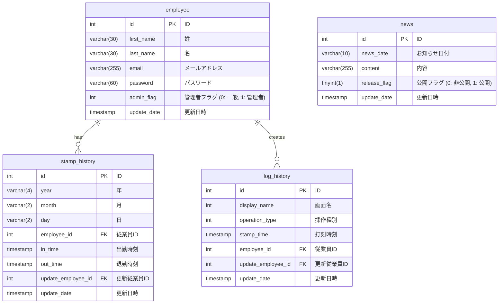

# データベースER図

このドキュメントは、`01_schema.sql` に基づくデータベースのエンティティ関連図（ER図）です。

## テーブル概要

| テーブル名 | 説明 |
| :--- | :--- |
| `employee` | 従業員情報。ログイン情報や管理者権限を管理します。 |
| `stamp_history` | 日々の出退勤の打刻記録を保存します。 |
| `log_history` | システム内の操作履歴を記録します。 |
| `news` | ホーム画面に表示するお知らせ情報を管理します。 |

## 主なリレーション

-   `employee` と `stamp_history`:
    -   `stamp_history.employee_id` が `employee.id` を参照します。各打刻記録がどの従業員のものかを紐付けます。
-   `employee` と `log_history`:
    -   `log_history.employee_id` が `employee.id` を参照します。各操作ログをどの従業員が実行したかを紐付けます。

