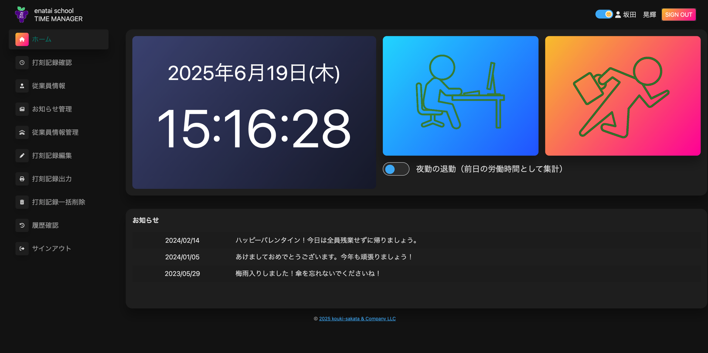

# TeamDevelop Bravo 勤怠管理システム

モバイルフレンドリーな React + Spring Boot SPA 版の勤怠管理システムです。既存の
Thymeleaf 実装を置き換え、PostgreSQL へのマイグレーションと合わせてフロントエンド／バックエンドを再構築しました。

## 🌐 デプロイ先 & テストアカウント

- **URL:
  ** http://my-spring-app-env.eba-kmwuwpfp.ap-northeast-1.elasticbeanstalk.com/
- **テストユーザー:** `test@gmail.com`
- **パスワード:** `testtest`

> ⚠️ 本番環境は移行作業中です。最新の UI はローカルまたはステージングで確認してください。

## 🧰 技術スタック

| レイヤー          | 採用技術                                                                                    |
|:--------------|:----------------------------------------------------------------------------------------|
| **フロントエンド**   | React 19, TypeScript, Vite, React Router 7, React Query 5, Vitest, ESLint / Prettier    |
| **バックエンド**    | Java 21, Spring Boot 3.4, Spring Security, MyBatis, Testcontainers                      |
| **データベース**    | PostgreSQL 16 (コンテナ・ローカル・本番共通)                                                          |
| **ビルド/パッケージ** | Gradle 8.14.2, npm 10, Docker, Docker Compose                                           |
| **CI/CD**     | GitHub Actions (フロント lint/test + Gradle test/build + Docker build, SonarCloud, 依存性スキャン) |



## ✨ 主な改善ポイント

- **SPA 化:** React + TypeScript + React Query によるシングルページ構成。Spring
  MVC 側は API と SPA フォワーダーのみを提供。
- **認証まわりの再設計:** `/api/auth`
  エンドポイントでセッションベースのログイン／ログアウト／セッション確認を実装。CSRF
  トークンは Cookie + `X-XSRF-TOKEN` で自動送出。
- **従業員・打刻周り API:** 従業員管理、打刻登録、打刻履歴を JSON API 化し、React
  から呼び出す構成へ移行。
- **PostgreSQL 移行:** MySQL 依存を排除し、Docker Compose／Testcontainers／CI すべてを
  Postgres 16 に統一。初期化スクリプトは `src/main/resources/01_schema.sql` /
  `02_data.sql` で管理。
- **CI 拡充:** `npm run lint` & `npm run test` を Gradle テストと連携して実行、Vite
  ビルドをリリースフローへ組み込み済み。

## 🏗️ アーキテクチャ概要

```
frontend/       # React + Vite (SPA)
  ├─ src/app    # ルーティングとレイアウト
  ├─ src/features
  └─ src/shared
src/main/java/
  ├─ config/    # SecurityConfig など
  ├─ controller/api/  # REST API 群
  └─ util/      # SecurityUtil など共通処理
src/test/java/  # JUnit + Testcontainers
```

- SPA ビルド成果物は `./gradlew build` 実行時に `frontend` から生成し、Spring
  Boot の静的リソースとして配備。
- 開発モードでは Vite Dev Server (ポート 5173) と Spring Boot を並走させる構成をサポート。

## 🚀 セットアップ

### 1. Docker Compose を使う（推奨）

```bash
# リポジトリ取得
git clone https://github.com/your-org/TeamDevelopBravo.git
cd TeamDevelopBravo-main

# 環境変数テンプレートをコピー
cp .env.example .env

# コンテナ起動
docker-compose up -d

# 初回のみログ確認
docker-compose logs -f app
```

- アプリ: http://localhost:8080
- ヘルスチェック: http://localhost:8080/actuator/health
- PostgreSQL: `localhost:5432` (`DOCKER_DB_USERNAME` / `DOCKER_DB_PASSWORD`)

### 2. ローカルで直接実行

#### 必要要件

- Java 21 (Eclipse Temurin 推奨)
- Node.js 20
- PostgreSQL 16

#### 手順

```bash
# 1. リポジトリ取得
git clone https://github.com/your-org/TeamDevelopBravo.git
cd TeamDevelopBravo-main

# 2. フロント依存をセットアップ
npm install --prefix frontend

# 3. PostgreSQL を準備
createdb teamdev_db
psql -d teamdev_db -f src/main/resources/01_schema.sql
psql -d teamdev_db -f src/main/resources/02_data.sql

# 4. バックエンドを起動
SPRING_PROFILES_ACTIVE=dev ./gradlew bootRun

# 5. （任意）Vite Dev Server を起動しホットリロード利用
npm run dev --prefix frontend
```

> Vite Dev Server を併用する場合は、`.env.development` (または
`frontend/.env.local`) に `VITE_API_BASE_URL=http://localhost:8080/api`
> を設定してください。

## 🔐 環境変数 & シークレット管理

| 変数                                | 用途               | デフォルト                               | 備考                     |
|:----------------------------------|:-----------------|:------------------------------------|:-----------------------|
| `DB_HOST` / `DB_PORT` / `DB_NAME` | PostgreSQL 接続先   | `localhost` / `5432` / `teamdev_db` | CI では `127.0.0.1` を利用  |
| `DB_USERNAME` / `DB_PASSWORD`     | DB 認証情報          | `user` / `password`                 | **本番では必ずシークレットストアに保管** |
| `JWT_SECRET`                      | 認証トークン用シークレット    | placeholder                         | 32〜64 文字以上を推奨          |
| `ENCRYPTION_KEY`                  | アプリ内暗号化キー        | placeholder                         | 32 文字以上                |
| `LOG_LEVEL_*`                     | ログレベル            | `INFO` 等                            | 監査要件に応じて調整             |
| `VITE_API_BASE_URL`               | フロントエンドの API ルート | `/api`                              | Dev Server 利用時に上書き     |

**運用のベストプラクティス**

1. ローカル : `.env` / `frontend/.env.local` に保存 (Git 管理外)
2. CI : GitHub Secrets (`DB_PASSWORD`, `JWT_SECRET` など) で提供
3. 本番 : AWS Secrets Manager 等を使用し、Elastic Beanstalk / ECS に注入

### 🔑 テスト用ログイン情報

- 管理者: `admin.user@example.com` / `AdminPass123!`
- 一般社員: `test.user@example.com` / `TestPass123!`

## 🗃️ PostgreSQL 移行ガイド

MySQL
からのデータ移行や既存環境の切り替え手順は [docs/postgres-migration-guide.md](docs/postgres-migration-guide.md)
を参照してください。

- 事前チェックリスト
- `pgloader` を使った移行例
- 本番切り戻し戦略
- GitHub Actions / Docker Compose の更新ポイント

## 🧪 テスト & ビルド

| コマンド                                 | 説明                                  |
|:-------------------------------------|:------------------------------------|
| `npm run lint --prefix frontend`     | React コードの Lint                     |
| `npm run test --prefix frontend`     | Vitest + jsdom                      |
| `npm run test:e2e --prefix frontend` | Playwright を利用した E2E(UI) テスト        |
| `npm run build --prefix frontend`    | Vite 本番ビルド                          |
| `./gradlew test`                     | Spring + Testcontainers を用いた統合テスト   |
| `./gradlew build`                    | Jar 作成 + Vite ビルド（`npmBuild` タスク連携） |
| `./scripts/dev-workflow.sh --quick`  | コンパイル + ユニットテスト (既存スクリプト)           |

> `./gradlew test` は Testcontainers で PostgreSQL を起動するため、Docker
> が動作する環境で実行してください。
>
> `npm run test:e2e --prefix frontend`
> を実行する際は、別ターミナルでバックエンドを起動しておく必要があります（例:
`SPRING_PROFILES_ACTIVE=dev ./gradlew bootRun`）。初回は
`npm run --prefix frontend playwright install --with-deps` でブラウザをセットアップしてください。

### 🔍 Swagger(OpenAPI) を使った API テスト

1. `git checkout -b chore/add-swagger` など新しいブランチで作業を開始。
2. バックエンドを起動: `SPRING_PROFILES_ACTIVE=dev ./gradlew bootRun`
3. ブラウザで [http://localhost:8080/swagger-ui/index.html](http://localhost:8080/swagger-ui/index.html) を開き、`Authorize` からテスト用の認証ヘッダーを設定。
4. `GET /api/auth/session` で CSRF トークンを取得してから、`POST /api/auth/login` 等を実行しレスポンスを確認。
5. Swagger でまとめたシナリオを `AuthRestControllerIntegrationTest` などの統合テストに落とし込み、API 振る舞いをコードで再現する。

**推奨フェーズ**
1. Swagger で API の挙動とテストケースを整理 → 統合テストを順次追加。
2. API が安定したら、React 側はサービス層モックやユニットテストでカバーを強化。
3. 最後に Playwright E2E で UI フロー（ログイン成功／失敗）を確認し、全体の整合性を取る。

## 🧭 CI/CD サマリ

- `ci.yml`
    - Node 20 + npm ci
    - `npm run lint` / `npm run test`
    - PostgreSQL サービスを起動して `./gradlew test`
    - `./gradlew build` / SonarCloud / Docker build
- `feature.yml`
    - ブランチ命名規則チェック
    - Quick test (コンパイル + 並列テスト)
    - セキュリティチェック (OWASP Dependency Check)
    - Docker ビルド検証

## 📄 ライセンス

社内利用を想定したプロジェクトのためライセンスは未定義です。外部公開する場合は各種依存ライセンスを確認のうえ適切なライセンスファイルを用意してください。

---

フィードバックや改善提案は Issue / Pull Request で歓迎しています！
