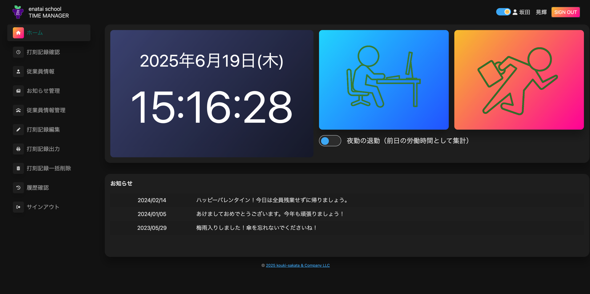

# TeamDev 勤怠管理システム

## 🌐 デプロイ先 & テストアカウント

**URL:
** http://my-spring-app-env.eba-kmwuwpfp.ap-northeast-1.elasticbeanstalk.com/

下記アカウントでログインしてお試しいただけます。

* **ユーザ名:** `test@gmail.com`
* **パスワード:** `test`

⚠️ **注意**
本プロジェクトは現在も開発を継続しており、機能追加やリファクタリングを随時行っています。

---

## 📸 スクリーンショット



## 🛠️ 技術スタック

| カテゴリ | 技術 |
| :--- | :--- |
| **バックエンド** | Java, Spring Boot |
| **フロントエンド** | HTML, CSS, JavaScript, jQuery, Thymeleaf |
| **データベース** | MySQL |
| **ビルドツール** | Gradle |
| **インフラ** | AWS Elastic Beanstalk |
| **開発・連携ツール**| Git, GitHub |

## ✨ 概要

本アプリケーションは、職業訓練校のチーム開発で制作した企業向けの勤怠管理システムです。

チームメンバーと協力し、要件定義から設計、実装、テストまでの一連の開発プロセスを経験しました。本プロジェクトを通じて、Gitを用いたチームでの共同開発手法や、Spring
Bootによる実践的なWebアプリケーション開発スキルの習得を目的としています。

## 🌟 主な機能

### ホーム画面

* **出退勤打刻:** 出勤・退勤時刻を記録します。
* **夜勤対応:** 日をまたぐ勤務に対応した打刻が可能です。
* **お知らせ表示:** 管理者が設定した重要なお知らせを表示します（公開フラグで制御）。

### 従業員管理

* **従業員情報の登録・更新:** 従業員の基本情報を管理します。
* **管理者権限設定:** 管理者フラグにより、特定の従業員に管理者権限を付与できます。
* **一括削除:** 複数の従業員情報を一括で削除できます。
* **メールアドレス重複チェック:** 登録時のリアルタイムチェックで、データの一意性を保証します。

### データ管理

* **操作履歴記録:** 全てのデータ操作（登録・更新・削除）の履歴を記録し、追跡可能です。
* **日付フォーマット統一:** `yyyy-MM-dd` と `yyyy/MM/dd` 形式を自動で相互変換し、表示を統一します。

## 💡 工夫した点・アピールポイント

### チーム開発のプロセス

* **コーディング規約の策定:**
  チーム内で変数名やインデントなどのコーディング規約を定め、コードの可読性と保守性を高めました。

### 技術的な挑戦

* **共通処理のモジュール化:**
  日付フォーマットの変換など、複数箇所で利用されるロジックを`DateFormatUtil`
  のようなユーティリティクラスに切り出しました。これにより、コードの重複を削減し、メンテナンス性を向上させています。
* **データ整合性の担保:**
  データベースのトランザクション管理を徹底し、従業員情報の一括削除や更新時にデータ不整合が発生しないよう設計しました。また、リアルタイムの入力検証によるメールアドレスの重複チェック機能も実装しています。

## 🏁 セットアップと実行方法

ローカル環境で本プロジェクトをセットアップする手順です。

### 前提条件

* Java 21
* MySQL 8.0
* Gradle 7.6.1

### 手順

1. **リポジトリをクローンします。**
   ```bash
   git clone [リポジトリのURL]
   cd [リポジトリのディレクトリ名]
   ```

2. **データベースをセットアップします。**
    * MySQLサーバーを起動します。
    * `src/main/resources/application.properties` にあるMySQLの接続情報（URL,
      ユーザー名, パスワード）をご自身の環境に合わせて変更してください。

3. **アプリケーションをビルド・実行します。**
   ```bash
   ./gradlew bootRun
   ```

4. **ブラウザで `http://localhost:8080` にアクセスしてください。**

## 🎯 今後の拡張予定

* **ユーザー認証・認可機能の強化** (Spring Securityの導入)
* **REST API化** (バックエンドのAPIサーバー化)
* **フロントエンドのモダン化** (React/Vue.jsへの置き換え)
* **テストカバレッジの向上** (JUnitによる単体テストの充実)
* **CI/CDパイプラインの構築** (GitHub Actions)
