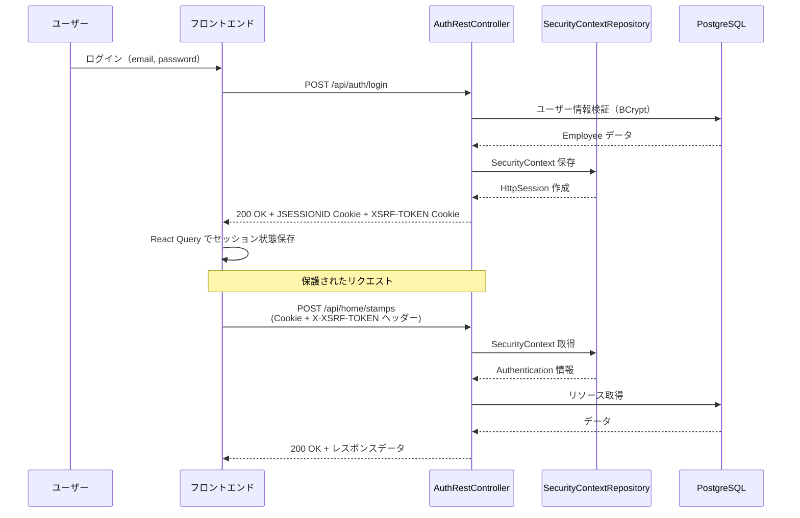

# 認証システム全体像

## システム概要

本アプリケーションは **セッションベース認証** を採用した Spring Boot + React SPA アーキテクチャです。Spring Security 6.x と HttpSession を組み合わせ、クロスオリジン環境（Vercel フロントエンド + Render バックエンド）での堅牢な認証を実現しています。

### 主要な特徴

- **ステートフル認証**: サーバー側で HttpSession を使用してセキュリティコンテキストを保持
- **CSRF 保護**: Cookie ベーストークン（`XSRF-TOKEN`）と HTTP ヘッダー（`X-XSRF-TOKEN`）の二重検証
- **CORS 対応**: `SameSite=None` + `Secure` Cookie によるクロスオリジンリクエスト対応
- **マルチデバイス対応**: 最大 3 セッション同時接続可能（PC + モバイル + タブレット）
- **自動リトライ**: CSRF エラー時に `/api/auth/session` でトークンをリフレッシュして自動リトライ

### 技術スタック

| レイヤー | 技術 |
|---------|------|
| **バックエンド** | Spring Security 6.x, HttpSession, BCryptPasswordEncoder, PostgreSQL |
| **フロントエンド** | React 19, React Query (セッション管理), Axios (HTTP クライアント), js-cookie |
| **インフラ** | Render (バックエンド), Vercel (フロントエンド), Docker Compose (開発環境) |

### 認証フロー概要



---

## 関与ファイル一覧

### バックエンド（Java）

| ファイルパス | 役割 |
|------------|------|
| `src/main/java/com/example/teamdev/config/SecurityConfig.java` | セキュリティ設定の中心。CSRF トークンリポジトリ、CORS 設定、フィルターチェーン、セッション管理を定義 |
| `src/main/java/com/example/teamdev/config/CsrfHeaderFilter.java` | CSRF トークンをレスポンスヘッダー（`X-XSRF-TOKEN`）に追加するカスタムフィルター |
| `src/main/java/com/example/teamdev/controller/api/AuthRestController.java` | 認証エンドポイント（`/api/auth/login`, `/api/auth/logout`, `/api/auth/session`）を提供 |
| `src/main/java/com/example/teamdev/controller/RenderHealthController.java` | Render プラットフォーム向けヘルスチェックエンドポイント（`/internal/health`） |
| `src/main/java/com/example/teamdev/util/SecurityUtil.java` | `SecurityContextHolder` を使用した認証情報取得の抽象化レイヤー（JWT 移行時も変更不要） |
| `src/main/java/com/example/teamdev/service/AuthSessionService.java` | セッション認証に関するビジネスロジック（ユーザー情報取得、セッション検証） |

### フロントエンド（TypeScript/React）

| ファイルパス | 役割 |
|------------|------|
| `frontend/src/shared/api/interceptors/csrfInterceptor.ts` | CSRF トークンを Cookie から読み取り、`X-XSRF-TOKEN` ヘッダーに自動付与。403 エラー時にトークンをリフレッシュしてリトライ |
| `frontend/src/shared/api/axiosClient.ts` | Axios インスタンス作成。`withCredentials: true` で Cookie を送信、CSRF インターセプターを登録 |
| `frontend/src/features/auth/hooks/useAuth.tsx` | React Query でセッション状態を管理（8 時間有効、タブ切り替え時に再検証） |
| `frontend/src/features/auth/components/AuthProvider.tsx` | グローバル認証コンテキストを提供。セッション期限切れ警告（7 時間 45 分後）を表示 |
| `frontend/src/features/auth/api/authApi.ts` | 認証 API クライアント（login, logout, getSession） |

### 設定ファイル

| ファイルパス | 役割 |
|------------|------|
| `src/main/resources/application.properties` | 共通設定（データベース接続、ログレベル） |
| `src/main/resources/application-dev.properties` | 開発環境設定（`Secure=false`, `SameSite=Lax`, 詳細ログ） |
| `src/main/resources/application-test.properties` | テスト環境設定（Testcontainers, 最小ログ） |
| `src/main/resources/application-prod.properties` | 本番環境設定（`Secure=true`, `SameSite=None`, CORS 環境変数|

---

## 重要な実装詳細

### CSRF 保護の仕組み

1. **Cookie ベーストークン**: サーバーが `XSRF-TOKEN` Cookie を発行（`HttpOnly=false` で JavaScript から読み取り可能）
2. **ヘッダー検証**: フロントエンドが `X-XSRF-TOKEN` ヘッダーに Cookie 値を設定し、サーバーが両者を比較
3. **トークンハンドラー**: `CsrfTokenRequestAttributeHandler`（標準ハンドラー）を使用。Cookie とヘッダーのトークンが一致することを検証
4. **除外エンドポイント**: `/api/auth/login`, `/api/auth/logout`, `/actuator/**`, `/api/debug/**` は CSRF チェックをスキップ

**重要**: 以前は `XorCsrfTokenRequestAttributeHandler` を使用していましたが、Cookie ベースのトークンリポジトリと互換性がなく 403 エラーが発生したため、標準ハンドラーに変更しました。

### CORS 設定

- **許可オリジン**: `spring.web.cors.allowed-origins` で設定（ワイルドカード禁止）
- **認証情報**: `allowCredentials(true)` で Cookie を含むリクエストを許可
- **公開ヘッダー**: `X-XSRF-TOKEN` をレスポンスヘッダーで公開し、フロントエンドがトークンを取得可能に
- **環境変数**: 本番環境では `CORS_ALLOWED_ORIGINS` 環境変数で Vercel URL を指定

### Cookie セキュリティ

| Cookie 種類 | HttpOnly | Secure (prod) | SameSite | 用途 |
|------------|----------|---------------|----------|------|
| `JSESSIONID` | `true` | `true` | `None` | セッション ID（XSS 対策で JavaScript アクセス不可） |
| `XSRF-TOKEN` | `false` | `true` | `None` | CSRF トークン（JavaScript から読み取り必要） |

**開発環境**: `Secure=false` で HTTP でも動作。`SameSite=Lax` で同一サイトのみ送信。

### セッション管理

- **最大セッション数**: 3（PC + モバイル + タブレット）
- **新規ログイン時**: 最古のセッションを破棄（`maxSessionsPreventsLogin=false`）
- **タイムアウト**: 8 時間（`server.servlet.session.timeout=8h`）
- **React Query 連携**: 7 時間 45 分で警告、8 時間でセッション無効化

---

## 主要エンドポイント

### 認証 API

| エンドポイント | メソッド | 認証 | CSRF | 説明 |
|--------------|---------|------|------|------|
| `/api/auth/login` | POST | 不要 | 除外 | ログイン（email, password）。成功時に `JSESSIONID` + `XSRF-TOKEN` を発行 |
| `/api/auth/logout` | POST | 必要 | 除外 | ログアウト。セッション無効化、Cookie 削除 |
| `/api/auth/session` | GET | 不要 | 必要 | セッション確認。認証済みユーザー情報を返却。CSRF トークンリフレッシュにも使用 |

### 認可設定

| パス | 認証 | 権限 |
|-----|------|------|
| `/`, `/signin`, `/api/auth/**`, `/api/public/**` | 不要 | - |
| `/actuator/health`, `/internal/health` | 不要 | - |
| `/api/news/published` | 不要 | - |
| `/api/admin/**`, `/employeemanage/**`, `/newsmanage/**` | 必要 | `ROLE_ADMIN` |
| その他の `/api/**` | 必要 | - |

---

## トラブルシューティング

### CSRF 403 エラー: "Invalid CSRF Token"

**症状**: `POST /api/home/stamps - 403 Forbidden`

**原因と解決策**:

1. **Cookie が保存されない**
   - Chrome/Edge でサードパーティ Cookie ブロックが有効
   - **解決**: ブラウザ設定でサードパーティ Cookie を許可、または同一ドメインに統一

2. **Cookie とヘッダーのトークンが不一致**
   - DevTools → Network → Headers で確認:
     ```
     Cookie: XSRF-TOKEN=abc123
     X-XSRF-TOKEN: abc123  ← 一致する必要がある
     ```
   - **解決**: CSRF インターセプターが正しく動作しているか確認

### CORS エラー: "Access-Control-Allow-Origin"

**原因**: `spring.web.cors.allowed-origins` にフロントエンド URL が含まれていない

**解決**: `application-prod.properties` で環境変数を設定
```properties
spring.web.cors.allowed-origins=${CORS_ALLOWED_ORIGINS}
```

**検証**:
```bash
curl -I -X OPTIONS https://api.example.com/api/auth/login \
  -H "Origin: https://your-vercel-app.vercel.app" \
  -H "Access-Control-Request-Method: POST"
```

## 環境変数（本番環境）

| 変数名 | 説明 | 例 |
|-------|------|---|
| `CORS_ALLOWED_ORIGINS` | 許可オリジン（カンマ区切り） | `https://your-app.vercel.app` |
| `DATABASE_URL` | PostgreSQL 接続 URL | `jdbc:postgresql://...` |
| `DATABASE_USERNAME` | データベースユーザー名 | `postgres` |
| `DATABASE_PASSWORD` | データベースパスワード | `***` |

---

## 参考リンク

- [Spring Security Reference](https://docs.spring.io/spring-security/reference/index.html)
- [React Query Documentation](https://tanstack.com/query/latest/docs/react/overview)
- [Axios Documentation](https://axios-http.com/docs/intro)
