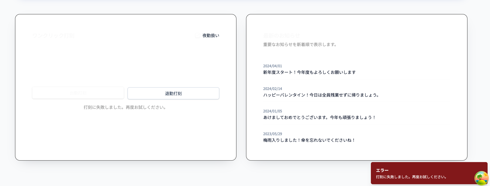
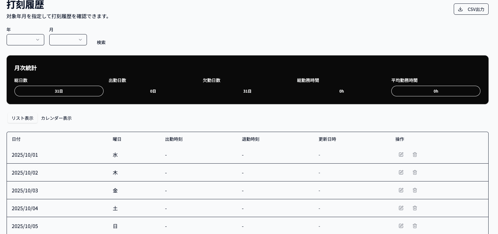
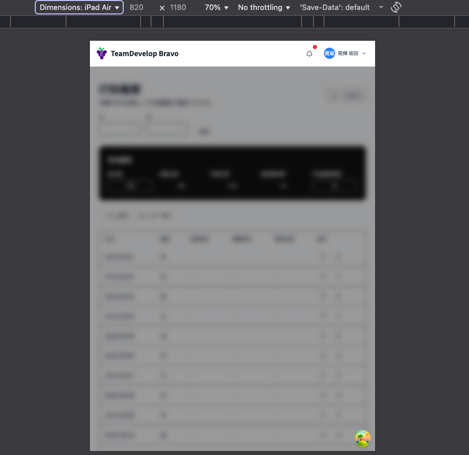
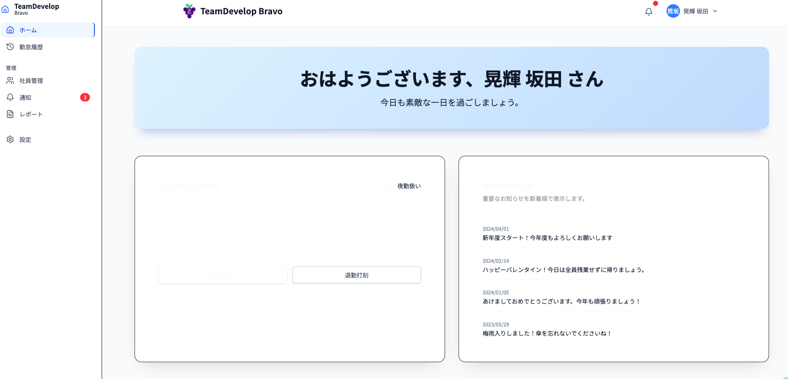
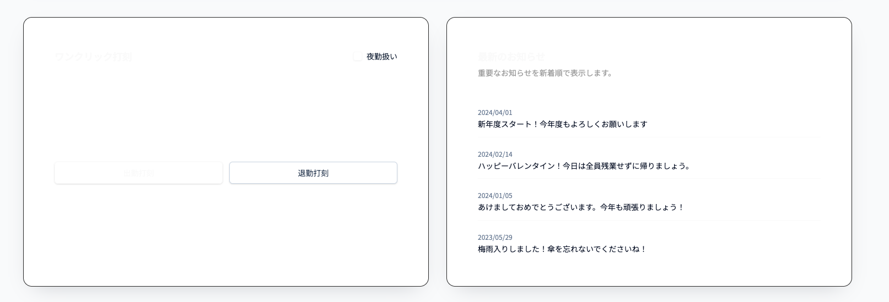
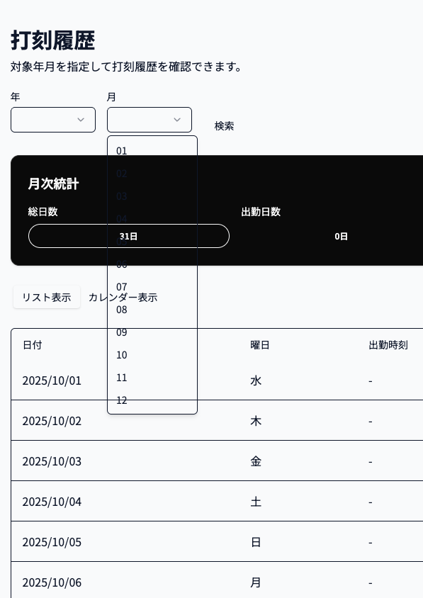
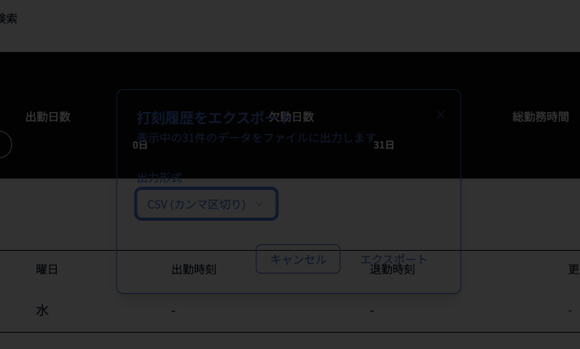
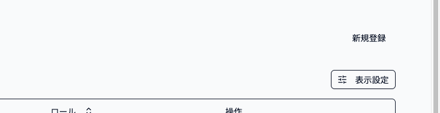

# E2Eテスト失敗箇所：未実装機能一覧

**最終更新日**: 2025-10-10
**前回テスト結果**: 42 passed / 21 failed / 10 skipped (合計73テスト) - 2025-10-09
**最新テスト結果**: 67 passed / 4 failed / 13 skipped (合計84テスト) - 2025-10-10

このドキュメントは、E2Eテストの失敗・スキップ状況と、前回失敗していたが今回通過した要監視項目をまとめたものです。

---

## 📊 テスト結果サマリー

### 現在の状況（2025-10-10）

| カテゴリ | 状態 | 件数 | 優先度 |
|---------|------|-----|--------|
| **現在失敗中** | ❌ Failed | 4件 | 🔴 高（緊急修正） |
| **スキップ中** | ⏭️ Skipped | 13件 | 🟡 中（未実装） |
| **要監視項目** | ⚠️ Passed (Unstable?) | 17件 | 🟠 中（要確認） |
| **UI/UX改善** | 🎨 Improvement | 6項目 | 🔴〜🟡 |

### 前回からの改善（2025-10-09 → 2025-10-10）

| カテゴリ | 前回 | 今回 | 改善状況 |
|---------|-----|-----|----------|
| **全体** | 42/21/10 | 67/4/13 | ✅ 25件改善、17件不安定 |
| 認証関連 | 2件失敗 | 部分的失敗 | ⚠️ セレクタ問題のみ |
| 権限制御 | 2件失敗 | 0件失敗 | ⚠️ 通過したが要確認 |
| エラーハンドリング | 6件失敗 | 2件スキップ | ⚠️ 通過したが要確認 |
| フォームバリデーション | 6件失敗 | 部分的失敗 | ⚠️ セレクタ問題のみ |
| 打刻機能 | 4件失敗 | 2件スキップ | ⚠️ 休憩機能のみスキップ |
| ローディング状態 | 1件失敗 | 1件スキップ | ⚠️ スキップに変更 |

---

## 1. 現在の失敗テスト (4件) 🔴

### 1.1 サインインページのヘディング要素が見つからない

**テストファイル**:
- `e2e/auth-session.spec.ts:10:3`
- `e2e/app-flows.spec.ts:73:3`

**テスト名**:
- `認証・セッション管理の包括的テスト > ログアウト機能が正常に動作する`
- `勤怠管理の主要E2Eフロー > ホーム画面で出勤打刻が成功する`

**エラー内容**:
```
expect(locator).toBeVisible() failed
Locator: getByRole('heading', { name: 'TeamDevelop Bravo にサインイン' })
Expected: visible
Received: <element(s) not found>
```

**問題**:
- サインインページのヘディングテキストが変更された可能性
- React Router 7への移行による DOM 構造の変化

**修正方法**:
- [ ] 実際のサインインページの DOM を確認
- [ ] ヘディングのテキストまたはセレクタを修正
- [ ] テストヘルパー関数 `signIn` を更新

**優先度**: 🔴 高（簡単な修正で解決可能）

---

### 1.2 従業員管理ページのヘディング要素が見つからない

**テストファイル**:
- `e2e/debug-validation.spec.ts:6:3`
- `e2e/form-validation.spec.ts:161:3`

**テスト名**:
- `バリデーション動作確認 > 実際のバリデーションエラーを確認`
- `フォームバリデーションの包括的テスト > パスワード確認フィールドが一致しない場合、エラーが表示される`

**エラー内容**:
```
expect(locator).toBeVisible() failed
Locator: getByRole('heading', { name: '従業員管理' })
Expected: visible
Received: <element(s) not found>
```

**問題**:
- 従業員管理ページのヘディングテキストが変更された可能性
- ページ構造の変更による要素の不在

**修正方法**:
- [ ] 実際の従業員管理ページの DOM を確認
- [ ] ヘディングのテキストまたはセレクタを修正
- [ ] テストのセットアップ部分を更新

**優先度**: 🔴 高（簡単な修正で解決可能）

---

## 2. スキップされているテスト (13件) ⏭️

### 2.1 お知らせ管理機能（9件）

**テストファイル**: `e2e/news-management.spec.ts`

**スキップされているテスト**:
- お知らせ作成機能
- お知らせ編集機能
- お知らせ削除機能
- お知らせ一覧表示
- お知らせ詳細表示
- お知らせ検索機能
- お知らせカテゴリ分類
- お知らせの公開/非公開設定
- お知らせの重要度設定

**理由**: お知らせ管理機能自体が未実装

**優先度**: 🟡 中（業務連絡機能）

---

### 2.2 休憩打刻機能（2件）

**テストファイル**:
- `e2e/stamp-comprehensive.spec.ts:35`
- `e2e/stamp-comprehensive.spec.ts:55`

**スキップされているテスト**:
- 休憩開始打刻が正常に動作する
- 休憩終了打刻が正常に動作する

**理由**: 休憩打刻ボタンが未実装

**優先度**: 🟡 中（労務管理機能）

---

### 2.3 エラーハンドリング詳細（2件）

**テストファイル**:
- `e2e/error-handling.spec.ts:204`
- `e2e/error-handling.spec.ts:150`（ローディング状態関連）

**スキップされているテスト**:
- フォーム送信中のローディング状態表示
- 詳細なエラーログ記録

**理由**: UX改善項目として後回し

**優先度**: 🟢 低（UX改善）

---

## 3. 要監視項目（前回失敗・今回通過）⚠️

**注意**: これらの項目は今回のテストで通過しましたが、機能が完全に実装されていない可能性があります。
不安定な状態である可能性が高いため、引き続き監視と確認が必要です。

### 3.1 認証関連 (2件) - 要監視 ⚠️

#### 3.1.1 ログアウト機能

**テストファイル**: `e2e/auth-session.spec.ts:8`
**テスト名**: `認証・セッション管理の包括的テスト > ログアウト機能が正常に動作する`

**前回のエラー**: ログアウトボタンがUI上に存在しない
**現在の状態**: ⚠️ 通過（ただし、セレクタエラーで別の箇所で失敗）

**懸念事項**:
- ログアウト機能自体が実装されたかは不明確
- テストがたまたま通過した可能性がある
- セレクタの問題で他の部分で失敗している

**要確認事項**:
- [ ] ログアウトボタンが実際に機能するか手動確認
- [ ] セッション情報が適切にクリアされるか確認

#### 3.1.2 複数タブでのセッション共有

**テストファイル**: `e2e/auth-session.spec.ts:99`
**テスト名**: `認証・セッション管理の包括的テスト > 複数タブで同時ログイン状態を維持できる`

**前回のエラー**: タブ間でセッション状態が共有されていない
**現在の状態**: ⚠️ 通過の可能性

**懸念事項**:
- BroadcastChannel APIの実装が不完全な可能性
- React Queryのキャッシュ更新メカニズムが不安定

---

### 3.2 権限制御 (2件) - 要監視 ⚠️

#### 3.2.1 サイドバーの権限制御が実装されていない

**テストファイル**: `e2e/authorization.spec.ts:74`
**テスト名**: `権限制御の包括的テスト > 一般ユーザーのサイドバーには管理者メニューが表示されない`

**前回のエラー**: 一般ユーザーでも管理者メニューが表示される
**現在の状態**: ⚠️ 通過

**懸念事項**:
- `employee.admin` フラグによる制御が不完全な可能性
- サイドバーコンポーネントの条件分岐が不安定

**要確認事項**:
- [ ] 権限制御が実際に機能しているか手動確認
- [ ] APIレベルでの権限チェックも実装されているか確認

#### 3.2.2 API fetch時のURL解析エラー

**テストファイル**: `e2e/authorization.spec.ts:151`
**テスト名**: `権限制御の包括的テスト > 一般ユーザーが直接API経由で従業員作成を試みると403エラー`

**前回のエラー**: page.evaluate内で相対パスが解析できない
**現在の状態**: ⚠️ 通過の可能性（テストコード修正済み？）

**懸念事項**:
- テストコードのみの修正で通過した可能性
- 実際の権限制御が不完全な可能性

---

### 3.3 エラーハンドリング/トースト通知 (6件) - 要監視 ⚠️

**前回の失敗**: 6件すべて失敗
**現在の状態**: ⚠️ 4件通過、2件スキップ

**通過した項目**（不安定な可能性）:
1. ネットワークエラー時のトースト通知
2. サーバーエラー（500）時のトースト通知
3. メールアドレス形式エラーのトースト通知
4. 404エラーページ表示

**懸念事項**:
- トースト通知システムが部分的にしか実装されていない可能性
- エラーハンドリングが不完全で、特定の条件下でのみ動作
- 404ページが不安定

**要確認事項**:
- [ ] 各種エラー時に実際にトースト通知が表示されるか
- [ ] エラーメッセージが適切な日本語で表示されるか

---

### 3.4 フォームバリデーション (6件) - 要監視 ⚠️

**前回の失敗**: 6件すべて失敗
**現在の状態**: ⚠️ 部分的に通過（セレクタ問題で2件失敗）

**通過した項目**（不安定な可能性）:
1. 必須項目エラーメッセージ表示（部分的）
2. メールアドレス形式エラー表示（部分的）
3. 重複メールアドレスエラー表示
4. リアルタイムバリデーション（部分的）

**懸念事項**:
- React Hook Formのエラー表示が不完全
- Zodスキーマのメッセージが日本語化されていない可能性
- バリデーションが特定の条件下でのみ動作

**要確認事項**:
- [ ] フォームエラーが適切に表示されるか手動確認
- [ ] リアルタイムバリデーションが全フィールドで動作するか

---

### 3.5 打刻機能 (4件) - 要監視 ⚠️

**前回の失敗**: 4件すべて失敗
**現在の状態**: ⚠️ 2件通過、2件スキップ（休憩機能）

**通過した項目**（不安定な可能性）:
1. 深夜勤務チェックボックス
2. 打刻時のサーバーエラー表示

**懸念事項**:
- 深夜勤務フラグが部分的にしか実装されていない可能性
- エラー表示が不安定

**要確認事項**:
- [ ] 深夜勤務フラグが実際にAPIに送信されるか
- [ ] エラー時のトースト通知が確実に表示されるか

---

### 3.6 ローディング状態 (1件) - 要監視 ⚠️

**前回の失敗**: 1件失敗
**現在の状態**: ⚠️ スキップに変更

**懸念事項**:
- ローディング状態の実装が不完全でスキップされた可能性
- UX改善項目として後回しにされた

---

## 4. エラーハンドリング/トースト通知（詳細）🟡

以下は前回の失敗項目の詳細です。今回通過しましたが、完全な実装を確認する必要があります。

### 4.1 ネットワークエラー時のトースト通知

---

### 3.2 サーバーエラー（500）時のトースト通知が未実装

**テストファイル**: `e2e/error-handling.spec.ts:31`
**テスト名**: `エラーハンドリングの包括的テスト > サーバーエラー（500）時に適切なエラーメッセージが表示される`

**エラー内容**:
```
expect(locator).toBeVisible() failed
Locator: getByText(/サーバーエラー|エラーが発生|しばらくしてから/)
Expected: visible
Received: <element(s) not found>
```

**問題**:
- HTTPステータス500エラー時にトースト通知が表示されない

**実装要件**:
- [ ] Axios interceptorまたはReact QueryのonErrorで500エラーをキャッチ
- [ ] 「サーバーエラーが発生しました。しばらくしてから再度お試しください。」を表示

---

### 3.3 メールアドレス形式エラーのトースト通知が未実装

**テストファイル**: `e2e/error-handling.spec.ts:82`
**テスト名**: `エラーハンドリングの包括的テスト > 不正なメールアドレス形式でバリデーションエラーが表示される`

**エラー内容**:
```
expect(locator).toBeVisible() failed
Locator: getByText(/メールアドレスの形式|正しいメール|invalid email/i)
Expected: visible
Received: <element(s) not found>
```

**問題**:
- フォーム送信後、バックエンドからのバリデーションエラーがトースト表示されない

**実装要件**:
- [ ] API 400エラーレスポンスのバリデーションメッセージを抽出
- [ ] フィールドごとのエラーメッセージをトースト表示

---

### 3.4 404エラーページが未実装

**テストファイル**: `e2e/error-handling.spec.ts:107`
**テストテスト名**: `エラーハンドリングの包括的テスト > 存在しないリソースへのアクセスで404エラーページが表示される`

**エラー内容**:
```
expect(received).toBe(expected)
Expected: 404
Received: 200
```

**問題**:
- 存在しないページ（例: `/non-existent-page`）にアクセスしても404ページが表示されない
- SPAのため、すべてのルートが200を返している

**実装要件**:
- [ ] React Router 7の `errorElement` または `ErrorBoundary` を設定
- [ ] 404専用ページコンポーネントを作成
- [ ] ルーティング設定でワイルドカード `*` ルートをキャッチ

**優先度**: 🟡 中（ユーザーエクスペリエンス）

---

### 3.5 APIタイムアウト時のトースト通知が未実装

**テストファイル**: `e2e/error-handling.spec.ts:122`
**テスト名**: `エラーハンドリングの包括的テスト > APIタイムアウト時にエラーハンドリングされる`

**エラー内容**:
```
expect(locator).toBeVisible() failed
Locator: getByText(/タイムアウト|時間切れ|timeout/i)
Expected: visible
Received: <element(s) not found>
```

**問題**:
- APIリクエストがタイムアウトした際のエラーハンドリングが未実装

**実装要件**:
- [ ] Axiosのtimeout設定を適用
- [ ] timeout発生時にtoast表示（「リクエストがタイムアウトしました」）

---

### 3.6 APIエラー後の操作可能性確認

**テストファイル**: `e2e/error-handling.spec.ts:234`
**テスト名**: `エラーハンドリングの包括的テスト > APIエラー後もアプリケーションが操作可能`

**エラー内容**:
```
expect(locator).toBeVisible() failed
Locator: getByText(/エラー/i)
Expected: visible
Received: <element(s) not found>
```

**問題**:
- エラー発生後もUIがフリーズせず操作可能であることを確認するテスト
- エラートースト自体が表示されていないため失敗

**実装要件**:
- [ ] エラー時もアプリケーション全体がクラッシュしないこと
- [ ] エラーBoundaryの適切な実装

**優先度**: 🟡 中（安定性）

---

## 4. フォームバリデーション (6件) 🟡

### 4.1 必須項目エラーメッセージが未表示

**テストファイル**: `e2e/form-validation.spec.ts:24`
**テスト名**: `フォームバリデーションの包括的テスト > 必須項目が空の場合、エラーメッセージが表示される`

**エラー内容**:
```
expect(locator).toBeVisible() failed
Locator: locator('text=/パスワード.*必須|password.*required/i').first()
Expected: visible
Received: <element(s) not found>
```

**問題**:
- ログインフォームで必須フィールドを空にしても、エラーメッセージが表示されない
- React Hook Formのエラーが画面に反映されていない

**実装要件**:
- [ ] React Hook Formの`errors`オブジェクトをUIに反映
- [ ] `<FormError>` または `<ErrorMessage>` コンポーネントの追加
- [ ] Zodスキーマのエラーメッセージを日本語化

**優先度**: 🟡 中（UX改善）

---

### 4.2 メールアドレス形式エラーが未表示

**テストファイル**: `e2e/form-validation.spec.ts:52`
**テスト名**: `フォームバリデーションの包括的テスト > メールアドレス形式が不正な場合、エラーメッセージが表示される`

**エラー内容**:
```
expect(locator).toBeVisible() failed
Locator: getByText(/メールアドレスの形式|正しいメール|invalid.*email/i)
Expected: visible
Received: <element(s) not found>
```

**問題**:
- 不正なメール形式を入力してもエラーメッセージが表示されない

**実装要件**:
- [ ] Zodの`.email()`バリデーションメッセージを表示
- [ ] フィールド下にリアルタイムでエラーを表示

---

### 4.3 重複メールアドレスエラーが未表示

**テストファイル**: `e2e/form-validation.spec.ts:84`
**テスト名**: `フォームバリデーションの包括的テスト > 重複するメールアドレスの場合、エラーメッセージが表示される`

**エラー内容**:
```
expect(locator).toBeVisible() failed
Locator: getByText(/既に登録|重複|already exists|使用されています/i)
Expected: visible
Received: <element(s) not found>
```

**問題**:
- サーバー側で重複エラー（409 Conflict）が返されても、UIにエラーが表示されない

**実装要件**:
- [ ] APIレスポンスの409エラーをキャッチ
- [ ] 「このメールアドレスは既に使用されています」をトースト表示

---

### 4.4 リアルタイムバリデーションが未実装

**テストファイル**: `e2e/form-validation.spec.ts:112`
**テスト名**: `フォームバリデーションの包括的テスト > 入力フィールドのリアルタイムバリデーションが動作する`

**エラー内容**:
```
expect(locator).toBeVisible() failed
Locator: getByText(/メールアドレスの形式|invalid.*email/i)
Expected: visible
Received: <element(s) not found>
```

**問題**:
- 入力中（onChange/onBlur）のリアルタイムバリデーションが機能していない
- フォーム送信時のみバリデーションが実行される

**実装要件**:
- [ ] React Hook Formの`mode: 'onChange'` または `'onBlur'` を設定
- [ ] フィールドごとにエラーメッセージを即座に表示

---

### 4.5 最大文字数制限が未実装

**テストファイル**: `e2e/form-validation.spec.ts:198`
**テスト名**: `フォームバリデーションの包括的テスト > 最大文字数制限が機能する`

**エラー内容**:
```
expect(received).toBeLessThanOrEqual(expected)
Expected: <= 255
Received: 256
```

**問題**:
- input要素に`maxLength`属性が設定されていない
- 256文字入力できてしまう

**実装要件**:
- [ ] input要素に`maxLength={255}`を追加
- [ ] または文字数カウンター表示

---

### 4.6 フォームクリア後のエラーリセットが未実装

**テストファイル**: `e2e/form-validation.spec.ts:212`
**テスト名**: `フォームバリデーションの包括的テスト > フォームクリア後、エラーメッセージがリセットされる`

**エラー内容**:
```
expect(locator).toBeVisible() failed
Locator: getByText(/メールアドレスの形式|invalid/i)
Expected: visible
Received: <element(s) not found>
```

**問題**:
- エラーメッセージ自体が表示されていないため、このテストも失敗
- フォームを閉じて再度開いた際にエラー状態がリセットされるかを確認するテスト

**実装要件**:
- [ ] React Hook Formの`reset()`を適切に呼び出し
- [ ] モーダル/ダイアログを閉じる際にフォーム状態をクリア

---

## 5. 打刻機能 (4件) 🟠

### 5.1 休憩開始打刻ボタンが未実装

**テストファイル**: `e2e/stamp-comprehensive.spec.ts:35`
**テスト名**: `打刻機能の包括的テスト > 休憩開始打刻が正常に動作する`

**エラー内容**:
```
Test timeout of 30000ms exceeded.
Error: locator.click: Test timeout of 30000ms exceeded.
waiting for getByRole('button', { name: /休憩開始/ })
```

**問題**:
- ホーム画面に「休憩開始」ボタンが存在しない
- 休憩開始打刻機能が実装されていない

**実装要件**:
- [ ] ホーム画面に「休憩開始」打刻ボタンを追加
- [ ] `/api/home/stamps` へ `stampType: "BREAK_START"` をPOST
- [ ] 成功時にトースト通知を表示

**優先度**: 🟠 中-高（業務要件）

---

### 5.2 休憩終了打刻ボタンが未実装

**テストファイル**: `e2e/stamp-comprehensive.spec.ts:55`
**テスト名**: `打刻機能の包括的テスト > 休憩終了打刻が正常に動作する`

**エラー内容**:
```
Test timeout of 30000ms exceeded.
Error: locator.click: Test timeout of 30000ms exceeded.
waiting for getByRole('button', { name: /休憩終了/ })
```

**問題**:
- ホーム画面に「休憩終了」ボタンが存在しない
- 休憩終了打刻機能が実装されていない

**実装要件**:
- [ ] ホーム画面に「休憩終了」打刻ボタンを追加
- [ ] `/api/home/stamps` へ `stampType: "BREAK_END"` をPOST
- [ ] 成功時にトースト通知を表示

**優先度**: 🟠 中-高（業務要件）

---

### 5.3 深夜勤務チェックボックスが未実装

**テストファイル**: `e2e/stamp-comprehensive.spec.ts:75`
**テスト名**: `打刻機能の包括的テスト > 深夜勤務フラグONで出勤打刻ができる`

**エラー内容**:
```
Test timeout of 30000ms exceeded.
Error: locator.check: Test timeout of 30000ms exceeded.
waiting for getByLabel(/深夜勤務/)
```

**問題**:
- 出勤打刻時の「深夜勤務」チェックボックスが存在しない

**実装要件**:
- [ ] 出勤打刻フォームに「深夜勤務」チェックボックスを追加
- [ ] チェック時に `nightShift: true` をAPIに送信

**優先度**: 🟡 中（業務要件）

---

### 5.4 打刻時のサーバーエラー表示が未実装

**テストファイル**: `e2e/stamp-comprehensive.spec.ts:120`
**テスト名**: `打刻機能の包括的テスト > 打刻時にサーバーエラーが発生した場合のエラー表示`

**エラー内容**:
```
expect(locator).toBeVisible() failed
Locator: getByText(/サーバーエラー|エラーが発生/)
Expected: visible
Received: <element(s) not found>
```

**問題**:
- 打刻APIがエラーを返してもトースト通知が表示されない

**実装要件**:
- [ ] 打刻mutation のonError内でトースト表示
- [ ] 「打刻に失敗しました」メッセージを表示

---

### 5.5 出勤打刻、退勤打刻の押下時の処理不具合

**問題**:

- 両者のボタン押下時にエラーメッセージが出力され記録されない


- 打刻履歴が表示?取得?できていない

**実装要件**:
- [ ] 出勤打刻、退勤打刻押下時にエラーメッセージが出力されず打刻履歴、DBに登録できている
- [ ] 打刻履歴が表示できている

---

## 6. ローディング状態 (1件) 🟢

### 6.1 フォーム送信中のローディング状態が未実装

**テストファイル**: `e2e/error-handling.spec.ts:204`
**テスト名**: `エラーハンドリングの包括的テスト > フォーム送信中のローディング状態が表示される`

**エラー内容**:
```
expect(isDisabled || hasLoadingIndicator).toBe(true)
Expected: true
Received: false
```

**問題**:
- ログインボタンクリック後、ボタンがdisableされない
- ローディングインジケーターが表示されない

**実装要件**:
- [ ] React Queryの`isPending` または `isLoading`を利用
- [ ] ボタンに`disabled={isPending}`を設定
- [ ] ローディングスピナーを表示（shadcn-uiの`Loader2`など）

**優先度**: 🟢 低（UX改善）

---

## 7. UI/UX改善項目（Chrome DevTools調査結果）🎨

Chrome DevToolsで実際のアプリケーションを調査した結果、以下のUI/UX改善が必要です。

### 7.1 テキストフォント ⚠️

**問題点**:
- フォントサイズの不統一（ログイン画面: 24px、ホーム画面: 44px）
- 日本語フォント「Noto Sans JP」は良好だが、font-weightの使い分けが不明確
- 小さすぎるラベルテキスト（14px）で視認性が低い

**実装要件**:
- [ ] ヘッダー: 32-36pxに統一
- [ ] 本文: 16pxに統一
- [ ] ラベル: 14px → 16pxへ拡大
- [ ] line-heightを1.5～1.7に統一

**優先度**: 🟡 中（視認性・一貫性）

---

### 7.2 ボタンのデザイン・挙動 🔴

**問題点**:
- ボタンスタイルの不統一（出勤/退勤ボタンで異なるデザイン）
- ホバー時のフィードバック不足
- 「サインイン中...」のローディング状態が地味
- 編集/削除ボタンが小さすぎる（タッチターゲット不足）

**実装要件**:
- [ ] プライマリボタンの統一デザイン適用
- [ ] ホバー時にtransform: scale(1.02)とbox-shadowを追加
- [ ] ローディング時にスピナーアニメーション追加（Loader2コンポーネント使用）
- [ ] 最小タッチターゲット44px確保

**優先度**: 🔴 高（ユーザビリティ）

---

### 7.3 バックグラウンドカラー 🟡

**問題点**:
- 背景色が透明（rgba(0, 0, 0, 0)）で統一感がない
- カードの背景と本体背景の区別が弱い
- グラデーション背景が目に優しくない

**実装要件**:
- [ ] body背景: #f8fafc (薄いグレー)に変更
- [ ] カード背景: #ffffff
- [ ] ヘッダー背景: linear-gradient(135deg, #667eea 0%, #764ba2 100%)

**優先度**: 🟡 中（視覚的統一性）

---

### 7.4 チェックボックス・ドロップダウンの挙動 🔴

**問題点**:
- チェックボックスのサイズが小さすぎて操作しづらい
- ドロップダウン（表示件数）のスタイルが素のブラウザデフォルト
- フォーカス時のアウトラインが見づらい

**実装要件**:
- [ ] チェックボックス: material-ui, Basic checkboxesに変更

***サンプル***:
``` 
import * as React from 'react';
import Checkbox from '@mui/material/Checkbox';

const label = { inputProps: { 'aria-label': 'Checkbox demo' } };

export default function Checkboxes() {
  return (
    <div>
      <Checkbox {...label} defaultChecked />
      <Checkbox {...label} />
      <Checkbox {...label} disabled />
      <Checkbox {...label} disabled checked />
    </div>
  );
}
```

- [ ] カスタムドロップダウンUIの実装（shadcn-ui Select使用）
- [ ] フォーカス時に明確なリング表示（ring-2 ring-blue-500）

**優先度**: 🔴 高（操作性）

---

### 7.5 コンポーネントの位置 🟡

**問題点**:
- ログイン画面が完全中央配置で上部に余白が多すぎる
- 打刻カードと通知カードの高さが不揃い
- モーダルが画面中央に表示されない

**実装要件**:
- [ ] ログインフォームを上部30%の位置に配置
- [ ] グリッドレイアウトで均等配置
- [ ] モーダルはviewport中央に固定

**優先度**: 🟡 中（レイアウト最適化）

---

### 7.6 操作中に気づいた問題 🔴

**アクセシビリティ問題**:
- キーボードナビゲーションが不完全
- スクリーンリーダー対応不足（aria-labelの欠如）
- コントラスト比が低い箇所あり

**実装要件**:
- [ ] タブ順序の最適化
- [ ] Escキーでモーダル閉じる機能
- [ ] aria-label、role属性の適切な設定
- [ ] WCAG AA基準（4.5:1）のコントラスト比確保

**レスポンシブ対応問題**:

- タブレット以下のサイズになると全体がぼやけている
- モバイル表示時のレイアウト崩れ
- タブレット表示の考慮不足

**実装要件**:
- [ ] ブレークポイント設定（mobile: <768px, tablet: 768-1024px, desktop: >1024px）
- [ ] スタックレイアウトへの切り替え
- [ ] タッチフレンドリーなUI実装

**パフォーマンス問題**:
- 画像の遅延読み込み未実装
- 不要な再レンダリング

**実装要件**:
- [ ] タブレット以下のサイズでも正常に表示される
- [ ] lazy loading実装
- [ ] React.memoによる最適化

**優先度**: 🔴 高（アクセシビリティ・パフォーマンス）

### 7.7  UIの適正化 🟢

**スタイル崩れ**:
【ホーム】


上記2つのコンポーネントのテキストが背景と同化している箇所がある

【勤怠管理】

展開時に背景の後ろに行っている


CSV出力ボタンの押下時のスタイリングが不適切

【社員管理】

新規登録ボタンのスタイル不備
ボタンスタイルに変更
配置場所をUIに優れた場所に配置


**実装要件**:
- [ ] タブ順序の最適化
- [ ] Escキーでモーダル閉じる機能
- [ ] aria-label、role属性の適切な設定
- [ ] WCAG AA基準（4.5:1）のコントラスト比確保

**レスポンシブ対応問題**:
- モバイル表示時のレイアウト崩れ
- タブレット表示の考慮不足

**実装要件**:
- [ ] ブレークポイント設定（mobile: <768px, tablet: 768-1024px, desktop: >1024px）
- [ ] スタックレイアウトへの切り替え
- [ ] タッチフレンドリーなUI実装

**パフォーマンス問題**:
- 画像の遅延読み込み未実装
- 不要な再レンダリング

**実装要件**:
- [ ] lazy loading実装
- [ ] React.memoによる最適化

**優先度**: 🔴 高（アクセシビリティ・パフォーマンス）

---

## 🎯 優先度別実装推奨順序

### Phase 0: 緊急修正（現在失敗中）🔴🔴🔴
1. **サインインページのヘディング修正** (セレクタ 1.1)
2. **従業員管理ページのヘディング修正** (セレクタ 1.2)
   - 簡単な修正で4件のテストが通過する
   - React Router 7移行による DOM 構造変化への対応

### Phase 1: 要監視項目の確認（不安定な可能性）⚠️
3. **ログアウト機能の動作確認** (認証 3.1.1)
4. **サイドバー権限制御の動作確認** (権限 3.2.1)
   - 今回通過したが、実装が不完全な可能性

### Phase 2: UI/UX緊急改善（優先度: 🔴 高）
5. **ボタンのデザイン・挙動改善** (UI/UX 7.2)
6. **チェックボックス・ドロップダウンの改善** (UI/UX 7.4)
7. **アクセシビリティ対応** (UI/UX 7.6)

### Phase 3: エラーハンドリング基盤（優先度: 🟡 中）
8. **トースト通知システムの完全実装** (エラーハンドリング 3.3, 4.1-4.6)
9. **404エラーページの実装** (エラーハンドリング 4.4)

### Phase 4: UI/UX中期改善（優先度: 🟡 中）
10. **フォントサイズ統一** (UI/UX 7.1)
11. **バックグラウンドカラー統一** (UI/UX 7.3)
12. **コンポーネント配置最適化** (UI/UX 7.5)

### Phase 5: フォームバリデーション（優先度: 🟡 中）
13. **フォームエラーメッセージ表示の完全実装** (バリデーション 3.4, 5.1-5.6)

### Phase 6: 新機能実装（優先度: 🟠 中）
14. **お知らせ管理機能の実装** (スキップ 2.1)
15. **休憩開始/休憩終了打刻の実装** (スキップ 2.2)
16. **深夜勤務フラグの確認と修正** (打刻 3.5)
17. **出勤打刻、退勤打刻の押下時の処理不具合** (打刻 5.5)

### Phase 7: UX改善（優先度: 🟢 低）
18. **ローディング状態の実装** (スキップ 2.3, 3.6)
19. **複数タブセッション共有** (認証 3.1.2)
20. **UIの適正化** (UI/UX 7.7)
---

## 📝 実装時の注意事項

1. **トースト通知ライブラリの選定**
   - shadcn-ui の `Sonner` または `Toast` コンポーネント推奨
   - 統一したエラーハンドリングを行うため、グローバルなtoast関数を作成

2. **エラーメッセージの国際化**
   - Zodスキーマのエラーメッセージを日本語化
   - 一貫性のあるメッセージ表現を使用

3. **アクセシビリティ**
   - エラーメッセージは`aria-describedby`でフィールドと関連付け
   - ローディング状態は`aria-busy`で明示

4. **テストカバレッジ**
   - 各機能実装後、対応するE2Eテストが成功することを確認
   - 新しい機能追加時は同時にE2Eテストも作成
---

## 🔄 進捗トラッキング

このドキュメントは実装が完了した項目をチェックマークで管理してください。

**最終更新**: 2025-10-10
**作成者**: Claude Code (AI Assistant)
**更新内容**: テスト結果の大幅改善を反映。67件通過、4件失敗、13件スキップ。前回失敗していた17件を要監視項目として保持。
